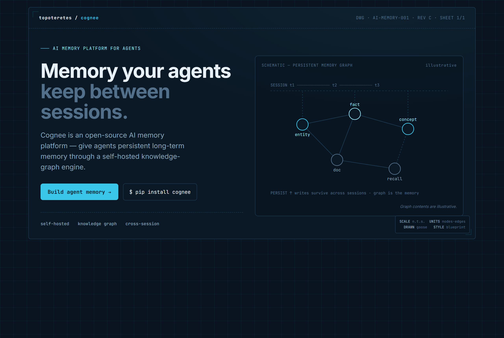
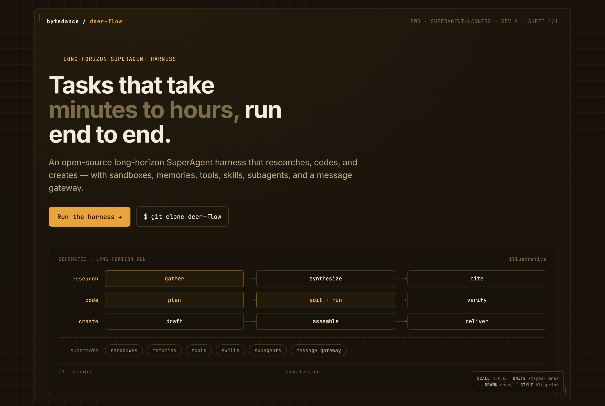
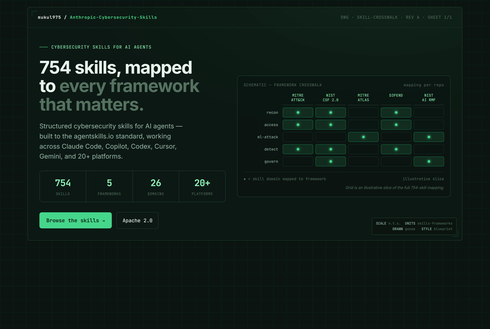

# GooseDesigns

A **daily design montage**. Each morning an automation reads GitHub Trending, picks the most interesting repos (biased to AI / agents / dev-tools / LLM / PKM), and reimagines each one's hero/landing UI in a rotating visual style. Design practice, captured and made browsable.

**42 mocks · 14 days · 4 style families** and counting.

## Browse

- **[Full catalog](CATALOG.md)** — every mock in one searchable table
- **By style:** [blueprint](styles/blueprint.md) · [editorial](styles/editorial.md) · [hud](styles/hud.md) · [terminal-dark](styles/terminal-dark.md)
- **[Design Taste Ledger](ledger.md)** · **[Concept: Design Taste](concept.md)**

## Latest — Sunday, June 21

<table><tr>
<td align="center" width="33%"> <b>topoteretes/cognee</b> blueprint</td>
<td align="center" width="33%"> <b>bytedance/deer-flow</b> blueprint</td>
<td align="center" width="33%"> <b>mukul975/Anthropic-Cybersecurity-Skills</b> blueprint</td>
</tr></table>

[See the full day →](days/2026-06-21/)

## All reps

| Date | Day | Mocks | Styles | Page |
|------|-----|-------|--------|------|
| 2026-06-21 | Sunday | 3 | blueprint | [open](days/2026-06-21/) |
| 2026-06-20 | Saturday | 3 | hud | [open](days/2026-06-20/) |
| 2026-06-19 | Friday | 3 | editorial | [open](days/2026-06-19/) |
| 2026-06-18 | Thursday | 3 | terminal-dark | [open](days/2026-06-18/) |
| 2026-06-17 | Wednesday | 3 | hud | [open](days/2026-06-17/) |
| 2026-06-16 | Tuesday | 3 | editorial | [open](days/2026-06-16/) |
| 2026-06-15 | Monday | 3 | terminal-dark | [open](days/2026-06-15/) |
| 2026-06-14 | Sunday | 3 | hud, editorial, terminal-dark | [open](days/2026-06-14/) |
| 2026-06-13 | Saturday | 3 | hud | [open](days/2026-06-13/) |
| 2026-06-12 | Friday | 3 | editorial | [open](days/2026-06-12/) |
| 2026-06-11 | Thursday | 3 | terminal-dark | [open](days/2026-06-11/) |
| 2026-06-10 | Wednesday | 3 | hud | [open](days/2026-06-10/) |
| 2026-06-09 | Tuesday | 3 | editorial | [open](days/2026-06-09/) |
| 2026-06-08 | Monday | 3 | terminal-dark | [open](days/2026-06-08/) |

## Style rotation

| Family | When | Feel |
|--------|------|------|
| terminal-dark | Mon / Thu | Near-black dev-tool; one electric accent (Linear / Vercel / Raycast) |
| editorial | Tue / Fri | Light, calm, serif headline + clean sans, generous whitespace (Stripe-essay) |
| hud | Wed / Sat | Top Gun aviation-instrument; amber/green readouts, subtle grid, restrained |
| blueprint | designer's choice | Architectural schematic; drafting grid, technical annotations |

## How it works

A scheduled `Goose` automation runs daily at 6:00 AM CT. It builds the trending briefing, writes 2—3 self-contained HTML hero mocks in the day's style, screenshots each, and captures everything to an Obsidian vault. `tools/Build-GooseDesigns.ps1` then regenerates this repo (catalog, day pages, style indexes, homepage) from those sources and pushes. The build is idempotent — re-running never duplicates.

## Search tips

- Press <kbd>/</kbd> for repo search, or <kbd>t</kbd> for the file finder.
- Code-search keywords land in [CATALOG.md](CATALOG.md): style names (`blueprint`, `hud`), repo names, and the *idea tested* per mock.
- Browse by visual family under [styles/](styles/).

Generated by `tools/Build-GooseDesigns.ps1` · sources: GitHub Trending + an Obsidian design-practice vault.
