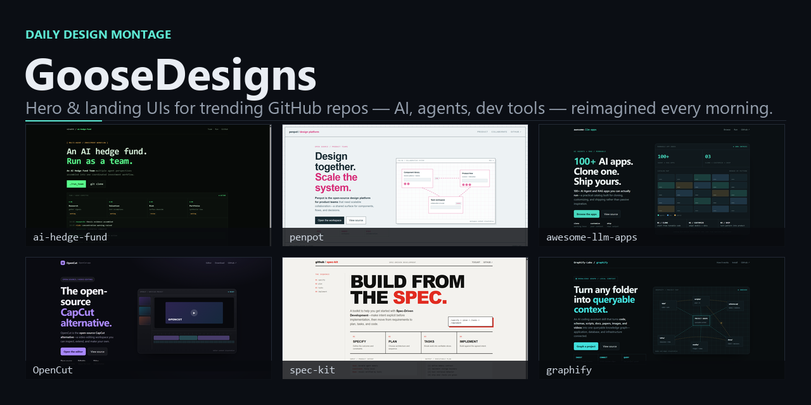
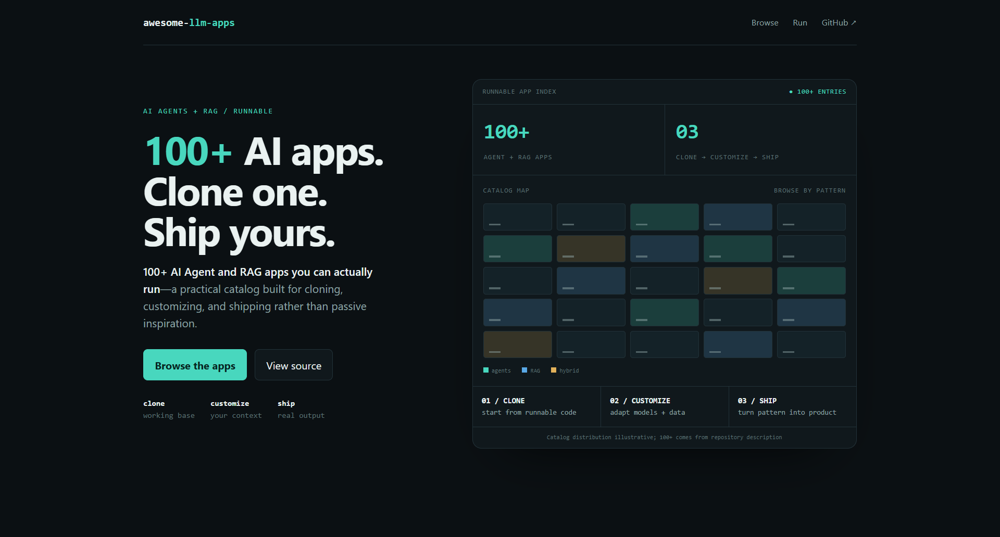
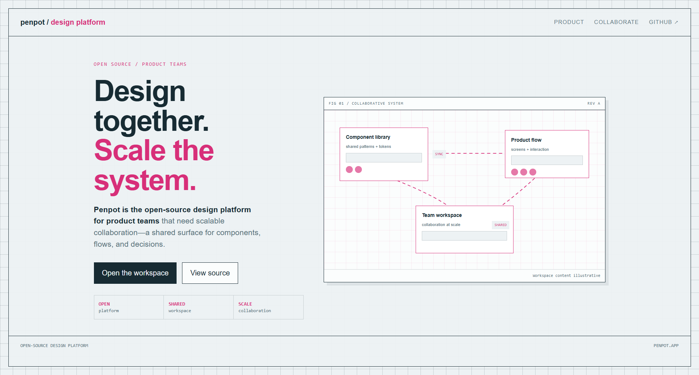
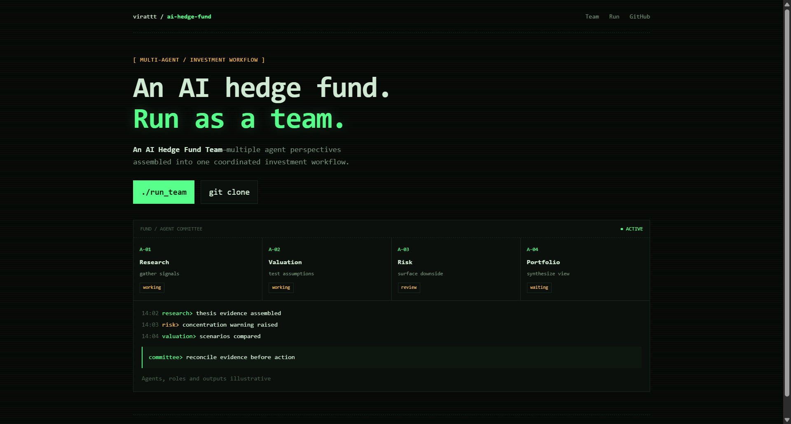

# GooseDesigns — Daily UI Design Inspiration from Trending GitHub Repos

    

**A fresh set of landing-page and hero-section design mockups every morning.** GooseDesigns is an automated design-practice gallery: each day it reads [GitHub Trending](https://github.com/trending), picks the most interesting repositories — AI, autonomous agents, developer tools, local LLMs, and PKM — and reimagines each project's **hero / landing-page UI** in a rotating visual style. Real product copy, accessible contrast, intentional motion, and no generic AI-gradient slop.

Use it for **UI inspiration, web-design examples, landing-page ideas, and front-end reference** — 99 mockups across 33 days and 14 style families, updated daily. See the **[full design catalog](CATALOG.md)** or the **[live gallery](https://newgoosefactory.github.io/GooseDesigns/)**.

## Browse

- **[Full catalog](CATALOG.md)** — every mock in one searchable table
- **By style:** [bauhaus](styles/bauhaus.md) · [blueprint](styles/blueprint.md) · [brutalist](styles/brutalist.md) · [constellation](styles/constellation.md) · [data-viz](styles/data-viz.md) · [editorial](styles/editorial.md) · [glass](styles/glass.md) · [hud](styles/hud.md) · [mono-zine](styles/mono-zine.md) · [neon-noir](styles/neon-noir.md) · [poster](styles/poster.md) · [swiss](styles/swiss.md) · [terminal-dark](styles/terminal-dark.md) · [warm-minimal](styles/warm-minimal.md)
- **[Design Taste Ledger](ledger.md)** · **[Concept: Design Taste](concept.md)**
- **[Design system & discoverability spec](DESIGN.md)** — palette, type scale, the four style families, and how this repo is built for reach

## Latest — Tuesday, July 14

<table><tr>
<td align="center" width="33%"> <b>Shubhamsaboo/awesome-llm-apps</b> data-viz</td>
<td align="center" width="33%"> <b>penpot/penpot</b> blueprint</td>
<td align="center" width="33%"> <b>virattt/ai-hedge-fund</b> mono-zine</td>
</tr></table>

[See the full day →](days/2026-07-14/)

## All reps

| Date | Day | Mocks | Styles | Page |
|------|-----|-------|--------|------|
| 2026-07-14 | Tuesday | 3 | data-viz, blueprint, mono-zine | [open](days/2026-07-14/) |
| 2026-07-13 | Monday | 3 | hud, swiss, glass | [open](days/2026-07-13/) |
| 2026-07-12 | Sunday | 3 | terminal-dark, editorial, bauhaus | [open](days/2026-07-12/) |
| 2026-07-11 | Saturday | 3 | data-viz, poster, warm-minimal | [open](days/2026-07-11/) |
| 2026-07-10 | Friday | 3 | brutalist, blueprint, neon-noir | [open](days/2026-07-10/) |
| 2026-07-09 | Thursday | 3 | swiss, mono-zine, glass | [open](days/2026-07-09/) |
| 2026-07-08 | Wednesday | 3 | terminal-dark, hud, editorial | [open](days/2026-07-08/) |
| 2026-07-07 | Tuesday | 3 | poster, data-viz, bauhaus | [open](days/2026-07-07/) |
| 2026-07-05 | Sunday | 3 | blueprint, neon-noir, warm-minimal | [open](days/2026-07-05/) |
| 2026-07-02 | Thursday | 3 | hud, brutalist, swiss | [open](days/2026-07-02/) |
| 2026-07-01 | Wednesday | 3 | editorial, glass, mono-zine | [open](days/2026-07-01/) |
| 2026-06-30 | Tuesday | 3 | data-viz, terminal-dark, bauhaus | [open](days/2026-06-30/) |
| 2026-06-29 | Monday | 3 | hud, poster, blueprint | [open](days/2026-06-29/) |
| 2026-06-28 | Sunday | 3 | constellation, brutalist, warm-minimal | [open](days/2026-06-28/) |
| 2026-06-27 | Saturday | 3 | swiss, neon-noir, data-viz | [open](days/2026-06-27/) |
| 2026-06-26 | Friday | 3 | editorial, terminal-dark, blueprint | [open](days/2026-06-26/) |
| 2026-06-25 | Thursday | 3 | poster, glass, hud | [open](days/2026-06-25/) |
| 2026-06-23 | Tuesday | 3 | mono-zine, bauhaus, warm-minimal | [open](days/2026-06-23/) |
| 2026-06-22 | Monday | 3 | brutalist, data-viz, swiss | [open](days/2026-06-22/) |
| 2026-06-21 | Sunday | 3 | blueprint | [open](days/2026-06-21/) |
| 2026-06-20 | Saturday | 3 | hud | [open](days/2026-06-20/) |
| 2026-06-19 | Friday | 3 | editorial | [open](days/2026-06-19/) |
| 2026-06-18 | Thursday | 3 | terminal-dark | [open](days/2026-06-18/) |
| 2026-06-17 | Wednesday | 3 | hud | [open](days/2026-06-17/) |
| 2026-06-16 | Tuesday | 3 | editorial | [open](days/2026-06-16/) |
| 2026-06-15 | Monday | 3 | terminal-dark | [open](days/2026-06-15/) |
| 2026-06-14 | Sunday | 3 | hud, editorial, terminal-dark | [open](days/2026-06-14/) |
| 2026-06-13 | Saturday | 3 | hud | [open](days/2026-06-13/) |
| 2026-06-12 | Friday | 3 | editorial | [open](days/2026-06-12/) |
| 2026-06-11 | Thursday | 3 | terminal-dark | [open](days/2026-06-11/) |
| 2026-06-10 | Wednesday | 3 | hud | [open](days/2026-06-10/) |
| 2026-06-09 | Tuesday | 3 | editorial | [open](days/2026-06-09/) |
| 2026-06-08 | Monday | 3 | terminal-dark | [open](days/2026-06-08/) |

## Style rotation

| Family | When | Feel |
|--------|------|------|
| terminal-dark | Mon / Thu | Near-black dev-tool; one electric accent (Linear / Vercel / Raycast) |
| editorial | Tue / Fri | Light, calm, serif headline + clean sans, generous whitespace (Stripe-essay) |
| hud | Wed / Sat | Top Gun aviation-instrument; amber/green readouts, subtle grid, restrained |
| blueprint | designer's choice | Architectural schematic; drafting grid, technical annotations |

## How it works

A scheduled `Goose` automation runs daily at 6:00 AM CT. It builds the trending briefing, writes 2—3 self-contained HTML hero mocks in the day's style, screenshots each, and captures everything to an Obsidian vault. `tools/Build-GooseDesigns.ps1` then regenerates this repo (catalog, day pages, style indexes, homepage) from those sources and pushes. The build is idempotent — re-running never duplicates.

## Search tips

- Press <kbd>/</kbd> for repo search, or <kbd>t</kbd> for the file finder.
- Code-search keywords land in [CATALOG.md](CATALOG.md): style names (`blueprint`, `hud`), repo names, and the *idea tested* per mock.
- Browse by visual family under [styles/](styles/).

Generated by `tools/Build-GooseDesigns.ps1` · sources: GitHub Trending + an Obsidian design-practice vault.
