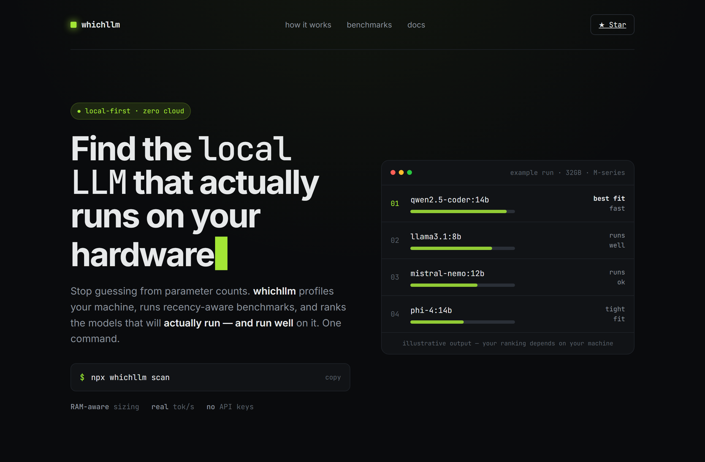
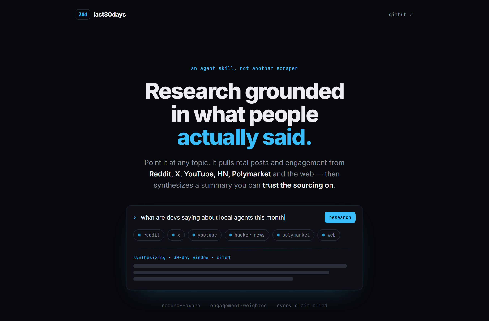
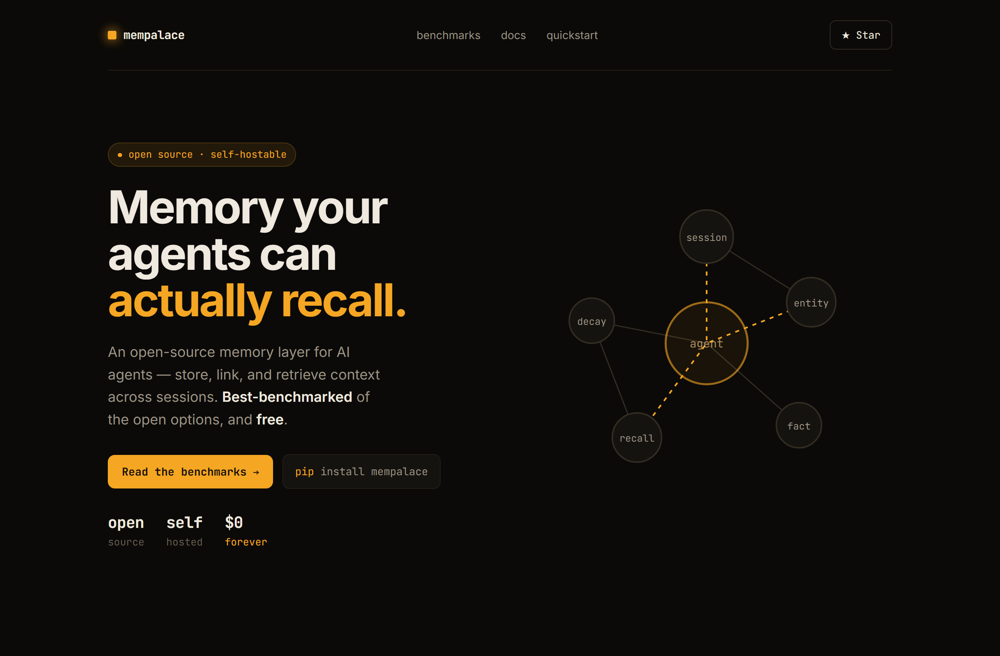

# Design Rep — Monday, June 8

> 3 mocks — terminal-dark

[Catalog](../../CATALOG.md) · [Home](../../README.md)

## [Andyyyy64/whichllm](https://github.com/Andyyyy64/whichllm)

- **Style:** terminal-dark / lime
- **Idea tested:** split hero + illustrative ranked panel
- **Verdict:** landed
- [live .html](./01-whichllm.html) · [repo on GitHub](https://github.com/Andyyyy64/whichllm)

## [mvanhorn/last30days-skill](https://github.com/mvanhorn/last30days-skill)

- **Style:** terminal-dark / cyan, centered
- **Idea tested:** faux prompt-bar + source chips
- **Verdict:** mostly (skeleton lines a touch cliché)
- [live .html](./02-last30days-skill.html) · [repo on GitHub](https://github.com/mvanhorn/last30days-skill)

## [MemPalace/mempalace](https://github.com/MemPalace/mempalace)

- **Style:** terminal-dark / amber
- **Idea tested:** bespoke animated SVG memory-graph hero
- **Verdict:** landed (strongest)
- [live .html](./03-mempalace.html) · [repo on GitHub](https://github.com/MemPalace/mempalace)

