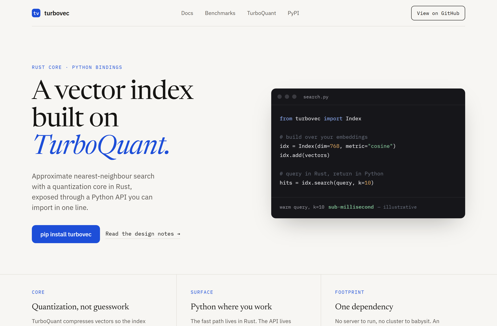
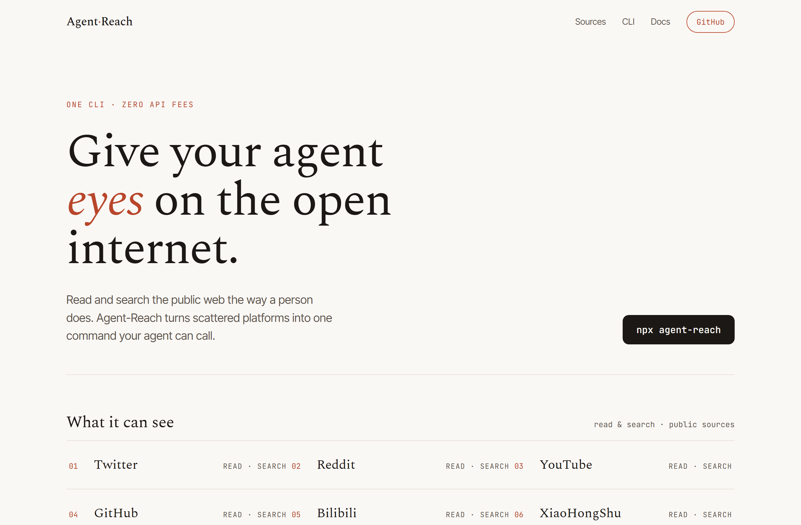
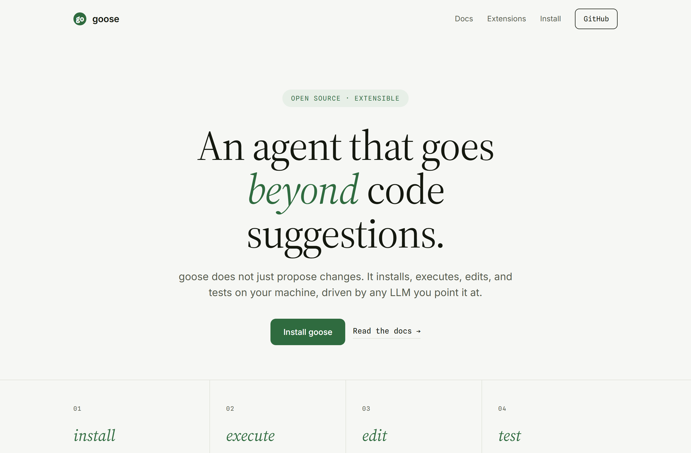

# Design Rep — Tuesday, June 9

> 3 mocks — editorial

[Catalog](../../CATALOG.md) · [Home](../../README.md)

## [RyanCodrai/turbovec](https://github.com/RyanCodrai/turbovec)

- **Style:** editorial / cobalt
- **Idea tested:** split hero + real code panel (no div-fake)
- **Verdict:** landed
- [live .html](./01-turbovec.html) · [repo on GitHub](https://github.com/RyanCodrai/turbovec)

## [Panniantong/Agent-Reach](https://github.com/Panniantong/Agent-Reach)

- **Style:** editorial / terracotta
- **Idea tested:** sources ledger instead of a logo wall
- **Verdict:** landed
- [live .html](./02-agent-reach.html) · [repo on GitHub](https://github.com/Panniantong/Agent-Reach)

## [aaif-goose/goose](https://github.com/aaif-goose/goose)

- **Style:** editorial / forest
- **Idea tested:** centered manifesto + real-verb loop (install/execute/edit/test)
- **Verdict:** mostly (centered hero leans on the headline)
- [live .html](./03-goose.html) · [repo on GitHub](https://github.com/aaif-goose/goose)

