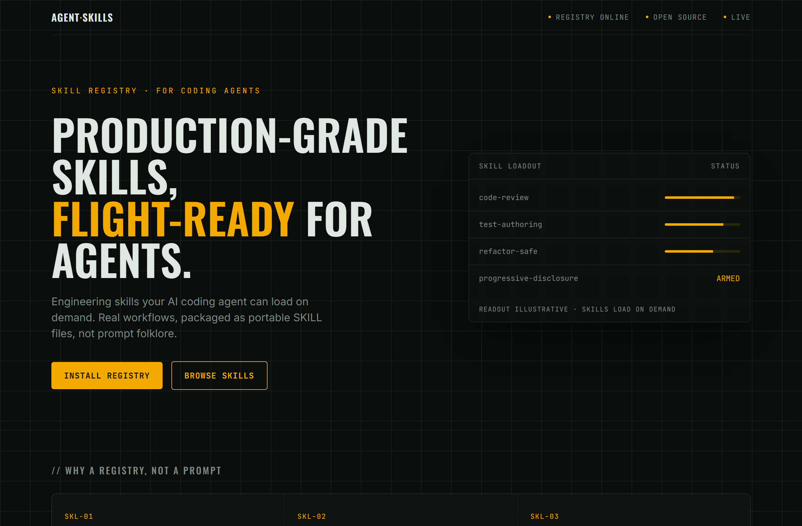
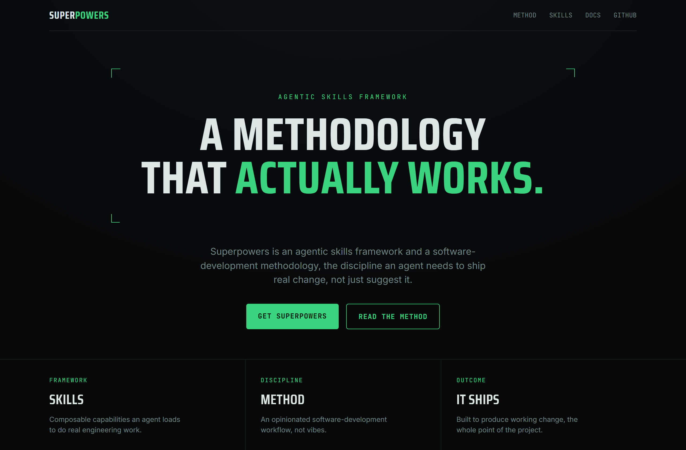
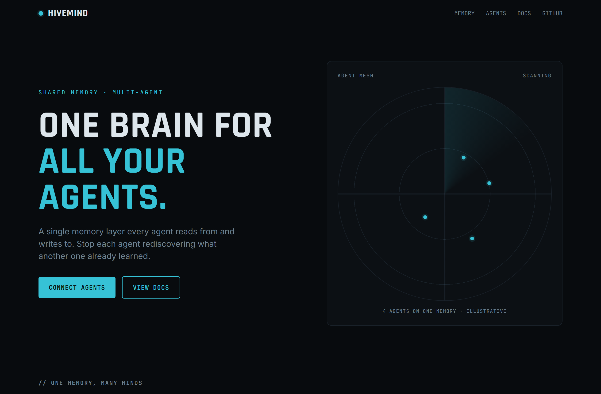

# Design Rep — Wednesday, June 10

> 3 mocks — hud

[Catalog](../../CATALOG.md) · [Home](../../README.md)

## [addyosmani/agent-skills](https://github.com/addyosmani/agent-skills)

- **Style:** hud / amber
- **Idea tested:** cockpit gauge as hero payload (skill-loadout readout, illustrative)
- **Verdict:** landed
- [live .html](./01-agent-skills.html) · [repo on GitHub](https://github.com/addyosmani/agent-skills)

## [obra/superpowers](https://github.com/obra/superpowers)

- **Style:** hud / phosphor-green
- **Idea tested:** targeting reticle framing the headline + telemetry strip
- **Verdict:** mostly (telemetry "stat" is slogan, not data)
- [live .html](./02-superpowers.html) · [repo on GitHub](https://github.com/obra/superpowers)

## [activeloopai/hivemind](https://github.com/activeloopai/hivemind)

- **Style:** hud / radar-cyan
- **Idea tested:** working animated radar scope as hero (4 agents/one memory)
- **Verdict:** landed (strongest)
- [live .html](./03-hivemind.html) · [repo on GitHub](https://github.com/activeloopai/hivemind)

