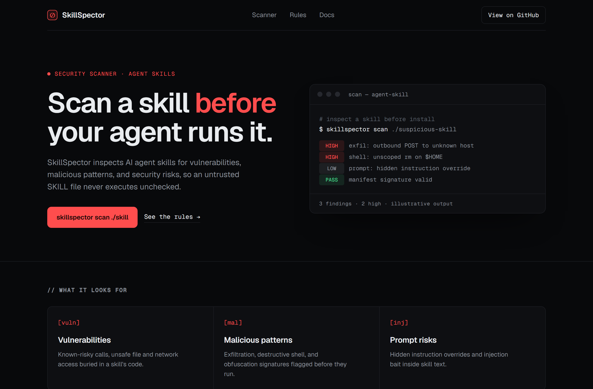
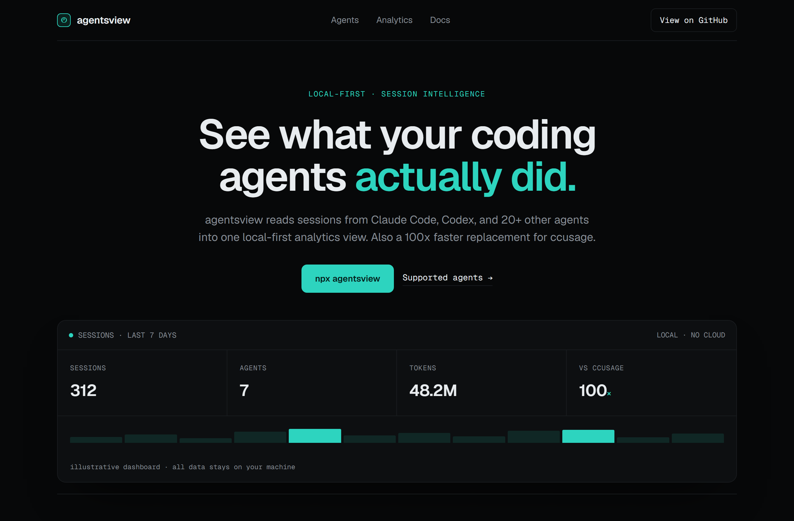
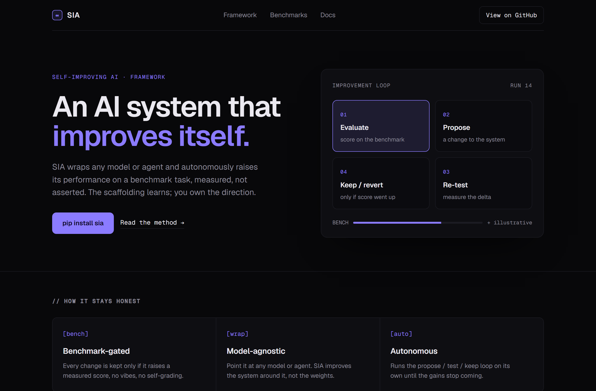

# Design Rep — Thursday, June 11

> 3 mocks — terminal-dark

[Catalog](../../CATALOG.md) · [Home](../../README.md)

## [NVIDIA/SkillSpector](https://github.com/NVIDIA/SkillSpector)

- **Style:** terminal-dark / threat-red
- **Idea tested:** scan-result terminal as hero (severity-tagged findings, illustrative)
- **Verdict:** landed
- [live .html](./01-skillspector.html) · [repo on GitHub](https://github.com/NVIDIA/SkillSpector)

## [kenn-io/agentsview](https://github.com/kenn-io/agentsview)

- **Style:** terminal-dark / electric-teal
- **Idea tested:** analytics dashboard as hero-belly visual
- **Verdict:** mostly (stat-tiles read template)
- [live .html](./02-agentsview.html) · [repo on GitHub](https://github.com/kenn-io/agentsview)

## [hexo-ai/sia](https://github.com/hexo-ai/sia)

- **Style:** terminal-dark / indigo
- **Idea tested:** the product is a loop so the hero is a 4-node loop diagram
- **Verdict:** landed (most on-brand)
- [live .html](./03-sia.html) · [repo on GitHub](https://github.com/hexo-ai/sia)

