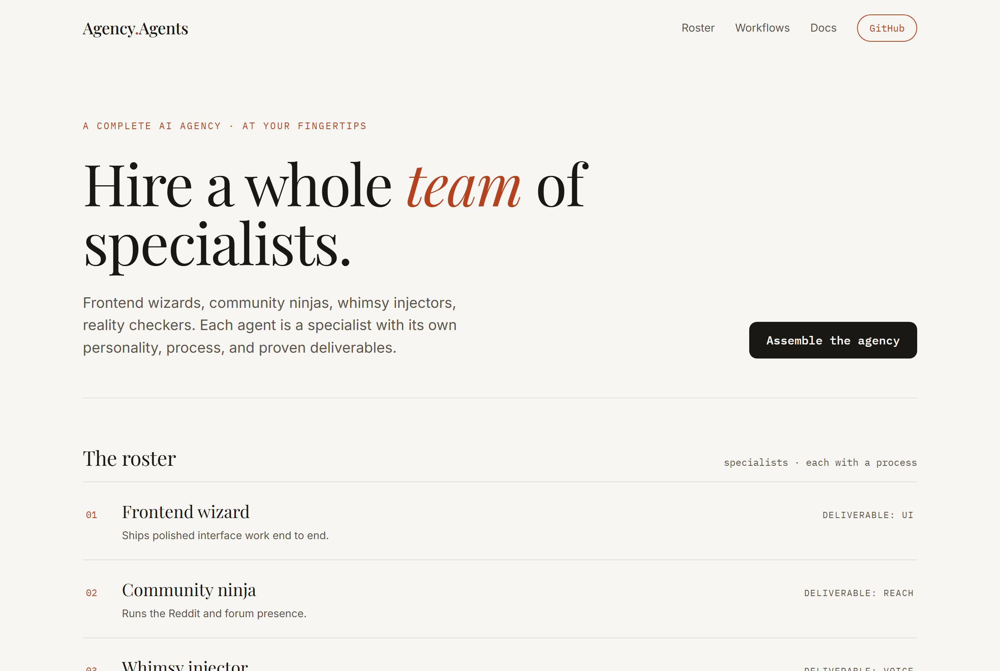
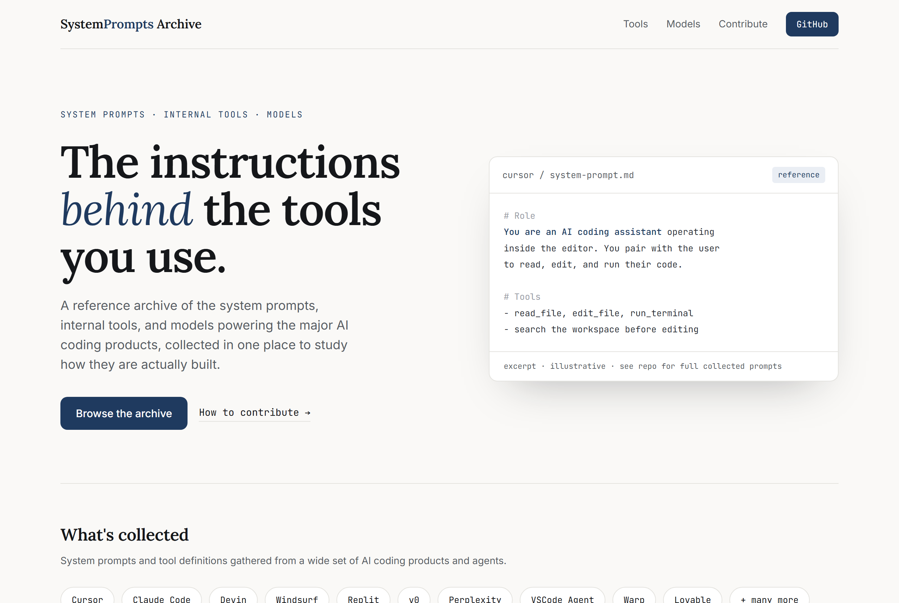
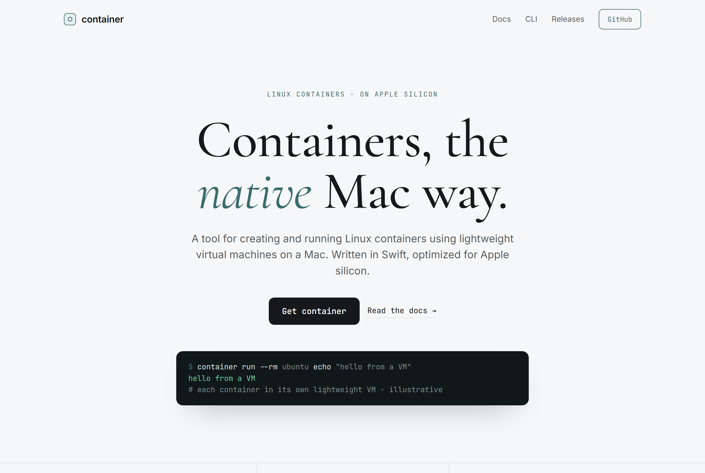

# Design Rep — Friday, June 12

> 3 mocks — editorial

[Catalog](../../CATALOG.md) · [Home](../../README.md)

## [msitarzewski/agency-agents](https://github.com/msitarzewski/agency-agents)

- **Style:** editorial / brick-red, Playfair
- **Idea tested:** agent roster as an editorial index, not cards
- **Verdict:** landed
- [live .html](./01-agency-agents.html) · [repo on GitHub](https://github.com/msitarzewski/agency-agents)

## [x1xhlol/system-prompts-and-models-of-ai-tools](https://github.com/x1xhlol/system-prompts-and-models-of-ai-tools)

- **Style:** editorial / slate-blue, Lora
- **Idea tested:** reference-document card as hero asset
- **Verdict:** landed
- [live .html](./02-system-prompts.html) · [repo on GitHub](https://github.com/x1xhlol/system-prompts-and-models-of-ai-tools)

## [apple/container](https://github.com/apple/container)

- **Style:** editorial / steel-teal, Cormorant
- **Idea tested:** big centered launch serif + single command-line proof
- **Verdict:** mostly (fragile display serif on small screens)
- [live .html](./03-container.html) · [repo on GitHub](https://github.com/apple/container)

