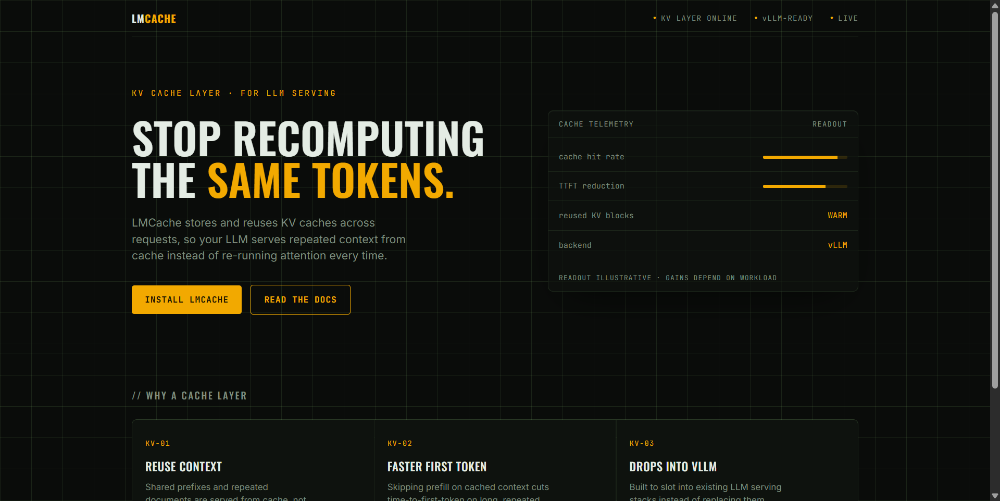
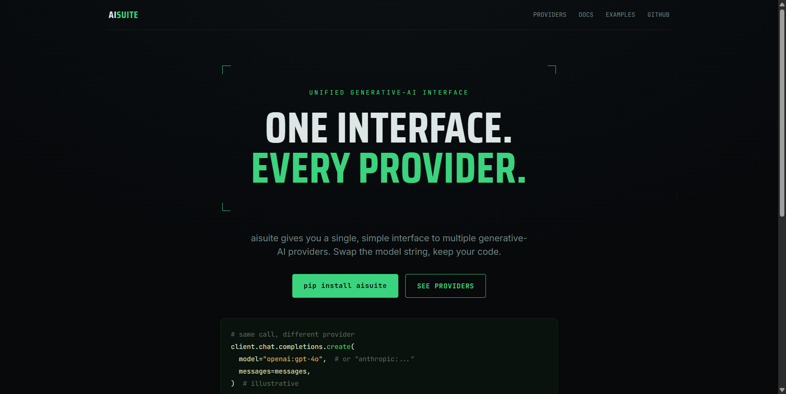
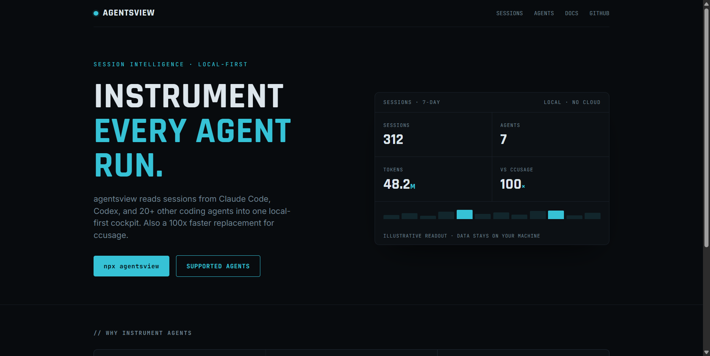

# Design Rep — Saturday, June 13

> 3 mocks — hud

[Catalog](../../CATALOG.md) · [Home](../../README.md)

## [LMCache/LMCache](https://github.com/LMCache/LMCache)

- **Style:** hud / amber
- **Idea tested:** cache-telemetry gauge as hero payload (hit-rate/TTFT, illustrative)
- **Verdict:** landed
- [live .html](./01-lmcache.html) · [repo on GitHub](https://github.com/LMCache/LMCache)

## [andrewyng/aisuite](https://github.com/andrewyng/aisuite)

- **Style:** hud / phosphor-green
- **Idea tested:** reticle manifesto + one-line model-swap proof terminal
- **Verdict:** landed (fixes Wed's bare-reticle miss)
- [live .html](./02-aisuite.html) · [repo on GitHub](https://github.com/andrewyng/aisuite)

## [kenn-io/agentsview](https://github.com/kenn-io/agentsview)

- **Style:** hud / radar-cyan
- **Idea tested:** same product re-skinned as a session cockpit (dials + bars)
- **Verdict:** mostly (stats panel still weakest shape)
- [live .html](./03-agentsview.html) · [repo on GitHub](https://github.com/kenn-io/agentsview)

