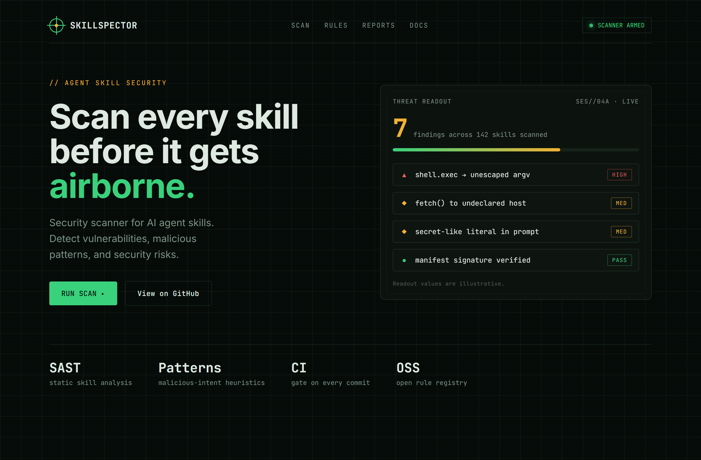
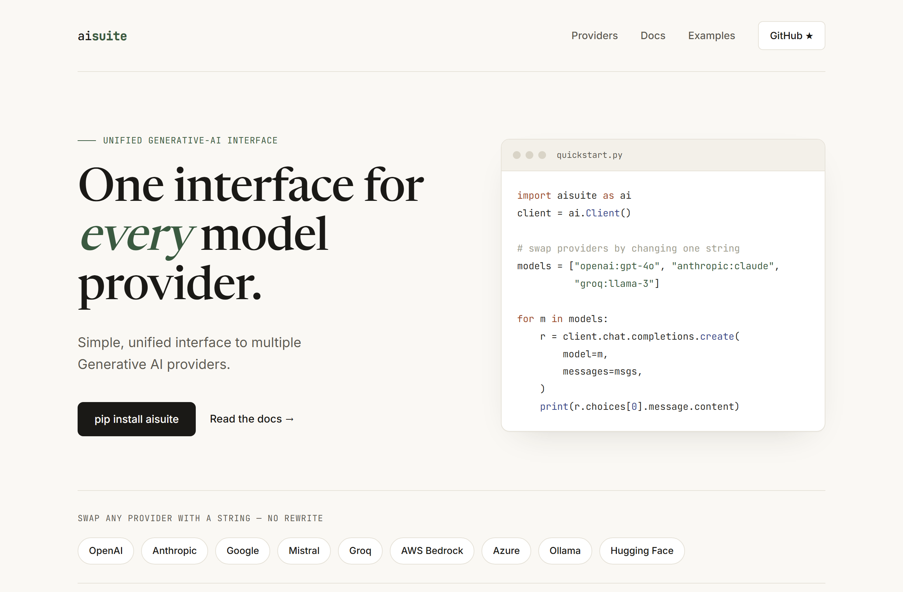
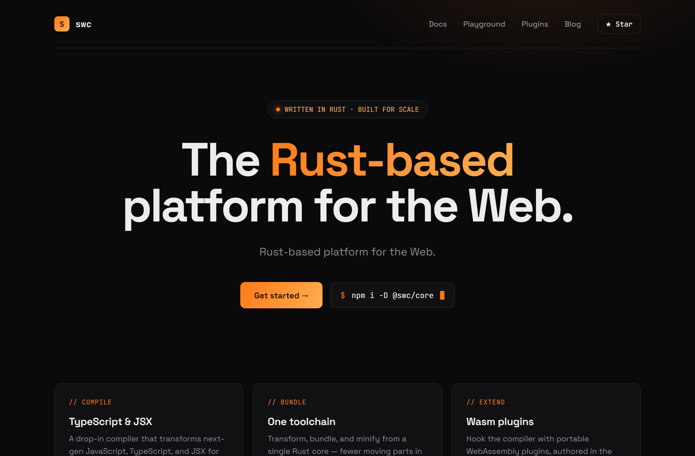

# Design Rep — Sunday, June 14

> 3 mocks — hud, editorial, terminal-dark

[Catalog](../../CATALOG.md) · [Home](../../README.md)

## [NVIDIA/SkillSpector](https://github.com/NVIDIA/SkillSpector)

- **Style:** hud / amber/green
- **Idea tested:** HUD as credible security instrument (threat readout + severity chips)
- **Verdict:** landed
- [live .html](./01-skillspector.html) · [repo on GitHub](https://github.com/NVIDIA/SkillSpector)

## [andrewyng/aisuite](https://github.com/andrewyng/aisuite)

- **Style:** editorial / forest
- **Idea tested:** sell "one interface" with a real provider-swap code panel
- **Verdict:** landed
- [live .html](./02-aisuite.html) · [repo on GitHub](https://github.com/andrewyng/aisuite)

## [swc-project/swc](https://github.com/swc-project/swc)

- **Style:** terminal-dark / ember
- **Idea tested:** single electric accent carrying a dark hero, no gradient slop
- **Verdict:** mostly (centered layout a touch familiar)
- [live .html](./03-swc.html) · [repo on GitHub](https://github.com/swc-project/swc)

