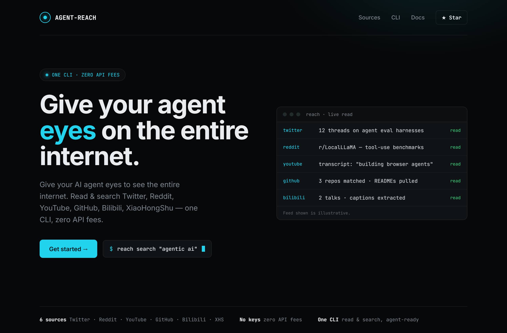
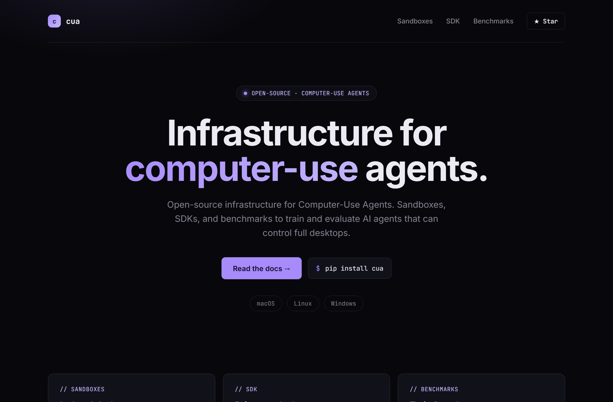
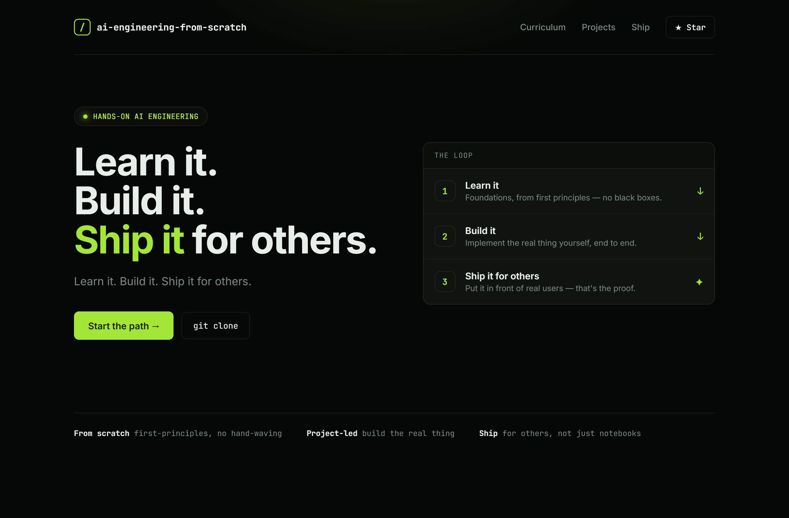

# Design Rep — Monday, June 15

> 3 mocks — terminal-dark

[Catalog](../../CATALOG.md) · [Home](../../README.md)

## [Panniantong/Agent-Reach](https://github.com/Panniantong/Agent-Reach)

- **Style:** terminal-dark / cyan
- **Idea tested:** live "read feed" panel makes "eyes on the internet" literal
- **Verdict:** landed
- [live .html](./01-agent-reach.html) · [repo on GitHub](https://github.com/Panniantong/Agent-Reach)

## [trycua/cua](https://github.com/trycua/cua)

- **Style:** terminal-dark / violet
- **Idea tested:** centered hero anchored by 3 real capability cards
- **Verdict:** mostly (centered = safe)
- [live .html](./02-cua.html) · [repo on GitHub](https://github.com/trycua/cua)

## [rohitg00/ai-engineering-from-scratch](https://github.com/rohitg00/ai-engineering-from-scratch)

- **Style:** terminal-dark / lime
- **Idea tested:** turn a 3-word tagline into a numbered Learn→Build→Ship pipeline
- **Verdict:** landed
- [live .html](./03-ai-engineering-from-scratch.html) · [repo on GitHub](https://github.com/rohitg00/ai-engineering-from-scratch)

