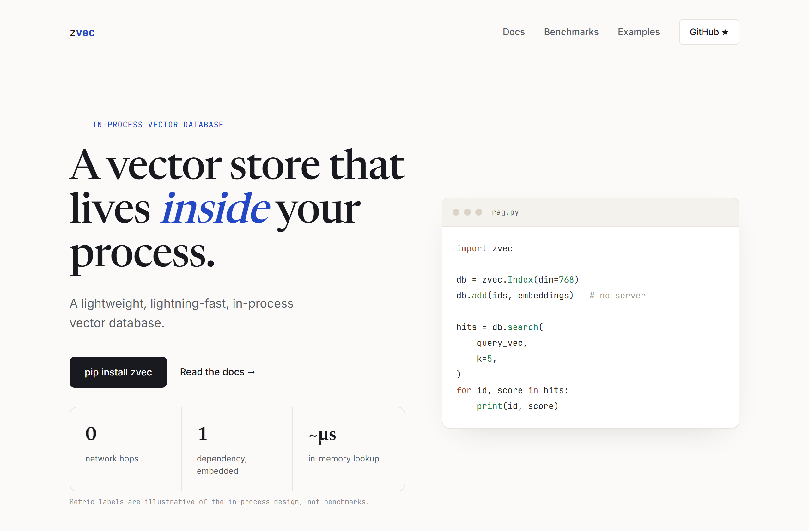
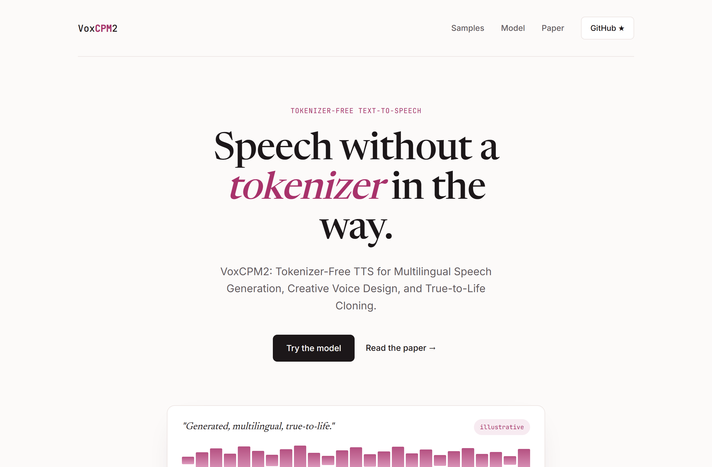
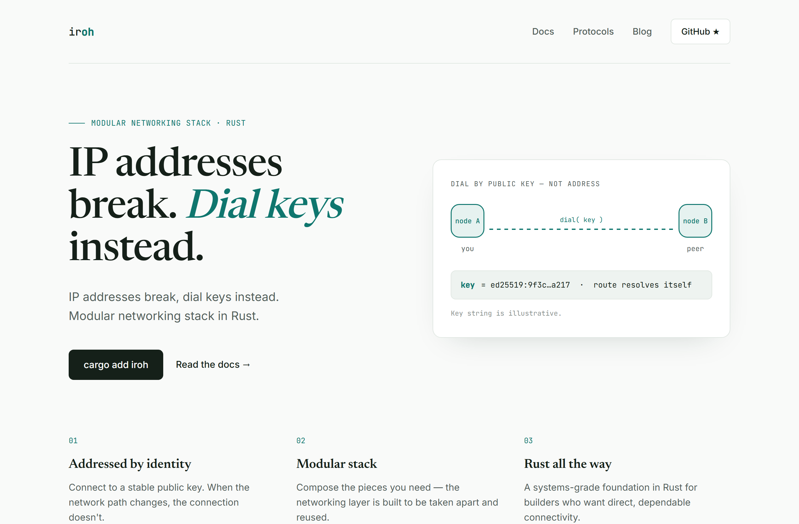

# Design Rep — Tuesday, June 16

> 3 mocks — editorial

[Catalog](../../CATALOG.md) · [Home](../../README.md)

## [alibaba/zvec](https://github.com/alibaba/zvec)

- **Style:** editorial / cobalt
- **Idea tested:** code panel + honest 0/1/µs architecture metric strip (no fake benchmarks)
- **Verdict:** landed
- [live .html](./01-zvec.html) · [repo on GitHub](https://github.com/alibaba/zvec)

## [OpenBMB/VoxCPM](https://github.com/OpenBMB/VoxCPM)

- **Style:** editorial / rose
- **Idea tested:** "show sound": centered hero over a single waveform player
- **Verdict:** mostly (static waveform leans on disclaimer)
- [live .html](./02-voxcpm.html) · [repo on GitHub](https://github.com/OpenBMB/VoxCPM)

## [n0-computer/iroh](https://github.com/n0-computer/iroh)

- **Style:** editorial / teal
- **Idea tested:** two-node "dial(key)" diagram replaces address with public key
- **Verdict:** landed
- [live .html](./03-iroh.html) · [repo on GitHub](https://github.com/n0-computer/iroh)

