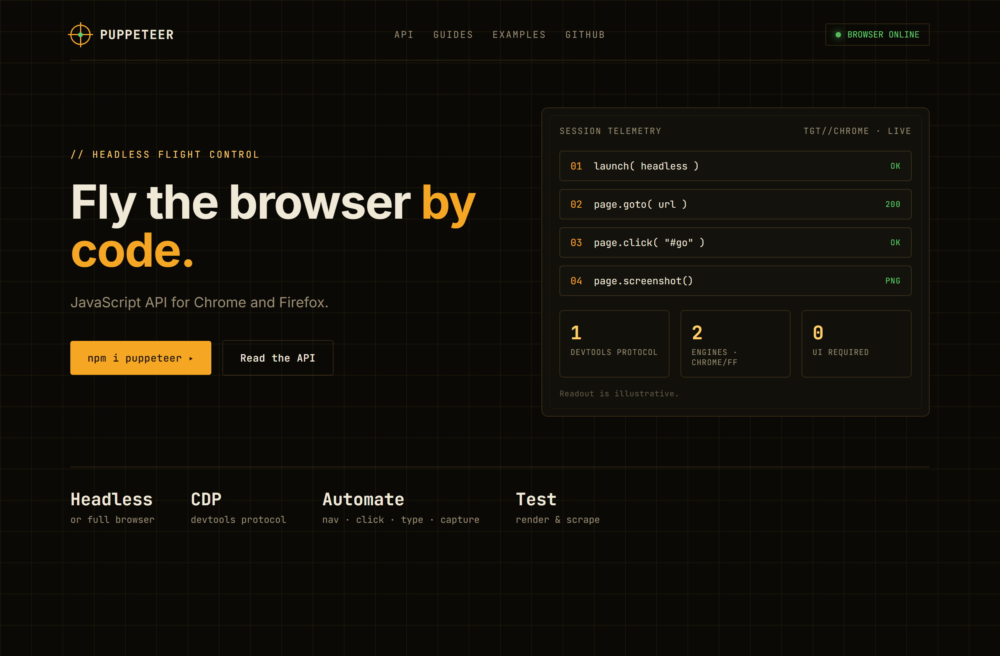
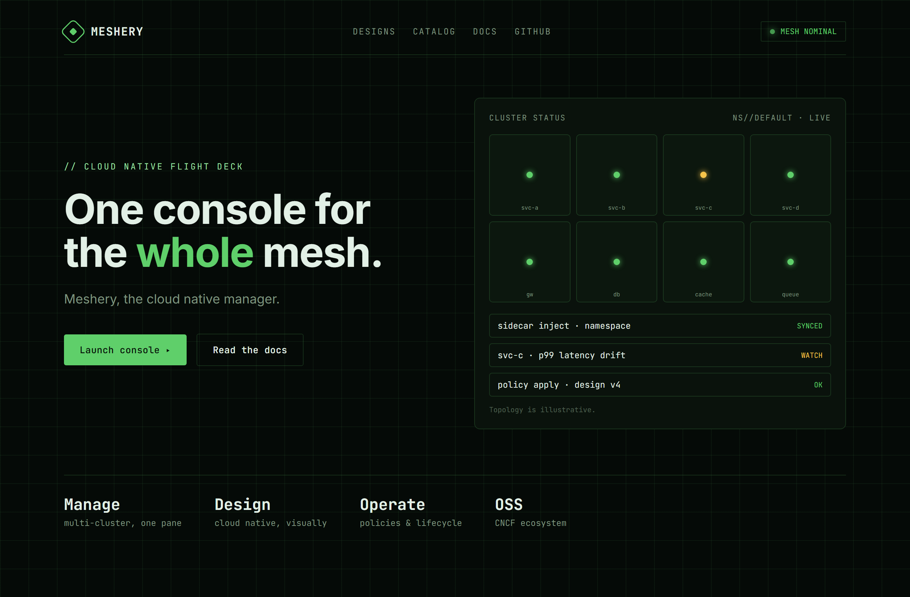
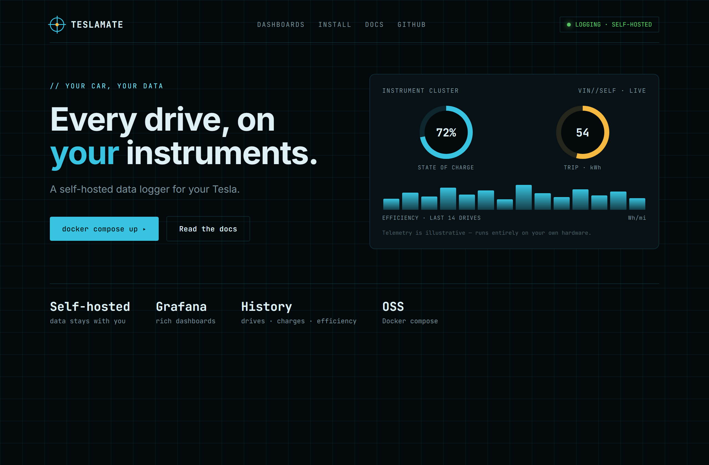

# Design Rep — Wednesday, June 17

> 3 mocks — hud

[Catalog](../../CATALOG.md) · [Home](../../README.md)

## [puppeteer/puppeteer](https://github.com/puppeteer/puppeteer)

- **Style:** hud / amber
- **Idea tested:** browser automation as "flight control": real script steps + honest capability gauges
- **Verdict:** landed
- [live .html](./01-puppeteer.html) · [repo on GitHub](https://github.com/puppeteer/puppeteer)

## [meshery/meshery](https://github.com/meshery/meshery)

- **Style:** hud / phosphor-green
- **Idea tested:** live cluster pod grid (one amber "watch" node) as a control-plane status surface
- **Verdict:** mostly (8 pods edge toward toy)
- [live .html](./02-meshery.html) · [repo on GitHub](https://github.com/meshery/meshery)

## [teslamate-org/teslamate](https://github.com/teslamate-org/teslamate)

- **Style:** hud / radar-cyan
- **Idea tested:** literal instrument cluster: conic-gradient dials + efficiency histogram, self-hosted footnote
- **Verdict:** landed
- [live .html](./03-teslamate.html) · [repo on GitHub](https://github.com/teslamate-org/teslamate)

