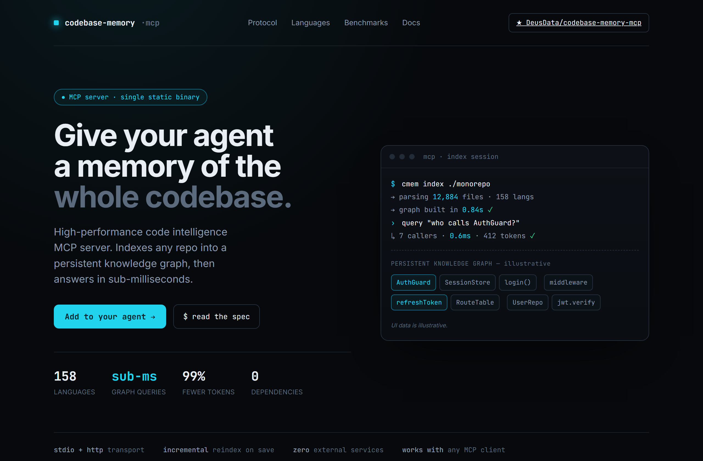
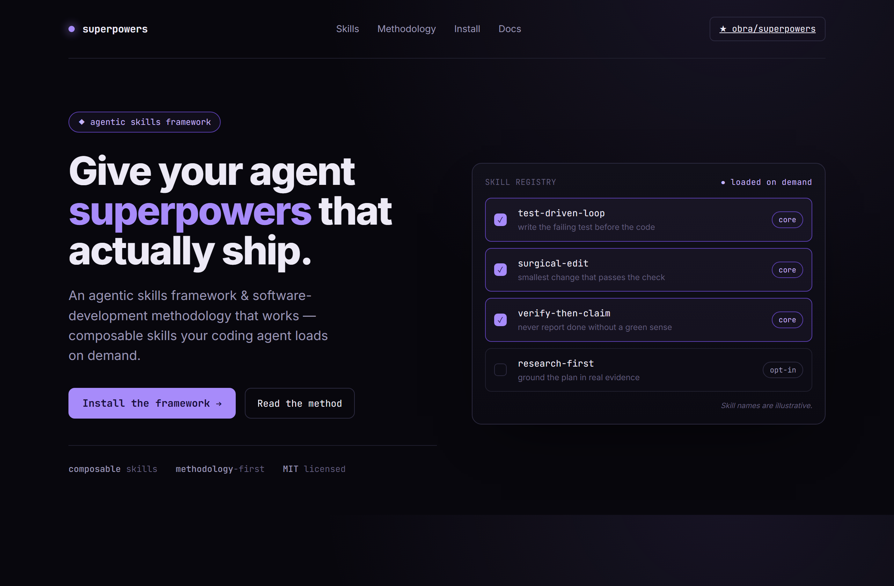
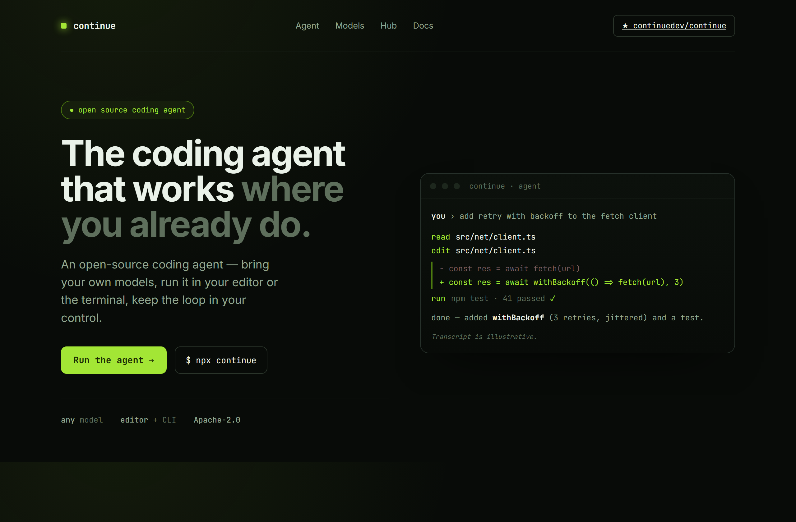

# Design Rep — Thursday, June 18

> 3 mocks — terminal-dark

[Catalog](../../CATALOG.md) · [Home](../../README.md)

## [DeusData/codebase-memory-mcp](https://github.com/DeusData/codebase-memory-mcp)

- **Style:** terminal-dark / cyan
- **Idea tested:** render the knowledge-graph output not a description
- **Verdict:** landed
- [live .html](./01-codebase-memory-mcp.html) · [repo on GitHub](https://github.com/DeusData/codebase-memory-mcp)

## [obra/superpowers](https://github.com/obra/superpowers)

- **Style:** terminal-dark / violet
- **Idea tested:** skills framework as a checkable on/off rack
- **Verdict:** mostly (sample reads thin)
- [live .html](./02-superpowers.html) · [repo on GitHub](https://github.com/obra/superpowers)

## [continuedev/continue](https://github.com/continuedev/continue)

- **Style:** terminal-dark / lime
- **Idea tested:** prove coding-agent with a compressed read→edit→test transcript
- **Verdict:** landed
- [live .html](./03-continue.html) · [repo on GitHub](https://github.com/continuedev/continue)

