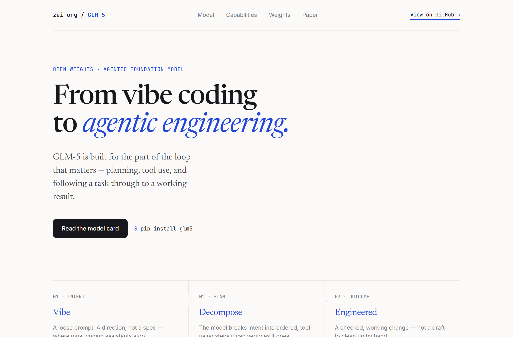
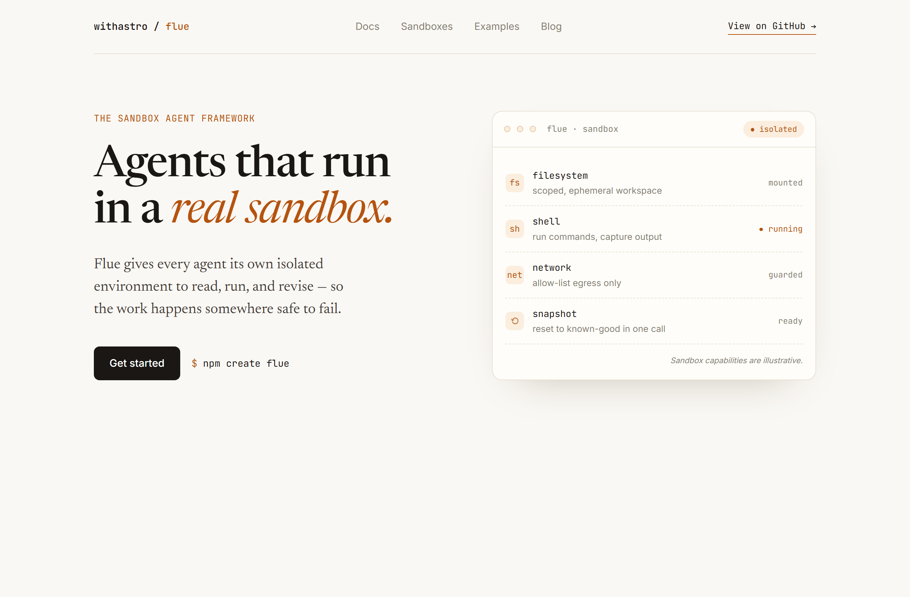
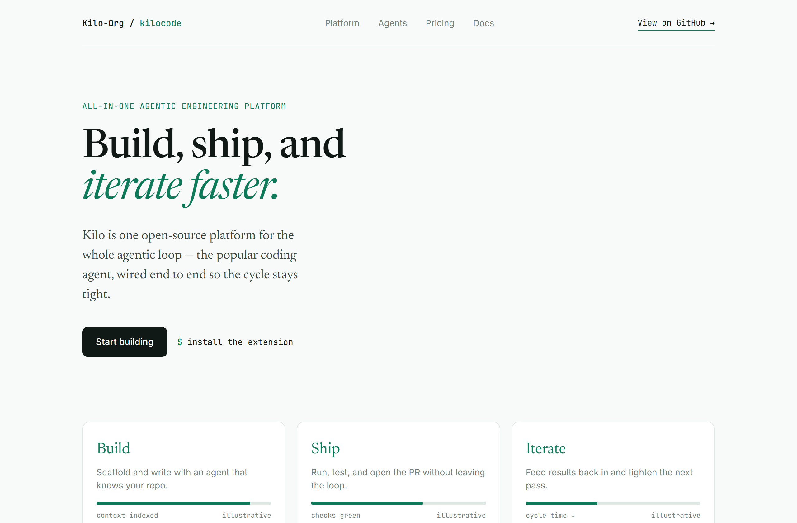

# Design Rep — Friday, June 19

> 3 mocks — editorial

[Catalog](../../CATALOG.md) · [Home](../../README.md)

## [zai-org/GLM-5](https://github.com/zai-org/GLM-5)

- **Style:** editorial / cobalt
- **Idea tested:** tagline as a literal Vibe→Decompose→Engineered arc
- **Verdict:** landed
- [live .html](./01-GLM-5.html) · [repo on GitHub](https://github.com/zai-org/GLM-5)

## [withastro/flue](https://github.com/withastro/flue)

- **Style:** editorial / amber
- **Idea tested:** draw the sandbox capability surface as a calm card
- **Verdict:** landed
- [live .html](./02-flue.html) · [repo on GitHub](https://github.com/withastro/flue)

## [Kilo-Org/kilocode](https://github.com/Kilo-Org/kilocode)

- **Style:** editorial / teal
- **Idea tested:** Build·Ship·Iterate as a descending-meter triad
- **Verdict:** mostly (symmetry risks template)
- [live .html](./03-kilocode.html) · [repo on GitHub](https://github.com/Kilo-Org/kilocode)

