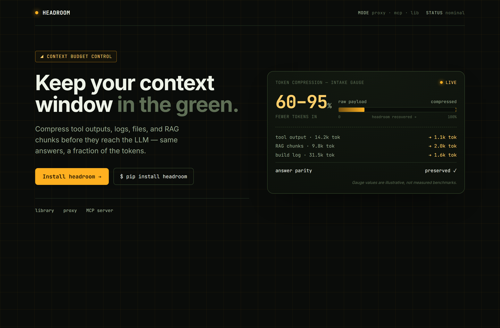
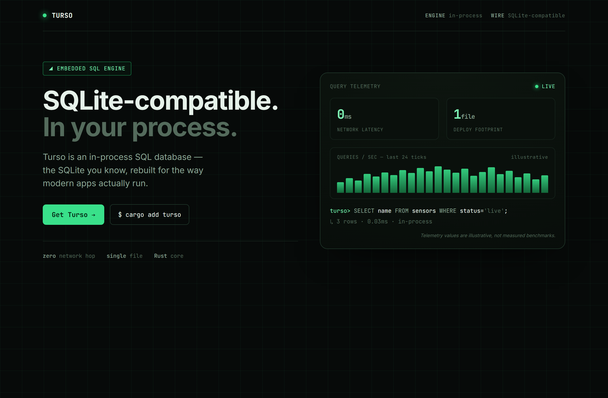
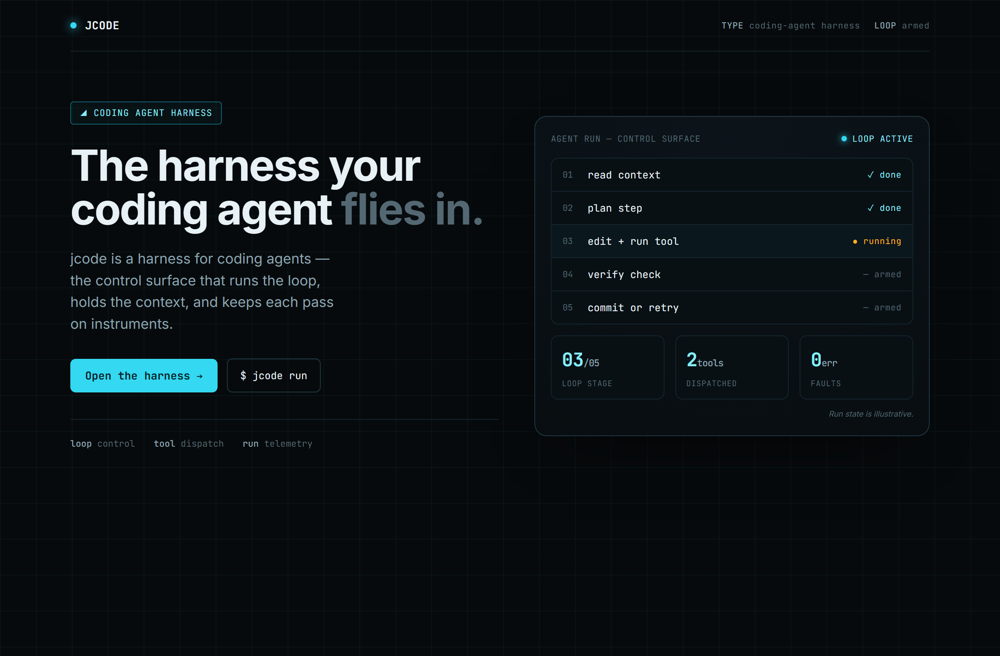

# Design Rep — Saturday, June 20

> 3 mocks — hud

[Catalog](../../CATALOG.md) · [Home](../../README.md)

## [chopratejas/headroom](https://github.com/chopratejas/headroom)

- **Style:** hud / amber
- **Idea tested:** token compression as a literal fuel/intake gauge
- **Verdict:** landed (most on-brand HUD subject of the week)
- [live .html](./01-headroom.html) · [repo on GitHub](https://github.com/chopratejas/headroom)

## [tursodatabase/turso](https://github.com/tursodatabase/turso)

- **Style:** hud / phosphor-green
- **Idea tested:** lead with 0ms network latency as the hero gauge
- **Verdict:** landed
- [live .html](./02-turso.html) · [repo on GitHub](https://github.com/tursodatabase/turso)

## [1jehuang/jcode](https://github.com/1jehuang/jcode)

- **Style:** hud / radar-cyan
- **Idea tested:** render the harness as a 5-stage run ladder for a tagline-less repo
- **Verdict:** mostly (metaphor carries more than the source proves)
- [live .html](./03-jcode.html) · [repo on GitHub](https://github.com/1jehuang/jcode)

