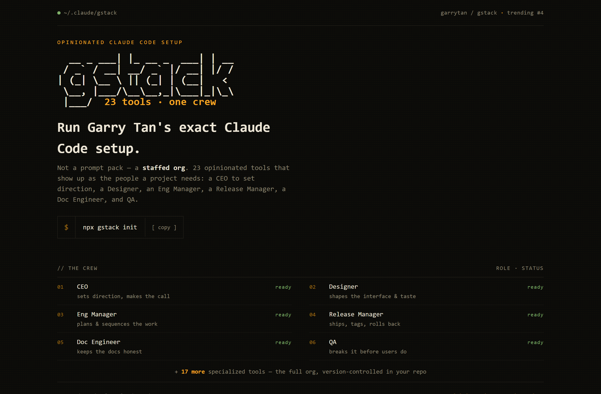
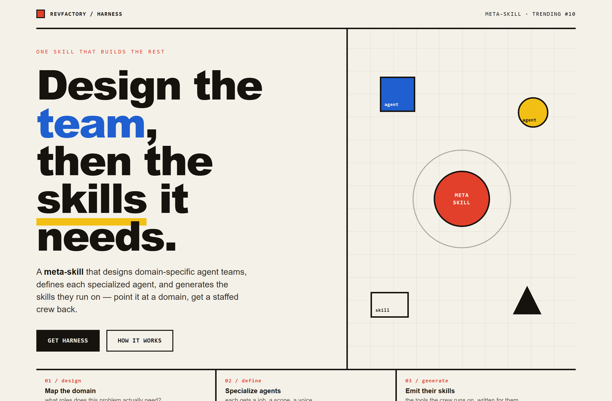
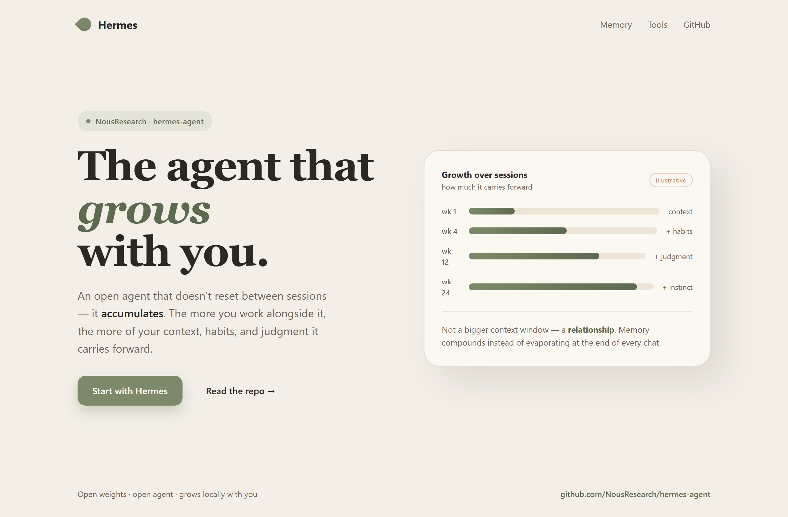

# Design Rep — Tuesday, June 23

> 3 mocks — mono-zine, bauhaus, warm-minimal

[Catalog](../../CATALOG.md) · [Home](../../README.md)

## [garrytan/gstack](https://github.com/garrytan/gstack)

- **Style:** mono-zine / amber
- **Idea tested:** cast the 23 tools as a literal crew roster in an all-mono terminal manifest
- **Verdict:** landed
- [live .html](./01-gstack.html) · [repo on GitHub](https://github.com/garrytan/gstack)

## [revfactory/harness](https://github.com/revfactory/harness)

- **Style:** bauhaus / primary
- **Idea tested:** meta-skill as a central node emitting geometric agents/skills on a drafting grid
- **Verdict:** landed
- [live .html](./02-harness.html) · [repo on GitHub](https://github.com/revfactory/harness)

## [NousResearch/hermes-agent](https://github.com/NousResearch/hermes-agent)

- **Style:** warm-minimal / sage
- **Idea tested:** a four-word tagline as a warm growth card compounding context to instinct
- **Verdict:** mostly (week figures are invented scaffolding)
- [live .html](./03-hermes-agent.html) · [repo on GitHub](https://github.com/NousResearch/hermes-agent)

