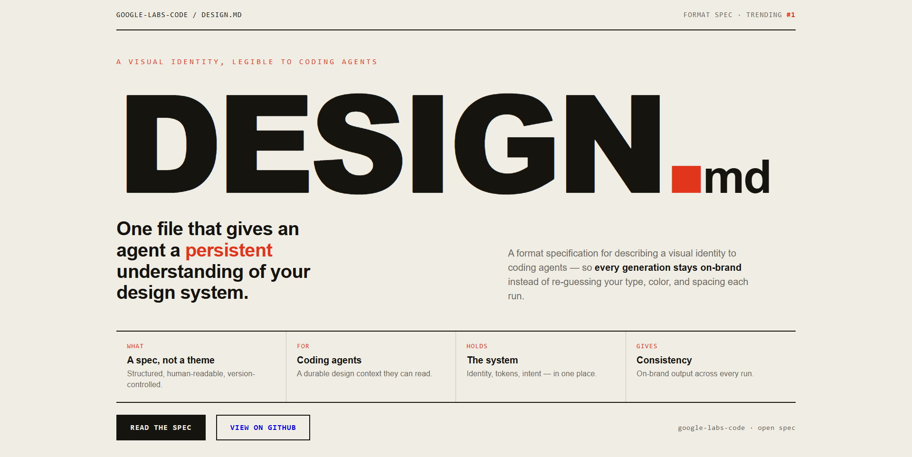
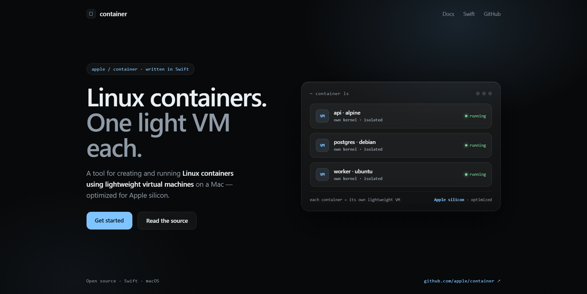
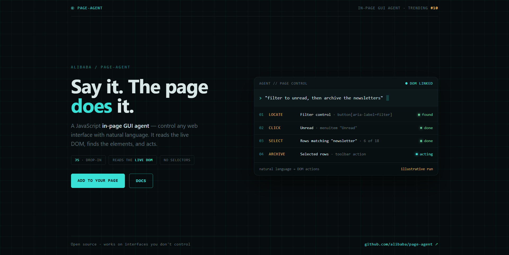

# Design Rep — Thursday, June 25

> 3 mocks — poster, glass, hud

[Catalog](../../CATALOG.md) · [Home](../../README.md)

## [google-labs-code/design.md](https://github.com/google-labs-code/design.md)

- **Style:** poster / ink
- **Idea tested:** filename as hero, four-cell what/for/holds/gives strip
- **Verdict:** landed
- [live .html](./01-design.md.html) · [repo on GitHub](https://github.com/google-labs-code/design.md)

## [apple/container](https://github.com/apple/container)

- **Style:** glass / frost-blue
- **Idea tested:** one frosted panel, each row its own lightweight VM
- **Verdict:** landed
- [live .html](./02-container.html) · [repo on GitHub](https://github.com/apple/container)

## [alibaba/page-agent](https://github.com/alibaba/page-agent)

- **Style:** hud / scan-cyan
- **Idea tested:** agent as instrument readout, NL command to LOCATE-CLICK-SELECT-ARCHIVE ladder
- **Verdict:** mostly
- [live .html](./03-page-agent.html) · [repo on GitHub](https://github.com/alibaba/page-agent)

