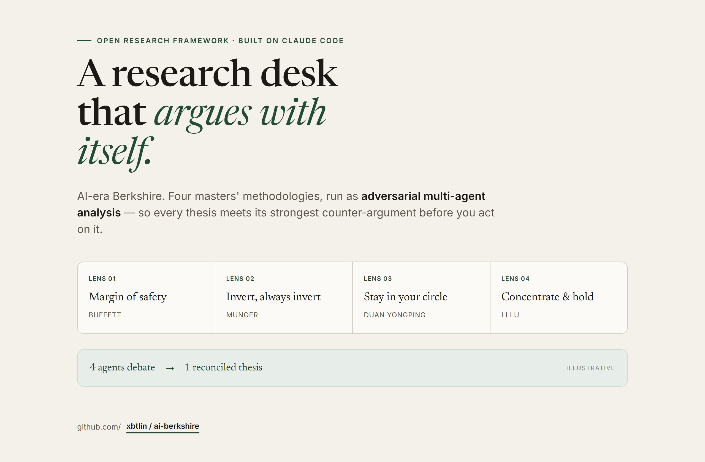
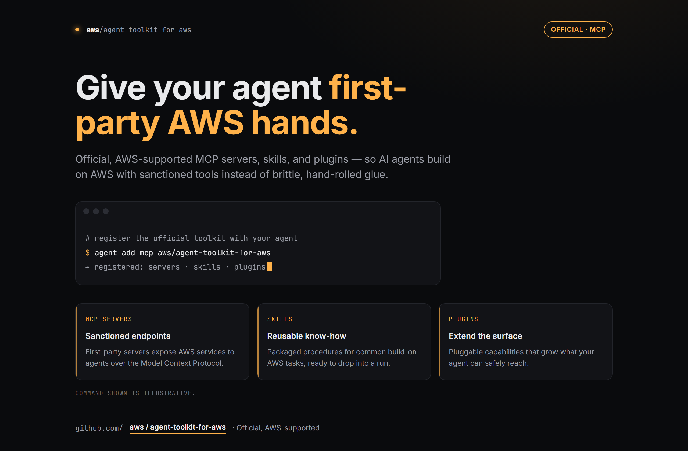
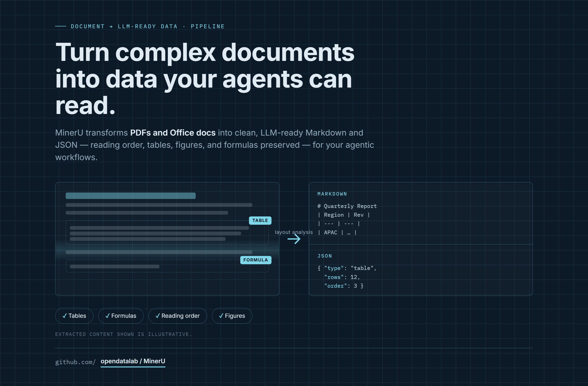

# Design Rep — Friday, June 26

> 3 mocks — editorial, terminal-dark, blueprint

[Catalog](../../CATALOG.md) · [Home](../../README.md)

## [xbtlin/ai-berkshire](https://github.com/xbtlin/ai-berkshire)

- **Style:** editorial / forest-green
- **Idea tested:** research desk that argues with itself, four lenses converge to one thesis
- **Verdict:** landed
- [live .html](./01-ai-berkshire.html) · [repo on GitHub](https://github.com/xbtlin/ai-berkshire)

## [aws/agent-toolkit-for-aws](https://github.com/aws/agent-toolkit-for-aws)

- **Style:** terminal-dark / amber
- **Idea tested:** give your agent first-party AWS hands, register-the-toolkit terminal + 3 cards
- **Verdict:** landed
- [live .html](./02-agent-toolkit-for-aws.html) · [repo on GitHub](https://github.com/aws/agent-toolkit-for-aws)

## [opendatalab/MinerU](https://github.com/opendatalab/MinerU)

- **Style:** blueprint / cyan
- **Idea tested:** make the extraction the hero, scan to layout analysis to tagged Markdown/JSON
- **Verdict:** landed
- [live .html](./03-MinerU.html) · [repo on GitHub](https://github.com/opendatalab/MinerU)

