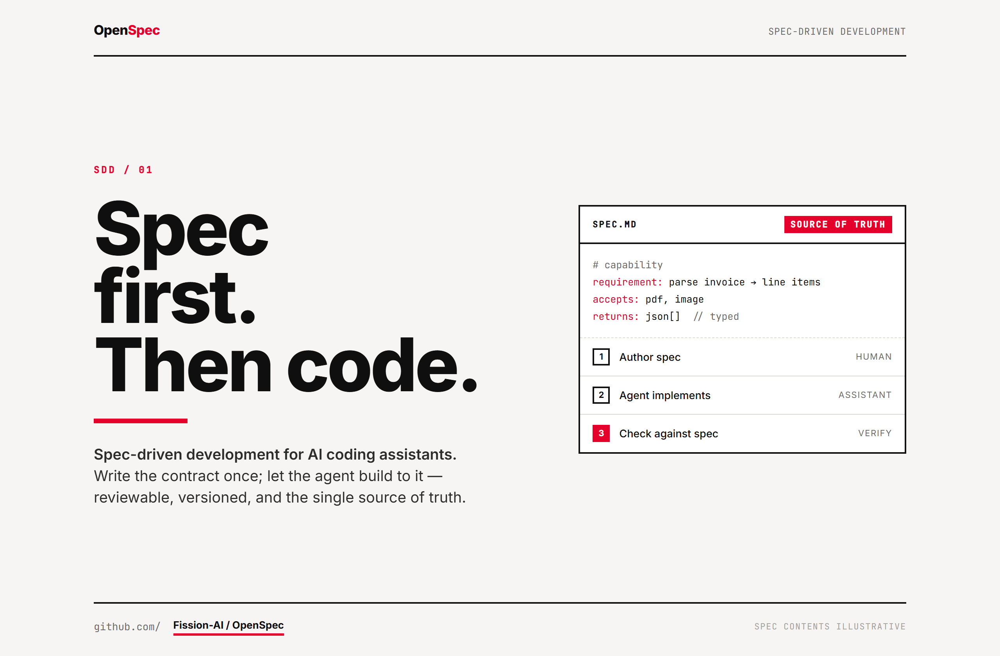
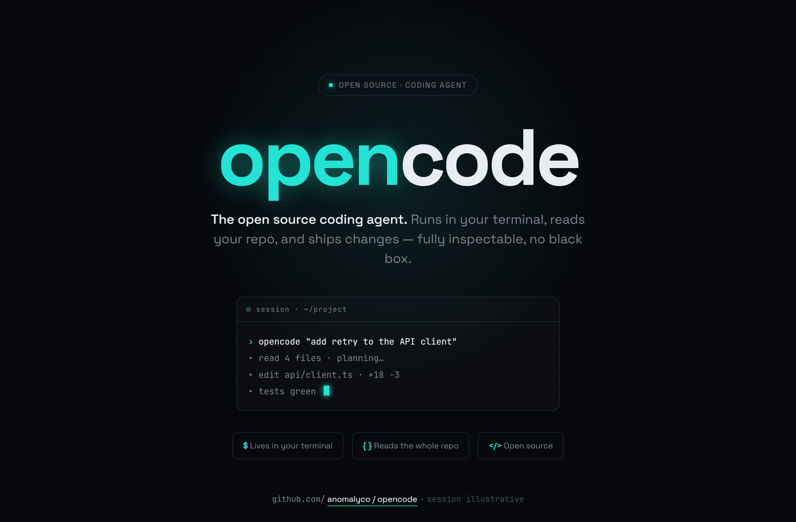
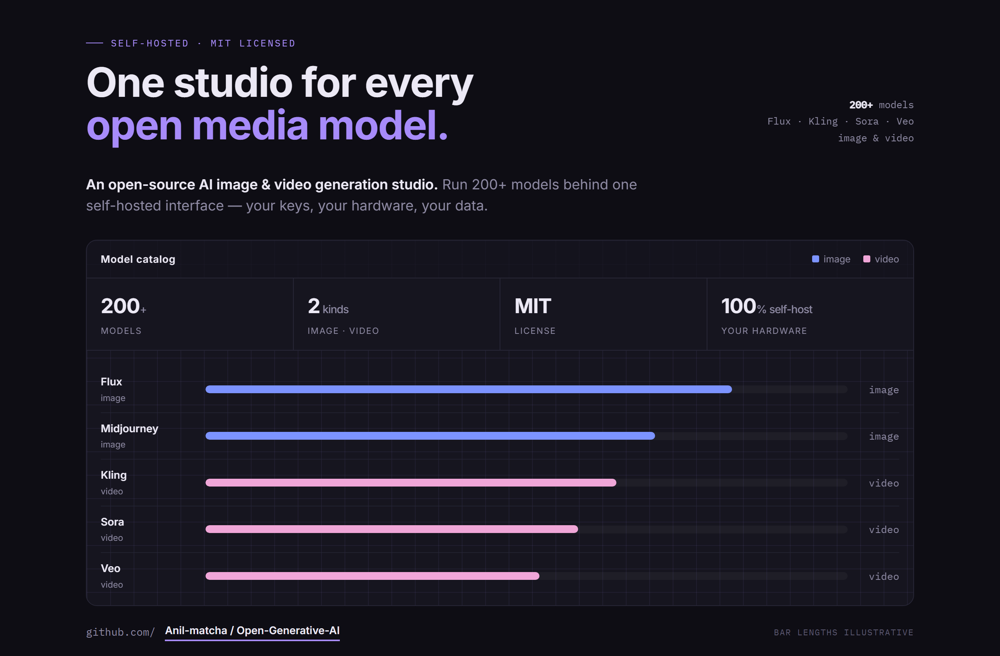

# Design Rep — Saturday, June 27

> 3 mocks — swiss, neon-noir, data-viz

[Catalog](../../CATALOG.md) · [Home](../../README.md)

## [Fission-AI/OpenSpec](https://github.com/Fission-AI/OpenSpec)

- **Style:** swiss / red
- **Idea tested:** spec.md as single source of truth feeding author-implement-verify ladder
- **Verdict:** landed
- [live .html](./01-OpenSpec.html) · [repo on GitHub](https://github.com/Fission-AI/OpenSpec)

## [anomalyco/opencode](https://github.com/anomalyco/opencode)

- **Style:** neon-noir / cyan
- **Idea tested:** neon exactly once, cyan wordmark glow over inspectable terminal session
- **Verdict:** mostly
- [live .html](./02-opencode.html) · [repo on GitHub](https://github.com/anomalyco/opencode)

## [Anil-matcha/Open-Generative-AI](https://github.com/Anil-matcha/Open-Generative-AI)

- **Style:** data-viz / violet
- **Idea tested:** 200+ models as a working model-catalog console with family bars
- **Verdict:** landed
- [live .html](./03-Open-Generative-AI.html) · [repo on GitHub](https://github.com/Anil-matcha/Open-Generative-AI)

