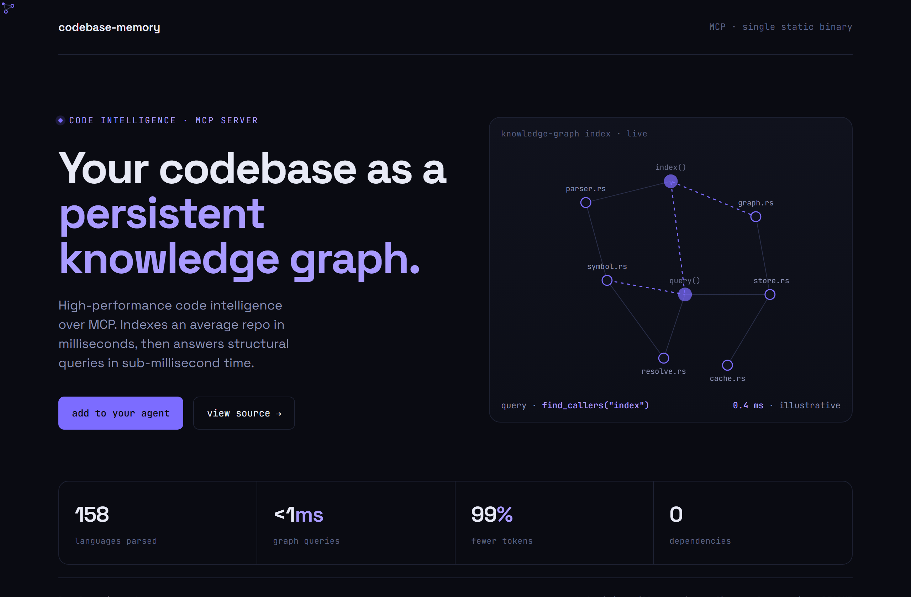
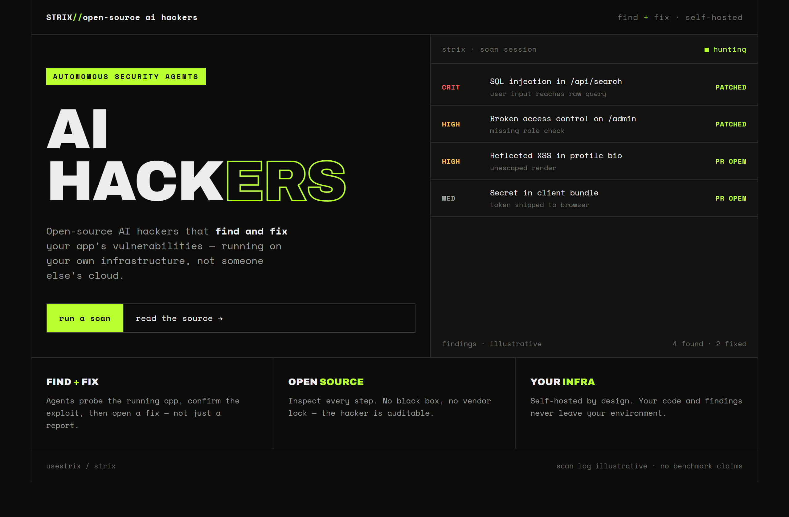
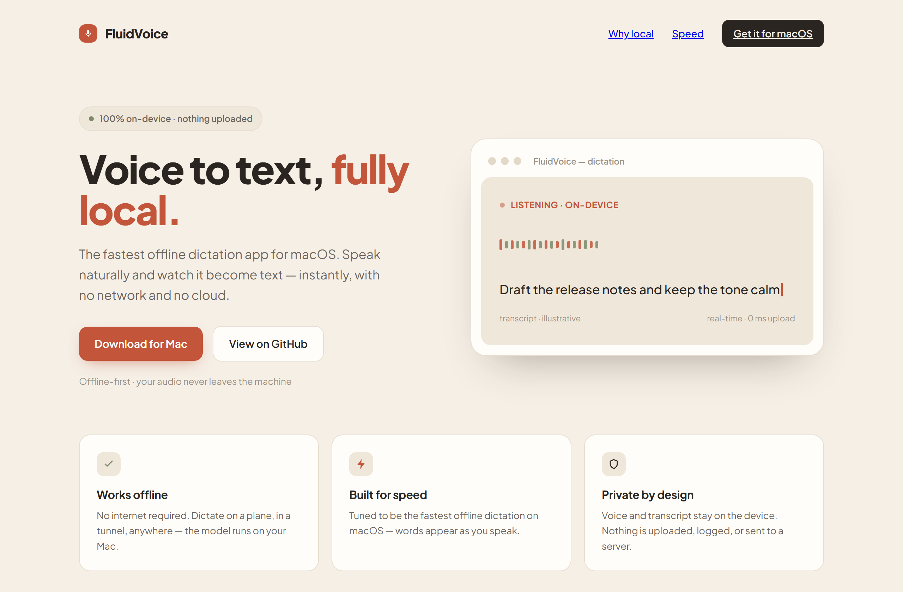

# Design Rep — Sunday, June 28

> 3 mocks — constellation, brutalist, warm-minimal

[Catalog](../../CATALOG.md) · [Home](../../README.md)

## [DeusData/codebase-memory-mcp](https://github.com/DeusData/codebase-memory-mcp)

- **Style:** constellation / electric-indigo
- **Idea tested:** codebase as a living knowledge graph, two live edges show a query traversing
- **Verdict:** landed
- [live .html](./01-codebase-memory-mcp.html) · [repo on GitHub](https://github.com/DeusData/codebase-memory-mcp)

## [usestrix/strix](https://github.com/usestrix/strix)

- **Style:** brutalist / acid-green
- **Idea tested:** security agent as a hard-edged find→fix scan log, one acid accent
- **Verdict:** landed
- [live .html](./02-strix.html) · [repo on GitHub](https://github.com/usestrix/strix)

## [altic-dev/FluidVoice](https://github.com/altic-dev/FluidVoice)

- **Style:** warm-minimal / terracotta
- **Idea tested:** fully-local dictation as a soft cream device, waveform becomes text
- **Verdict:** landed
- [live .html](./03-FluidVoice.html) · [repo on GitHub](https://github.com/altic-dev/FluidVoice)

