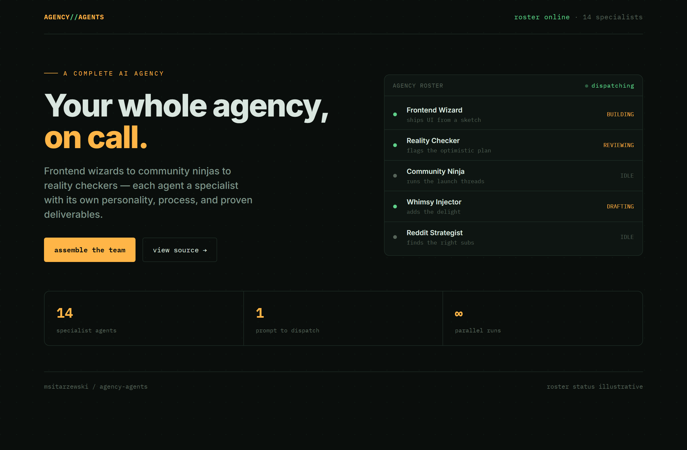
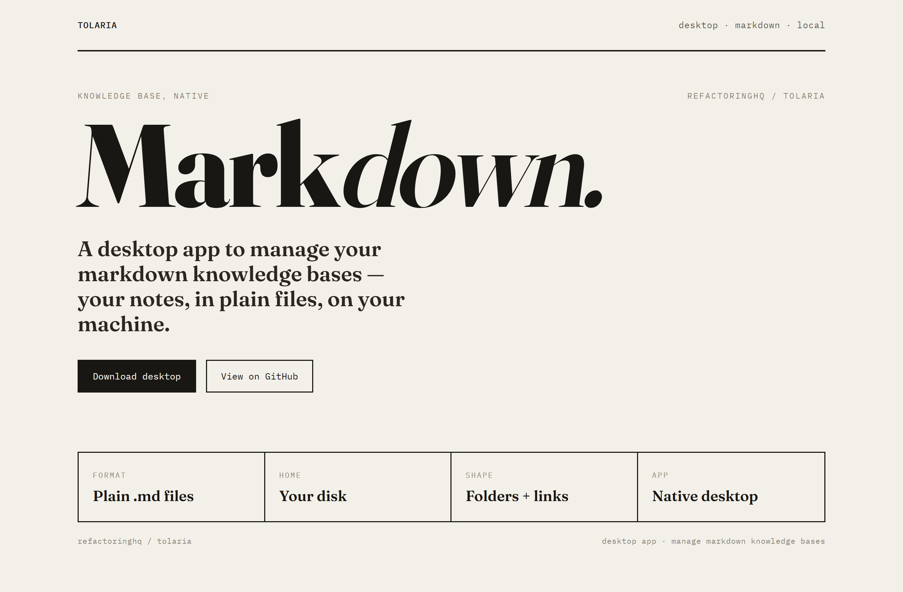
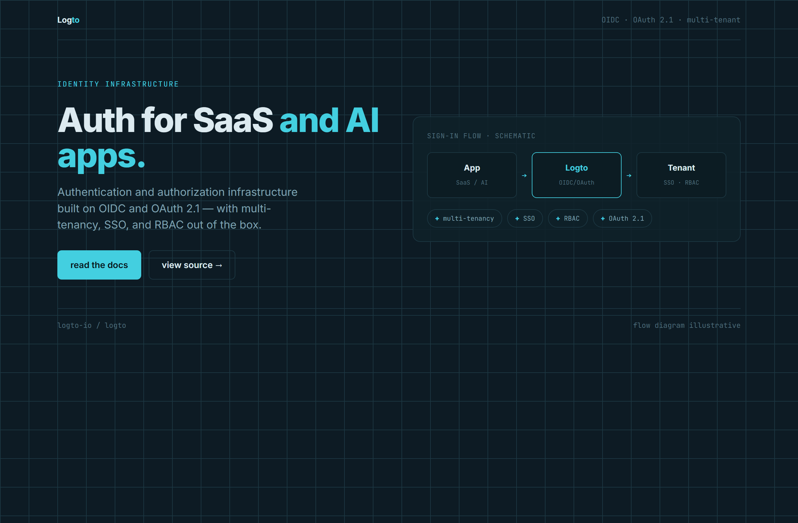

# Design Rep — Monday, June 29

> 3 mocks — hud, poster, blueprint

[Catalog](../../CATALOG.md) · [Home](../../README.md)

## [msitarzewski/agency-agents](https://github.com/msitarzewski/agency-agents)

- **Style:** hud / amber
- **Idea tested:** multi-agent crew as a live instrument panel with status LEDs
- **Verdict:** landed
- [live .html](./01-agency-agents.html) · [repo on GitHub](https://github.com/msitarzewski/agency-agents)

## [refactoringhq/tolaria](https://github.com/refactoringhq/tolaria)

- **Style:** poster / ink
- **Idea tested:** markdown as the hero, giant italic serif over a four-cell spec strip
- **Verdict:** landed
- [live .html](./02-tolaria.html) · [repo on GitHub](https://github.com/refactoringhq/tolaria)

## [logto-io/logto](https://github.com/logto-io/logto)

- **Style:** blueprint / cyan
- **Idea tested:** auth value as App→Logto→Tenant schematic on a drafting grid
- **Verdict:** landed
- [live .html](./03-logto.html) · [repo on GitHub](https://github.com/logto-io/logto)

