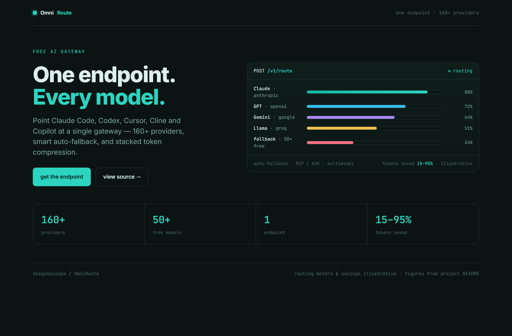
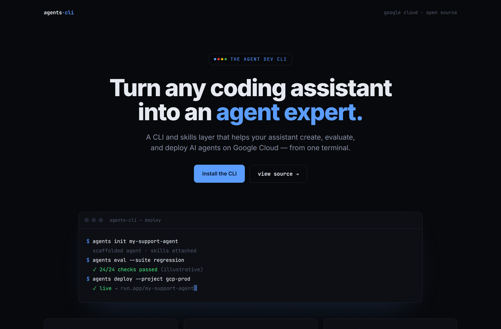
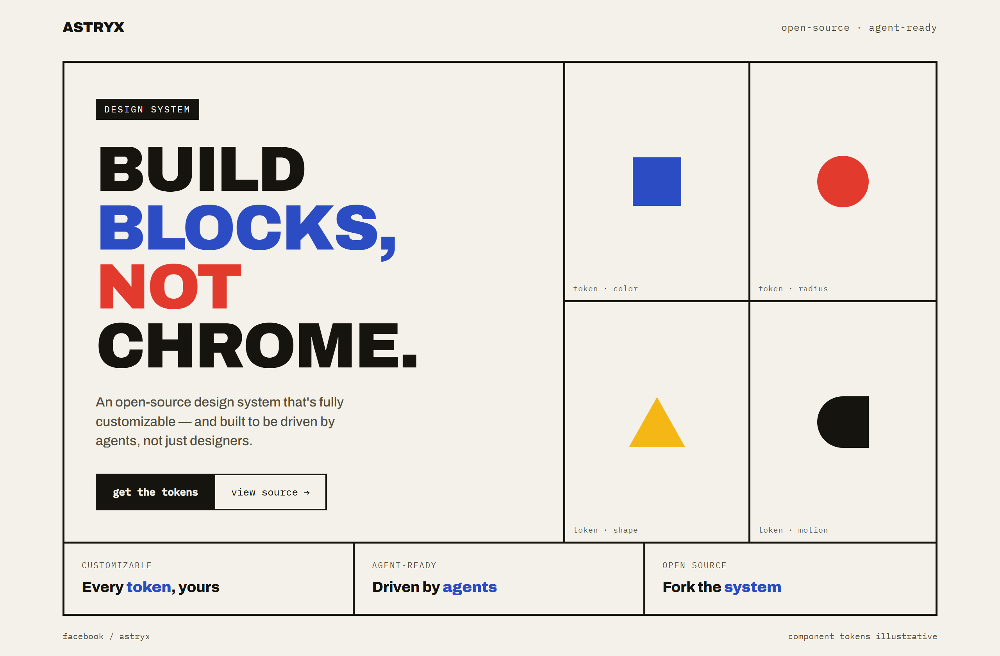

# Design Rep — Tuesday, June 30

> 3 mocks — data-viz, terminal-dark, bauhaus

[Catalog](../../CATALOG.md) · [Home](../../README.md)

## [diegosouzapw/OmniRoute](https://github.com/diegosouzapw/OmniRoute)

- **Style:** data-viz / teal
- **Idea tested:** AI gateway as a live routing console, provider lanes with utilization meters
- **Verdict:** landed
- [live .html](./01-OmniRoute.html) · [repo on GitHub](https://github.com/diegosouzapw/OmniRoute)

## [google/agents-cli](https://github.com/google/agents-cli)

- **Style:** terminal-dark / google-blue
- **Idea tested:** center the story on one terminal walking create→evaluate→deploy
- **Verdict:** landed
- [live .html](./02-agents-cli.html) · [repo on GitHub](https://github.com/google/agents-cli)

## [facebook/astryx](https://github.com/facebook/astryx)

- **Style:** bauhaus / primary
- **Idea tested:** show a design system AS primitives, a four-cell token wall of shapes
- **Verdict:** landed
- [live .html](./03-astryx.html) · [repo on GitHub](https://github.com/facebook/astryx)

