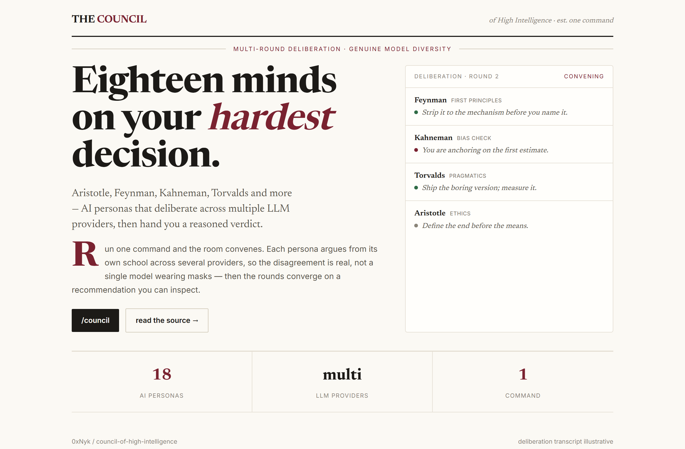
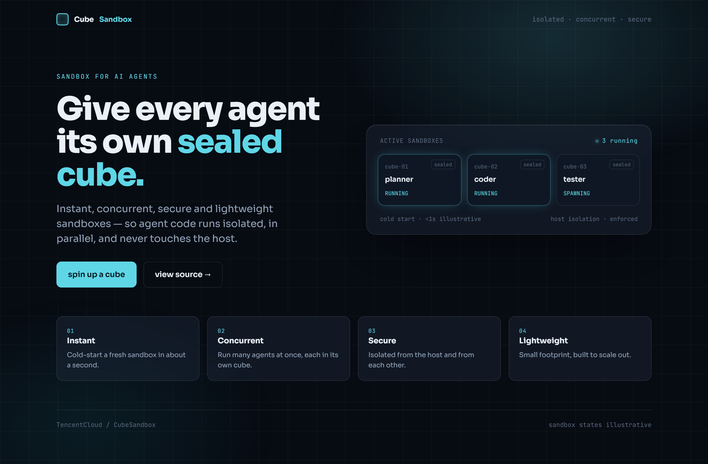
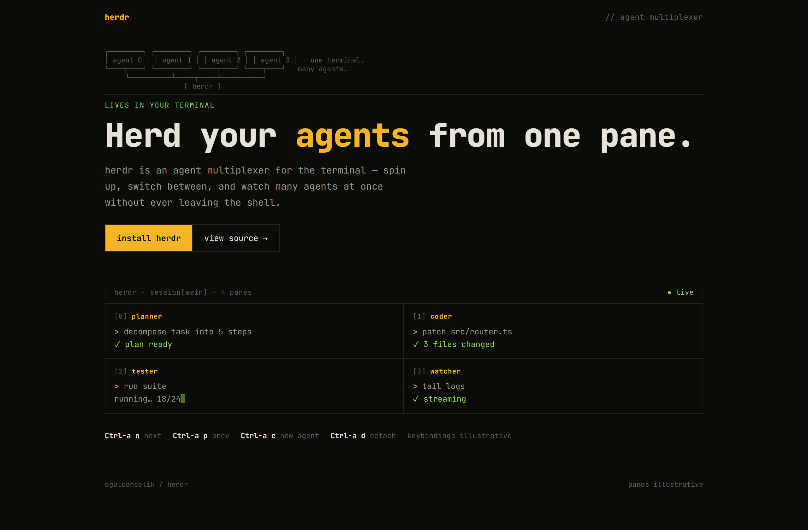

# Design Rep — Wednesday, July 1

> 3 mocks — editorial, glass, mono-zine

[Catalog](../../CATALOG.md) · [Home](../../README.md)

## [0xNyk/council-of-high-intelligence](https://github.com/0xNyk/council-of-high-intelligence)

- **Style:** editorial / burgundy
- **Idea tested:** 18 personas as a newspaper council with a live for/against/abstain deliberation column
- **Verdict:** landed
- [live .html](./01-council-of-high-intelligence.html) · [repo on GitHub](https://github.com/0xNyk/council-of-high-intelligence)

## [TencentCloud/CubeSandbox](https://github.com/TencentCloud/CubeSandbox)

- **Style:** glass / frost-cyan
- **Idea tested:** make isolation visible, one frosted panel holding three sealed agent cubes
- **Verdict:** landed
- [live .html](./02-CubeSandbox.html) · [repo on GitHub](https://github.com/TencentCloud/CubeSandbox)

## [ogulcancelik/herdr](https://github.com/ogulcancelik/herdr)

- **Style:** mono-zine / amber
- **Idea tested:** multiplexer as an ASCII fan-in over a four-pane terminal split
- **Verdict:** landed
- [live .html](./03-herdr.html) · [repo on GitHub](https://github.com/ogulcancelik/herdr)

