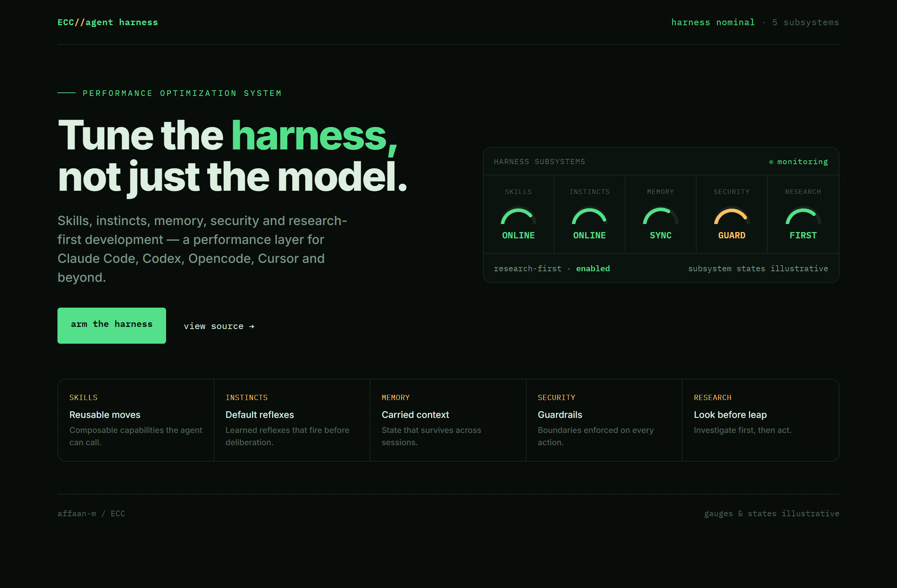
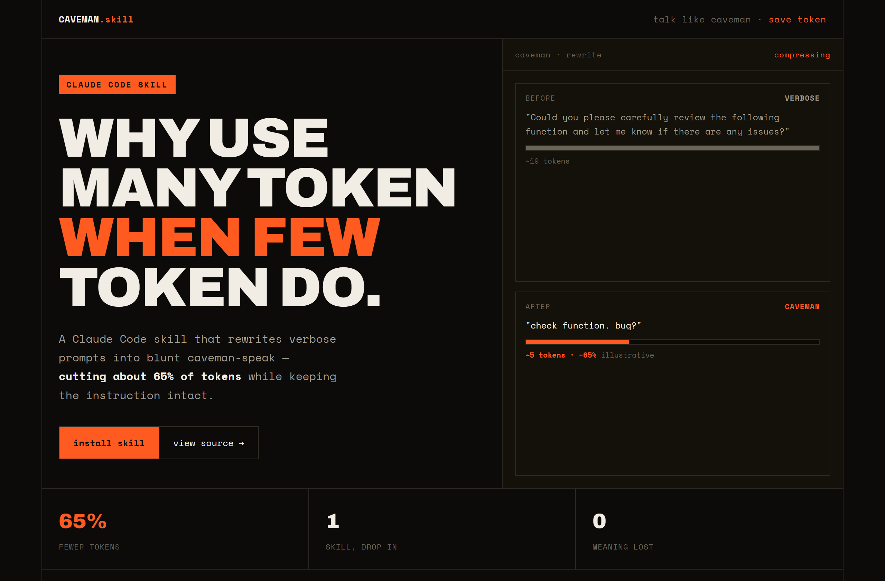
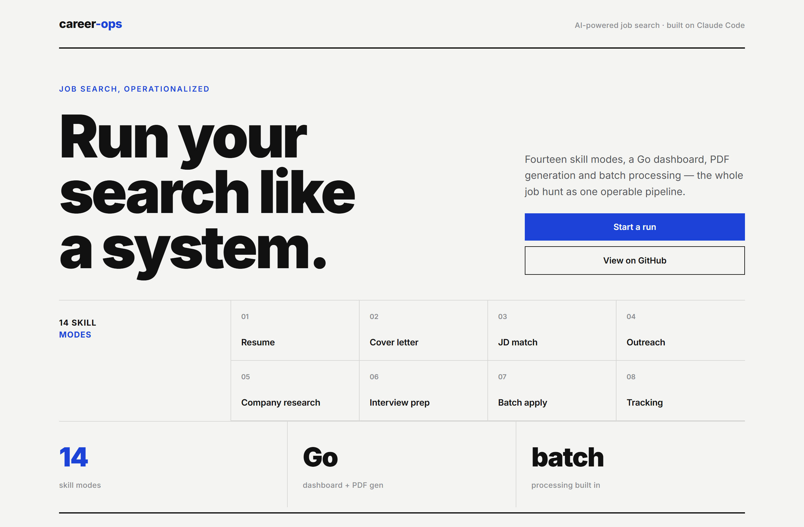

# Design Rep — Thursday, July 2

> 3 mocks — hud, brutalist, swiss

[Catalog](../../CATALOG.md) · [Home](../../README.md)

## [affaan-m/ECC](https://github.com/affaan-m/ECC)

- **Style:** hud / phosphor-green
- **Idea tested:** agent harness as an instrument panel, five subsystem gauges reading nominal
- **Verdict:** landed
- [live .html](./01-ECC.html) · [repo on GitHub](https://github.com/affaan-m/ECC)

## [JuliusBrussee/caveman](https://github.com/JuliusBrussee/caveman)

- **Style:** brutalist / orange
- **Idea tested:** headline is the joke, before/after token bar visibly shrinks to prove 65%
- **Verdict:** landed
- [live .html](./02-caveman.html) · [repo on GitHub](https://github.com/JuliusBrussee/caveman)

## [santifer/career-ops](https://github.com/santifer/career-ops)

- **Style:** swiss / cobalt
- **Idea tested:** run your search like a system, numbered 01-14 mode index on a 12-col grid
- **Verdict:** landed
- [live .html](./03-career-ops.html) · [repo on GitHub](https://github.com/santifer/career-ops)

