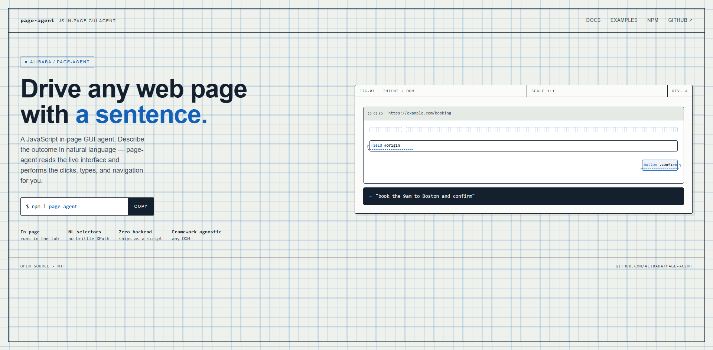
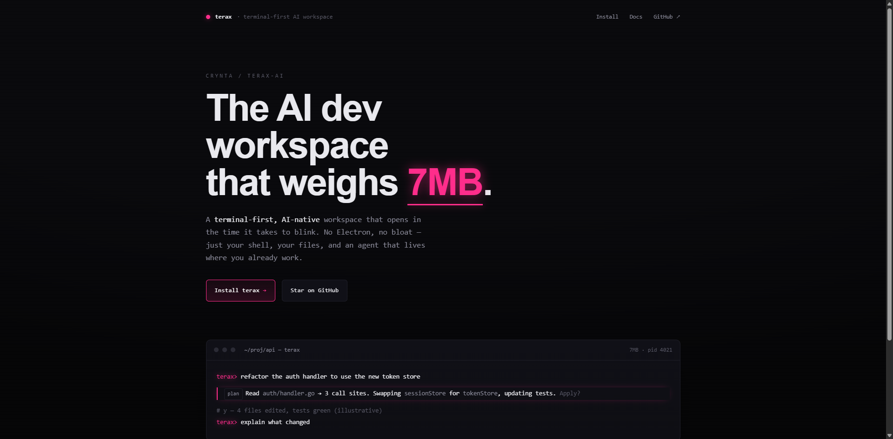
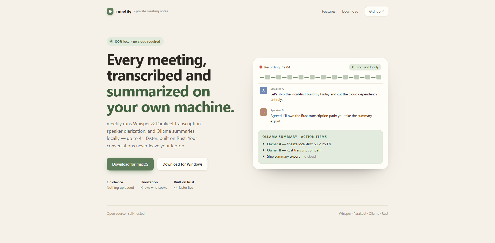

# Design Rep — Sunday, July 5

> 3 mocks — blueprint, neon-noir, warm-minimal

[Catalog](../../CATALOG.md) · [Home](../../README.md)

## [alibaba/page-agent](https://github.com/alibaba/page-agent)

- **Style:** blueprint / blueprint-blue
- **Idea tested:** natural-language→DOM as an annotated page schematic with element callouts
- **Verdict:** landed
- [live .html](./01-page-agent.html) · [repo on GitHub](https://github.com/alibaba/page-agent)

## [crynta/terax-ai](https://github.com/crynta/terax-ai)

- **Style:** neon-noir / magenta
- **Idea tested:** sell "featherweight" with near-total restraint, one neon accent on the 7MB claim
- **Verdict:** landed
- [live .html](./02-terax-ai.html) · [repo on GitHub](https://github.com/crynta/terax-ai)

## [Zackriya-Solutions/meetily](https://github.com/Zackriya-Solutions/meetily)

- **Style:** warm-minimal / sage
- **Idea tested:** make "100% local, no cloud" feel calm via a soft cream device, transcription→summary
- **Verdict:** landed
- [live .html](./03-meetily.html) · [repo on GitHub](https://github.com/Zackriya-Solutions/meetily)

