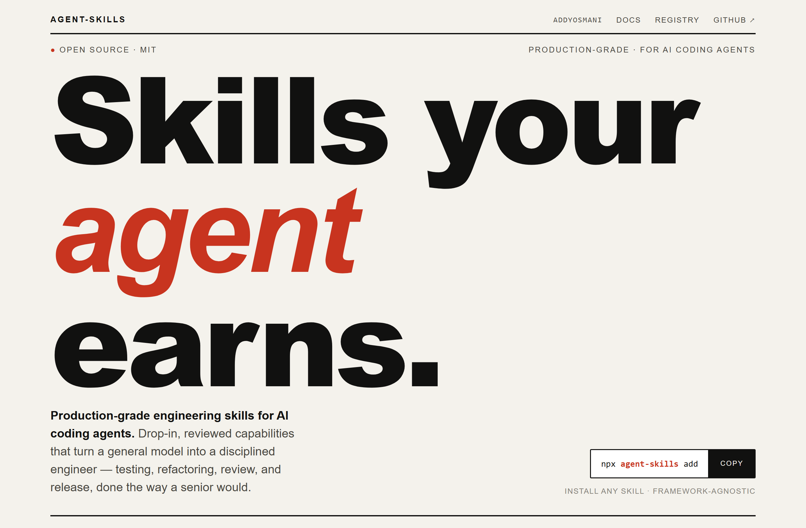
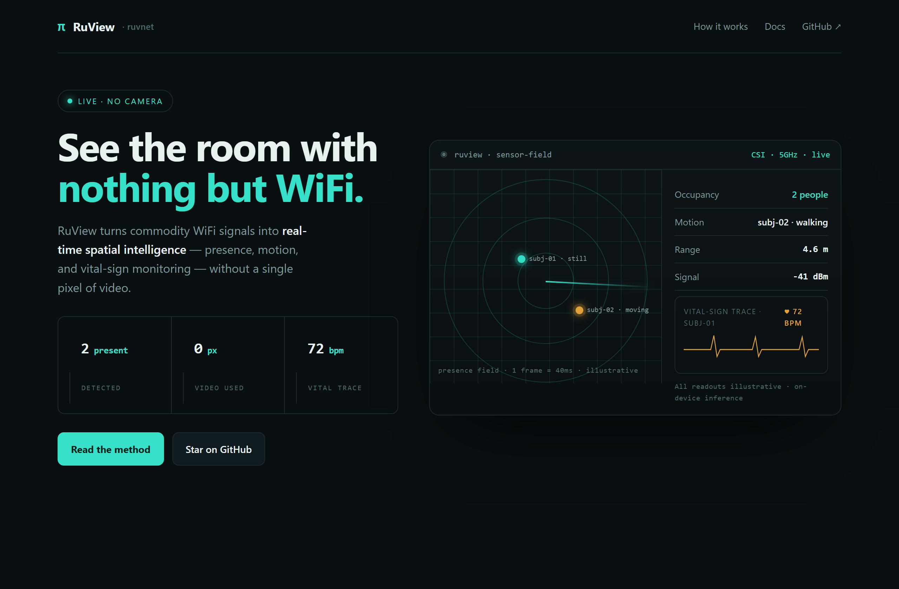
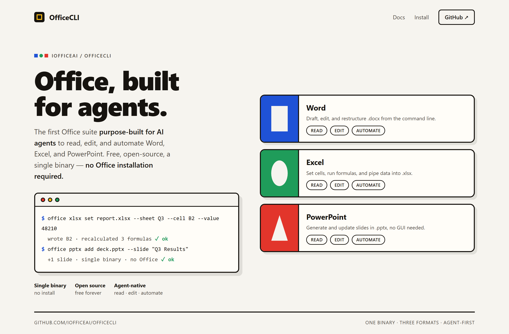

# Design Rep — Tuesday, July 7

> 3 mocks — poster, data-viz, bauhaus

[Catalog](../../CATALOG.md) · [Home](../../README.md)

## [addyosmani/agent-skills](https://github.com/addyosmani/agent-skills)

- **Style:** poster / ink-red
- **Idea tested:** poster-scale headline carries a skills catalog, restrained numbered index underneath
- **Verdict:** landed
- [live .html](./01-agent-skills.html) · [repo on GitHub](https://github.com/addyosmani/agent-skills)

## [ruvnet/RuView](https://github.com/ruvnet/RuView)

- **Style:** data-viz / signal-cyan
- **Idea tested:** show the sensor not the words: presence radar + vital-sign trace for camera-free WiFi sensing
- **Verdict:** landed
- [live .html](./02-RuView.html) · [repo on GitHub](https://github.com/ruvnet/RuView)

## [iOfficeAI/OfficeCLI](https://github.com/iOfficeAI/OfficeCLI)

- **Style:** bauhaus / primary
- **Idea tested:** map Word/Excel/PowerPoint to square/circle/triangle primitives unified by one CLI
- **Verdict:** landed
- [live .html](./03-OfficeCLI.html) · [repo on GitHub](https://github.com/iOfficeAI/OfficeCLI)

