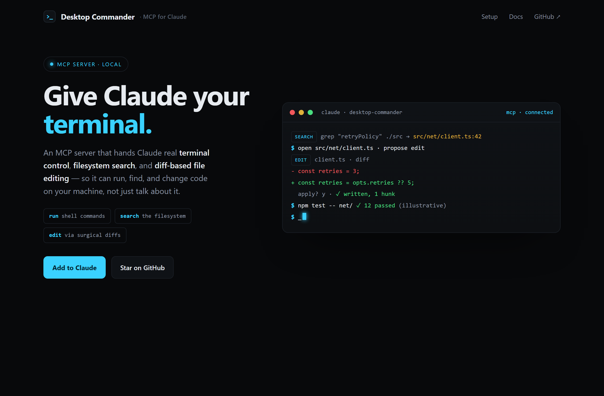
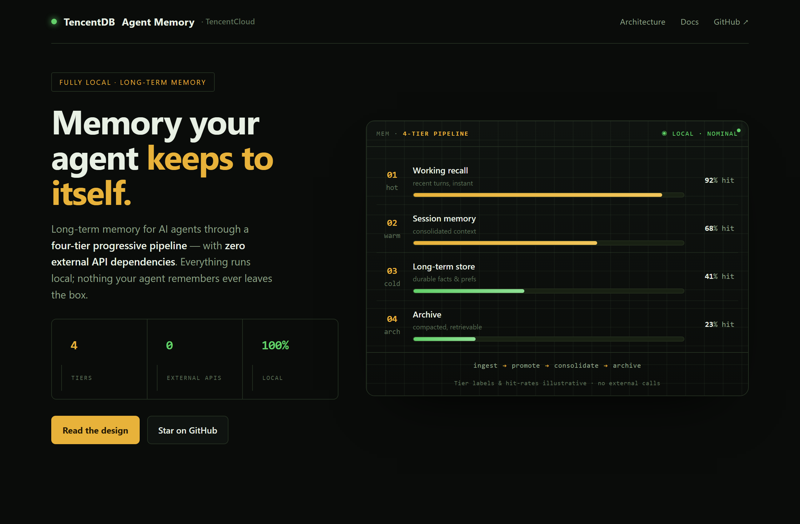
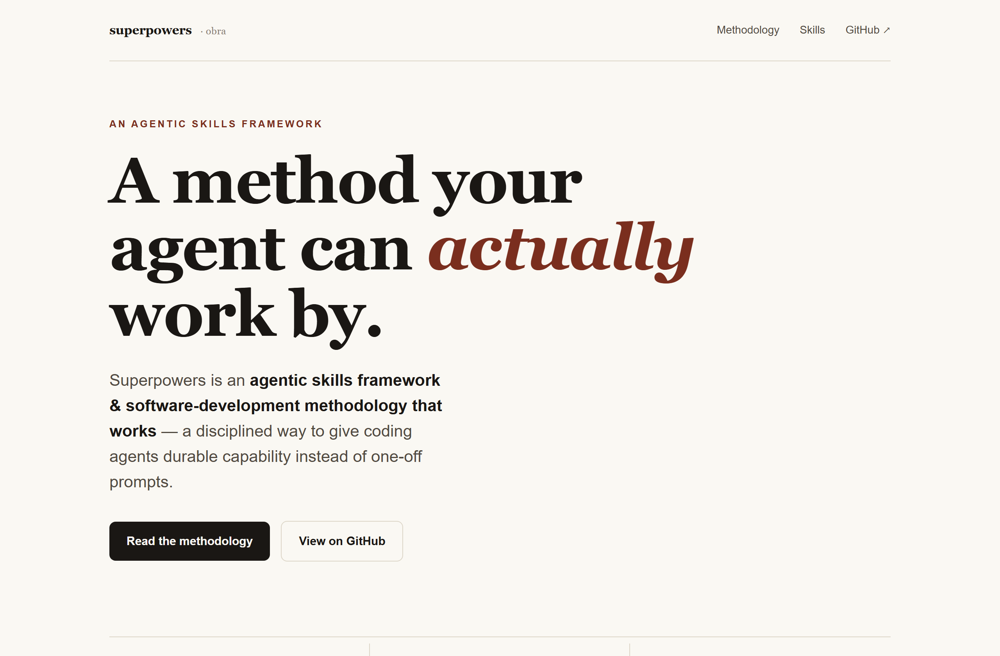

# Design Rep — Wednesday, July 8

> 3 mocks — terminal-dark, hud, editorial

[Catalog](../../CATALOG.md) · [Home](../../README.md)

## [wonderwhy-er/DesktopCommanderMCP](https://github.com/wonderwhy-er/DesktopCommanderMCP)

- **Style:** terminal-dark / electric-cyan
- **Idea tested:** prove "give Claude your terminal" by making the hero a live search→diff→apply→test session
- **Verdict:** landed
- [live .html](./01-DesktopCommanderMCP.html) · [repo on GitHub](https://github.com/wonderwhy-er/DesktopCommanderMCP)

## [TencentCloud/TencentDB-Agent-Memory](https://github.com/TencentCloud/TencentDB-Agent-Memory)

- **Style:** hud / amber
- **Idea tested:** render a 4-tier memory pipeline as an instrument panel with stacked tier gauges + flow strip
- **Verdict:** landed
- [live .html](./02-TencentDB-Agent-Memory.html) · [repo on GitHub](https://github.com/TencentCloud/TencentDB-Agent-Memory)

## [obra/superpowers](https://github.com/obra/superpowers)

- **Style:** editorial / burgundy
- **Idea tested:** treat an agentic methodology as a calm serif manifesto, one burgundy italic word, numbered principles
- **Verdict:** landed
- [live .html](./03-superpowers.html) · [repo on GitHub](https://github.com/obra/superpowers)

