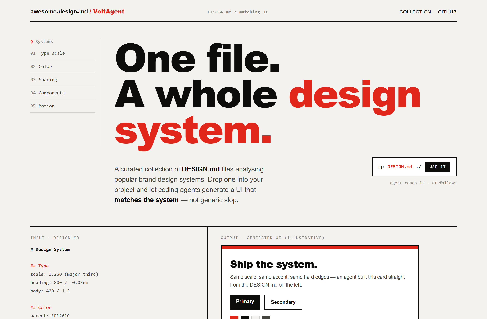
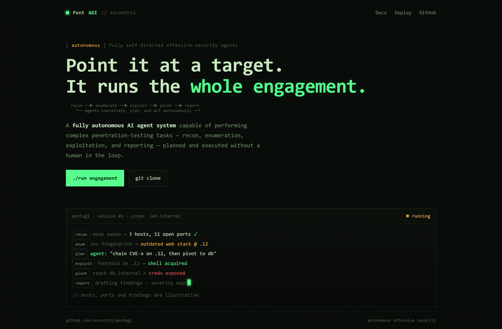
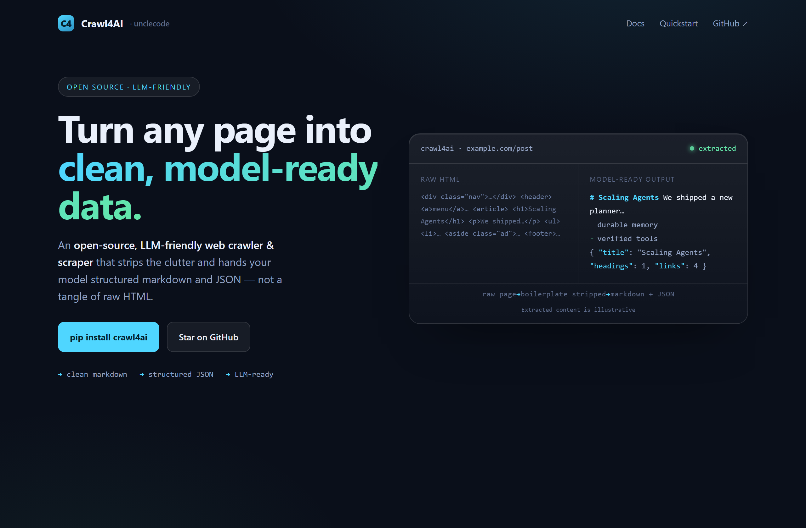

# Design Rep — Thursday, July 9

> 3 mocks — swiss, mono-zine, glass

[Catalog](../../CATALOG.md) · [Home](../../README.md)

## [VoltAgent/awesome-design-md](https://github.com/VoltAgent/awesome-design-md)

- **Style:** swiss / red
- **Idea tested:** make a design-system tool prove itself via a strict grid + DESIGN.md→UI input/output split
- **Verdict:** landed
- [live .html](./01-awesome-design-md.html) · [repo on GitHub](https://github.com/VoltAgent/awesome-design-md)

## [vxcontrol/pentagi](https://github.com/vxcontrol/pentagi)

- **Style:** mono-zine / phosphor-green
- **Idea tested:** render autonomous pentest as an ASCII kill-chain + tagged live engagement run-log
- **Verdict:** landed
- [live .html](./02-pentagi.html) · [repo on GitHub](https://github.com/vxcontrol/pentagi)

## [unclecode/crawl4ai](https://github.com/unclecode/crawl4ai)

- **Style:** glass / frost-cyan
- **Idea tested:** one frosted panel splitting messy raw HTML against clean markdown+JSON to show "LLM-friendly"
- **Verdict:** landed
- [live .html](./03-crawl4ai.html) · [repo on GitHub](https://github.com/unclecode/crawl4ai)

