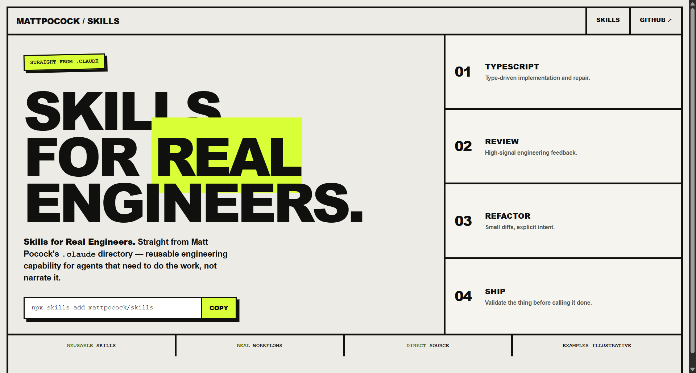
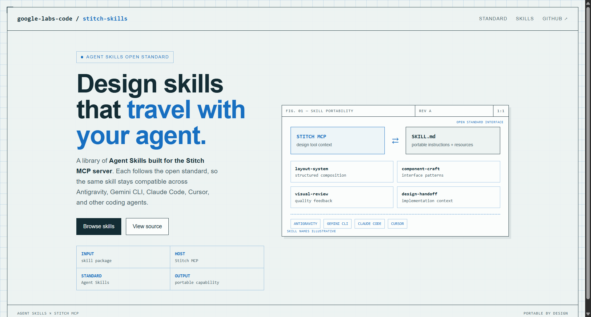
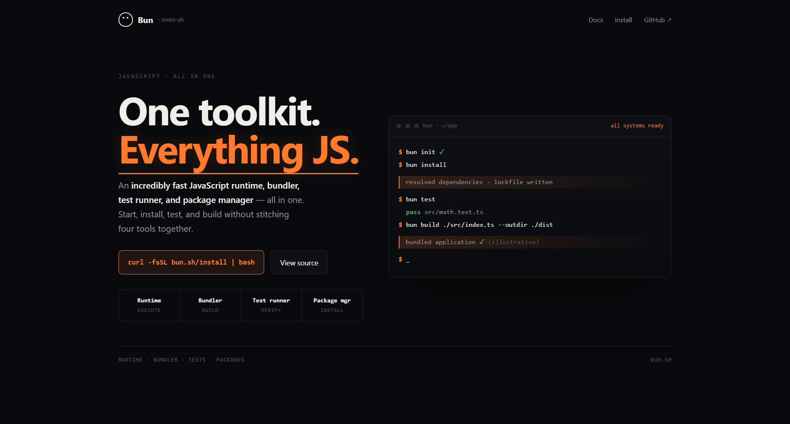

# Design Rep — Friday, July 10

> 3 mocks — brutalist, blueprint, neon-noir

[Catalog](../../CATALOG.md) · [Home](../../README.md)

## [mattpocock/skills](https://github.com/mattpocock/skills)

- **Style:** brutalist / acid-yellow
- **Idea tested:** turn "Skills for Real Engineers" into a hard-edged manifesto with one acid block behind REAL
- **Verdict:** landed
- [live .html](./01-skills.html) · [repo on GitHub](https://github.com/mattpocock/skills)

## [google-labs-code/stitch-skills](https://github.com/google-labs-code/stitch-skills)

- **Style:** blueprint / cobalt
- **Idea tested:** diagram portable Agent Skills as a Stitch MCP↔SKILL.md interface + compatibility rail
- **Verdict:** landed
- [live .html](./02-stitch-skills.html) · [repo on GitHub](https://github.com/google-labs-code/stitch-skills)

## [oven-sh/bun](https://github.com/oven-sh/bun)

- **Style:** neon-noir / hot-orange
- **Idea tested:** prove "all in one" as one uninterrupted init→install→test→build terminal journey
- **Verdict:** landed
- [live .html](./03-bun.html) · [repo on GitHub](https://github.com/oven-sh/bun)

