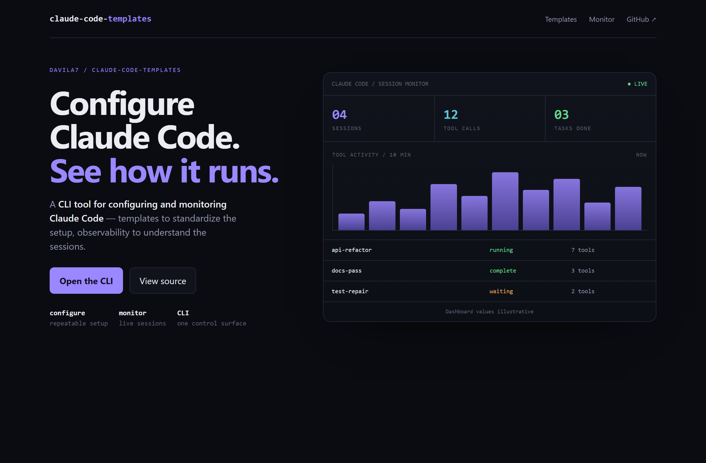
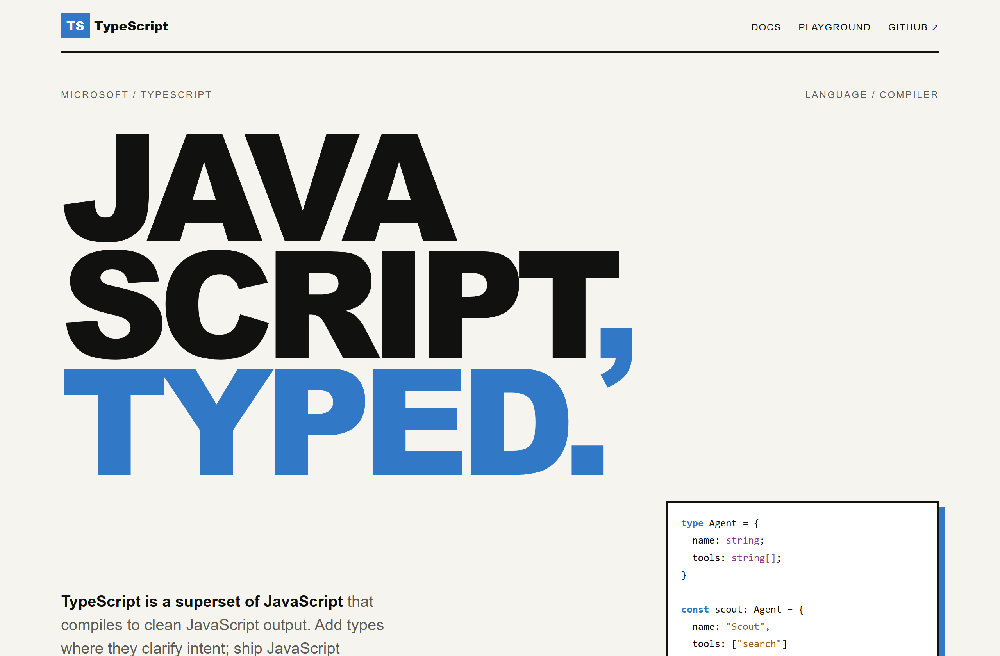
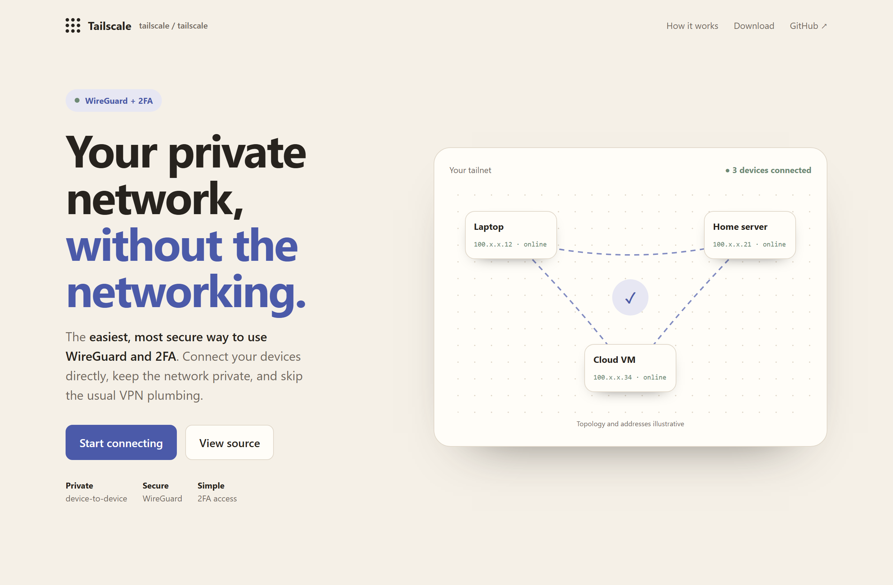

# Design Rep — Saturday, July 11

> 3 mocks — data-viz, poster, warm-minimal

[Catalog](../../CATALOG.md) · [Home](../../README.md)

## [davila7/claude-code-templates](https://github.com/davila7/claude-code-templates)

- **Style:** data-viz / violet
- **Idea tested:** combine configuration promise with a live Claude Code session-monitor dashboard
- **Verdict:** landed
- [live .html](./01-claude-code-templates.html) · [repo on GitHub](https://github.com/davila7/claude-code-templates)

## [microsoft/TypeScript](https://github.com/microsoft/TypeScript)

- **Style:** poster / cobalt
- **Idea tested:** reduce the proposition to a giant "JavaScript, Typed." plus one small typed-object proof
- **Verdict:** landed
- [live .html](./02-TypeScript.html) · [repo on GitHub](https://github.com/microsoft/TypeScript)

## [tailscale/tailscale](https://github.com/tailscale/tailscale)

- **Style:** warm-minimal / indigo
- **Idea tested:** make secure WireGuard+2FA approachable through a calm three-node tailnet map
- **Verdict:** landed
- [live .html](./03-tailscale.html) · [repo on GitHub](https://github.com/tailscale/tailscale)

