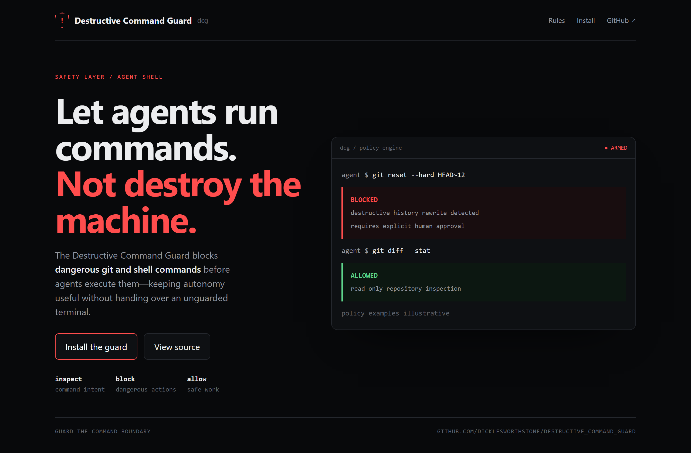
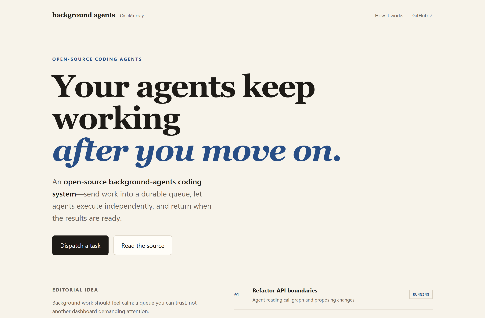
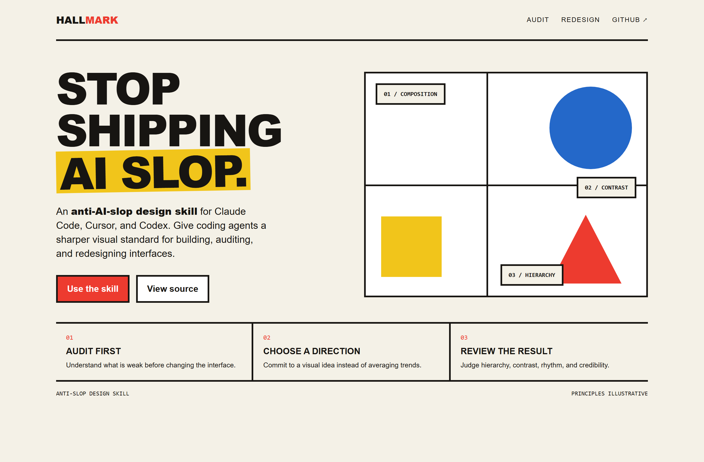

# Design Rep — Sunday, July 12

> 3 mocks — terminal-dark, editorial, bauhaus

[Catalog](../../CATALOG.md) · [Home](../../README.md)

## [Dicklesworthstone/destructive_command_guard](https://github.com/Dicklesworthstone/destructive_command_guard)

- **Style:** terminal-dark / danger-red
- **Idea tested:** make the command boundary visible with one destructive action blocked and one safe inspection allowed
- **Verdict:** landed
- [live .html](./01-destructive-command-guard.html) · [repo on GitHub](https://github.com/Dicklesworthstone/destructive_command_guard)

## [ColeMurray/background-agents](https://github.com/ColeMurray/background-agents)

- **Style:** editorial / cobalt
- **Idea tested:** make asynchronous coding work feel calm through a quiet durable queue rather than a noisy dashboard
- **Verdict:** landed
- [live .html](./02-background-agents.html) · [repo on GitHub](https://github.com/ColeMurray/background-agents)

## [Nutlope/hallmark](https://github.com/Nutlope/hallmark)

- **Style:** bauhaus / primary
- **Idea tested:** demonstrate anti-slop taste through a committed primary-color composition + three review principles
- **Verdict:** landed
- [live .html](./03-hallmark.html) · [repo on GitHub](https://github.com/Nutlope/hallmark)

