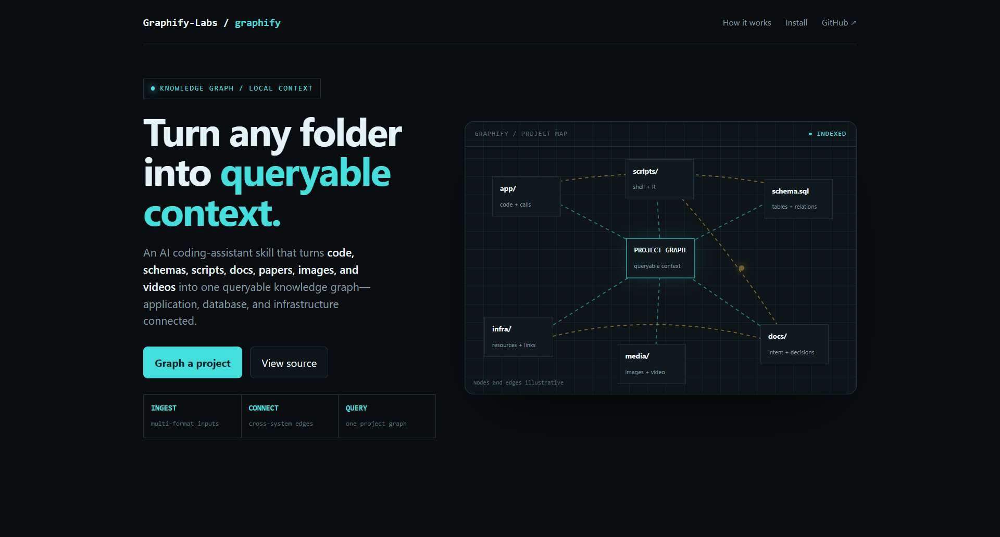
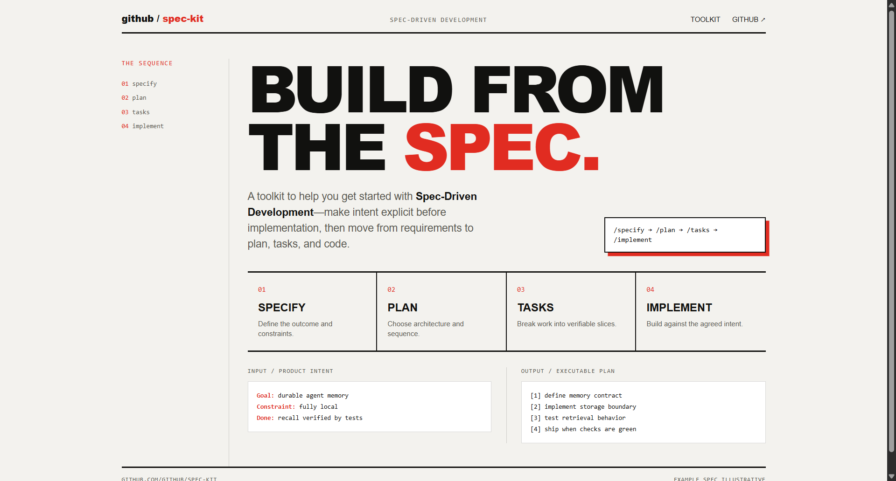
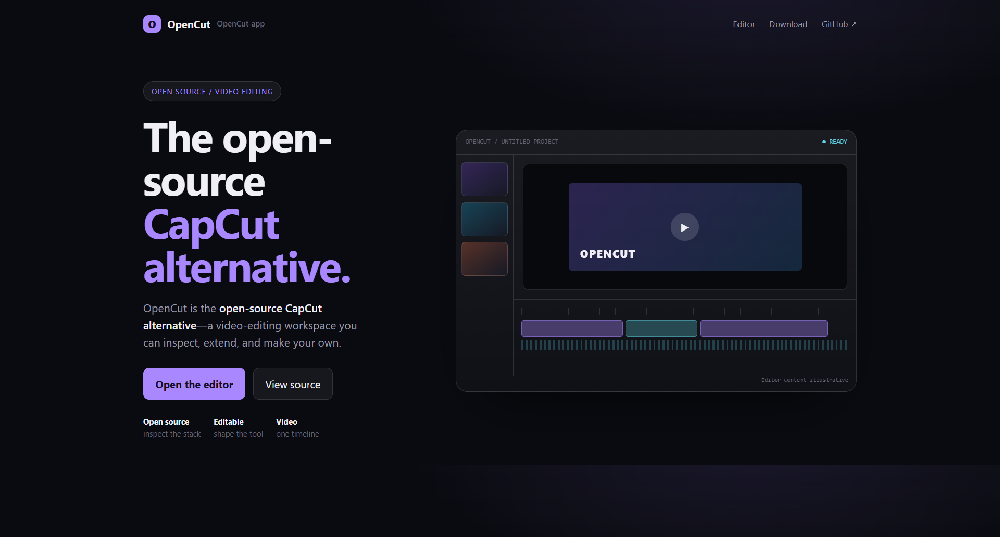

# Design Rep — Monday, July 13

> 3 mocks — hud, swiss, glass

[Catalog](../../CATALOG.md) · [Home](../../README.md)

## [Graphify-Labs/graphify](https://github.com/Graphify-Labs/graphify)

- **Style:** hud / radar-cyan
- **Idea tested:** render a multi-format project knowledge graph as a live instrument with cross-system edges + query pulse
- **Verdict:** landed
- [live .html](./01-graphify.html) · [repo on GitHub](https://github.com/Graphify-Labs/graphify)

## [github/spec-kit](https://github.com/github/spec-kit)

- **Style:** swiss / red
- **Idea tested:** embody spec-driven development as a strict specify→plan→tasks→implement grid + intent-to-plan proof
- **Verdict:** landed
- [live .html](./02-spec-kit.html) · [repo on GitHub](https://github.com/github/spec-kit)

## [OpenCut-app/OpenCut](https://github.com/OpenCut-app/OpenCut)

- **Style:** glass / frost-violet
- **Idea tested:** make the open-source video editor category immediate through one unified frosted editing surface
- **Verdict:** landed
- [live .html](./03-OpenCut.html) · [repo on GitHub](https://github.com/OpenCut-app/OpenCut)

