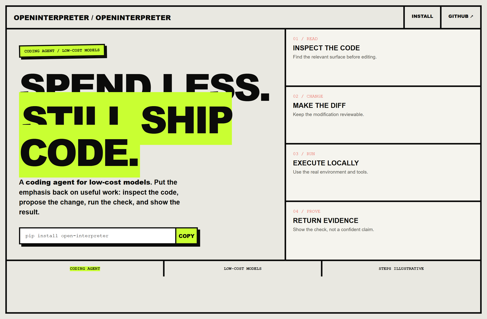
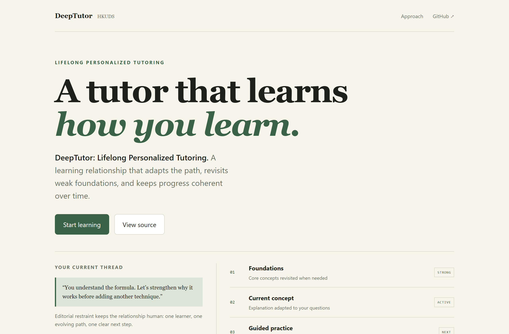
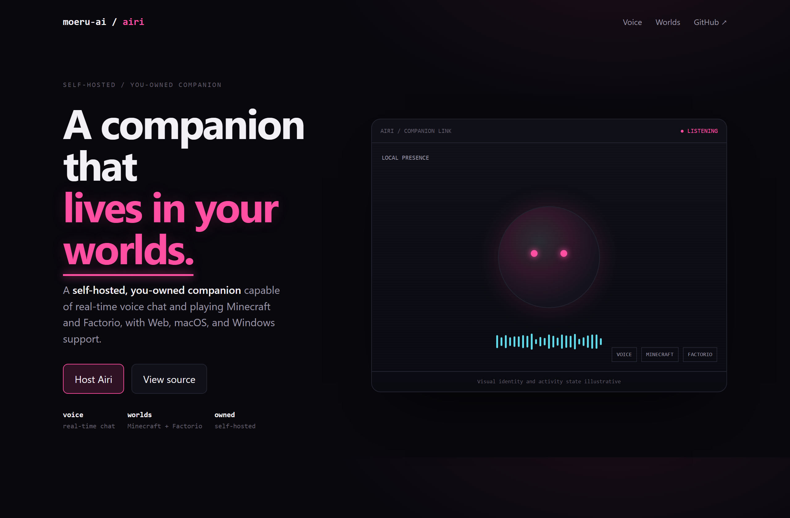

# Design Rep — Wednesday, July 15

> 3 mocks — brutalist, editorial, neon-noir

[Catalog](../../CATALOG.md) · [Home](../../README.md)

## [openinterpreter/openinterpreter](https://github.com/openinterpreter/openinterpreter)

- **Style:** brutalist / acid-lime
- **Idea tested:** turn a low-cost coding agent into a blunt read→change→run→prove engineering promise
- **Verdict:** landed
- [live .html](./01-openinterpreter.html) · [repo on GitHub](https://github.com/openinterpreter/openinterpreter)

## [HKUDS/DeepTutor](https://github.com/HKUDS/DeepTutor)

- **Style:** editorial / forest
- **Idea tested:** frame lifelong personalized tutoring as an evolving relationship + quiet learning path rather than a dashboard
- **Verdict:** landed
- [live .html](./02-DeepTutor.html) · [repo on GitHub](https://github.com/HKUDS/DeepTutor)

## [moeru-ai/airi](https://github.com/moeru-ai/airi)

- **Style:** neon-noir / magenta
- **Idea tested:** make a self-hosted companion feel like a local presence through one orb + voice waveform + world modes
- **Verdict:** landed
- [live .html](./03-airi.html) · [repo on GitHub](https://github.com/moeru-ai/airi)

