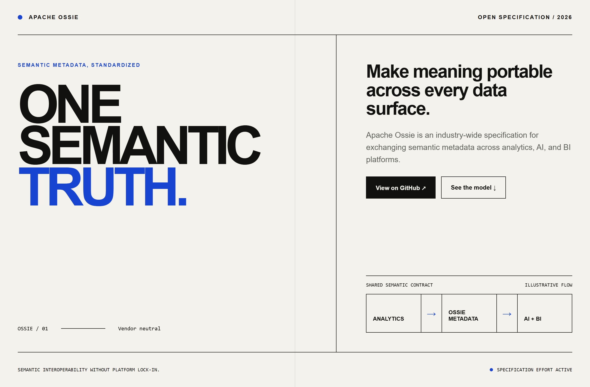
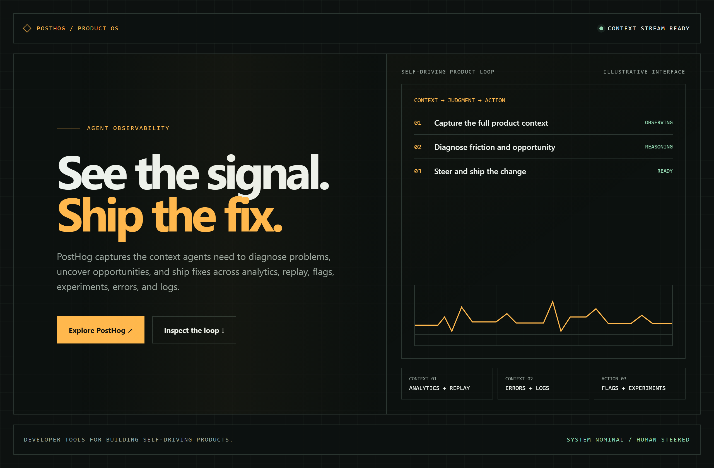
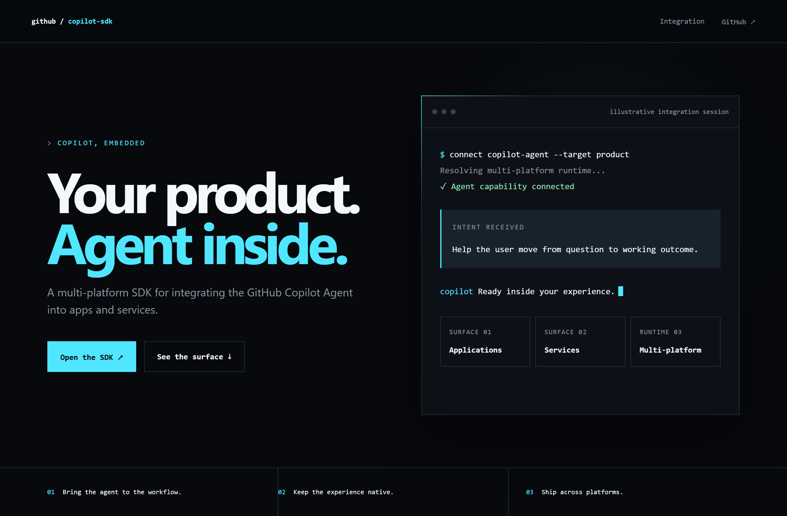

# Design Rep — Thursday, July 16

> 3 mocks — swiss, hud, terminal-dark

[Catalog](../../CATALOG.md) · [Home](../../README.md)

## [apache/ossie](https://github.com/apache/ossie)

- **Style:** swiss / ultramarine
- **Idea tested:** strict grid frames semantic metadata as one shared contract across analytics, AI, and BI
- **Verdict:** landed: authoritative and vendor-neutral
- [live .html](./01-ossie.html) · [repo on GitHub](https://github.com/apache/ossie)

## [PostHog/posthog](https://github.com/PostHog/posthog)

- **Style:** hud / amber
- **Idea tested:** instrument panel compresses observability into a capture→diagnose→ship agent loop
- **Verdict:** landed: operational without becoming game-like
- [live .html](./02-posthog.html) · [repo on GitHub](https://github.com/PostHog/posthog)

## [github/copilot-sdk](https://github.com/github/copilot-sdk)

- **Style:** terminal-dark / electric-cyan
- **Idea tested:** split hero pairs platform ambition with an illustrative integration session
- **Verdict:** landed: aspirational and technically credible
- [live .html](./03-copilot-sdk.html) · [repo on GitHub](https://github.com/github/copilot-sdk)

