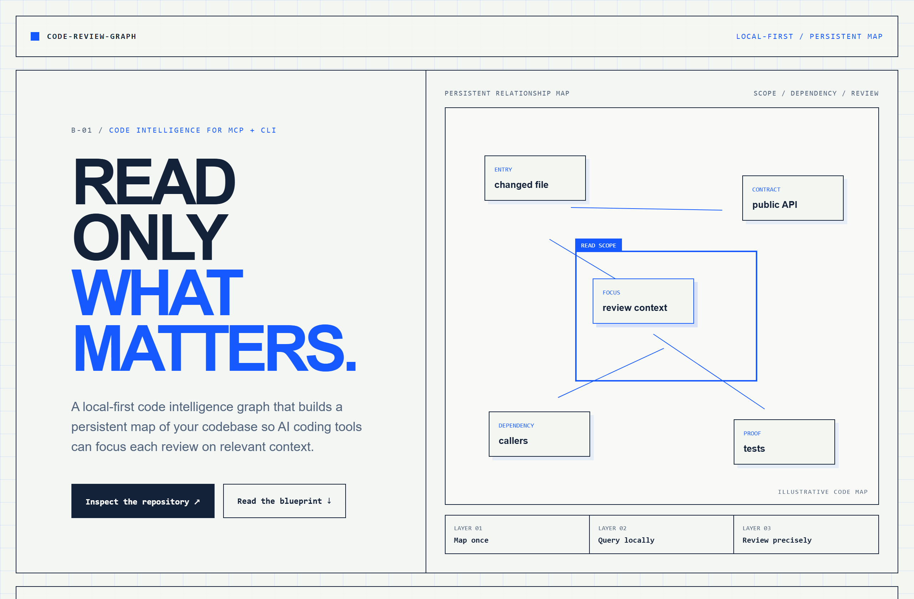
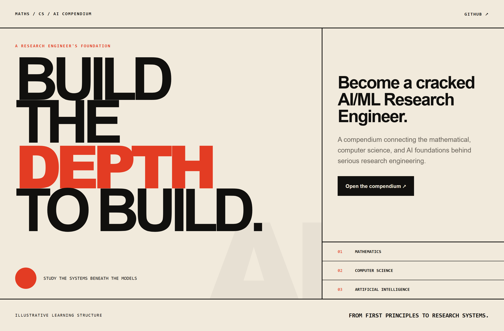
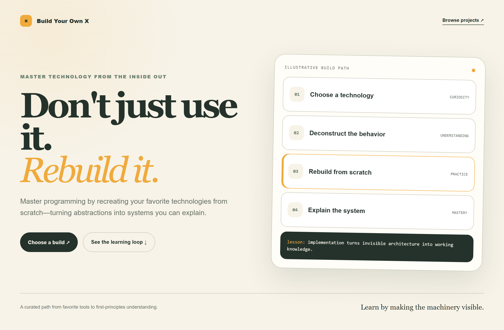

# Design Rep — Friday, July 17

> 3 mocks — blueprint, poster, warm-minimal

[Catalog](../../CATALOG.md) · [Home](../../README.md)

## [tirth8205/code-review-graph](https://github.com/tirth8205/code-review-graph)

- **Style:** blueprint / cobalt
- **Idea tested:** expose the persistent code map and narrow review scope as an annotated technical schematic
- **Verdict:** landed: context discipline is visible without fabricated metrics
- [live .html](./01-code-review-graph.html) · [repo on GitHub](https://github.com/tirth8205/code-review-graph)

## [HenryNdubuaku/maths-cs-ai-compendium](https://github.com/HenryNdubuaku/maths-cs-ai-compendium)

- **Style:** poster / vermilion
- **Idea tested:** reduce a broad technical curriculum to one memorable depth-before-systems promise
- **Verdict:** landed: ambitious hierarchy with sober support
- [live .html](./02-maths-cs-ai-compendium.html) · [repo on GitHub](https://github.com/HenryNdubuaku/maths-cs-ai-compendium)

## [codecrafters-io/build-your-own-x](https://github.com/codecrafters-io/build-your-own-x)

- **Style:** warm-minimal / marigold
- **Idea tested:** reframe systems education as an approachable choose→deconstruct→rebuild→explain workbench
- **Verdict:** landed: friendly without diluting the technical premise
- [live .html](./03-build-your-own-x.html) · [repo on GitHub](https://github.com/codecrafters-io/build-your-own-x)

