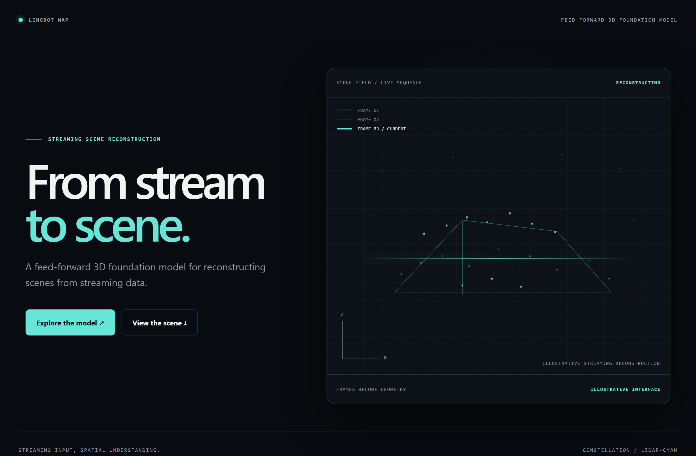
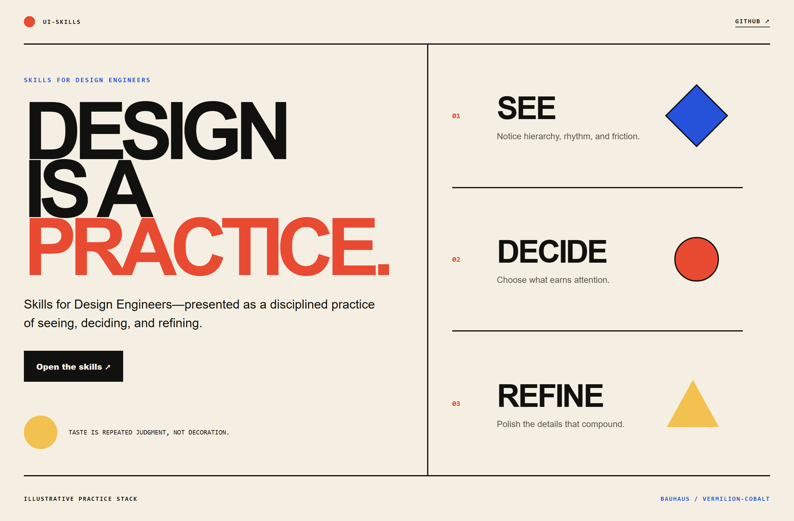
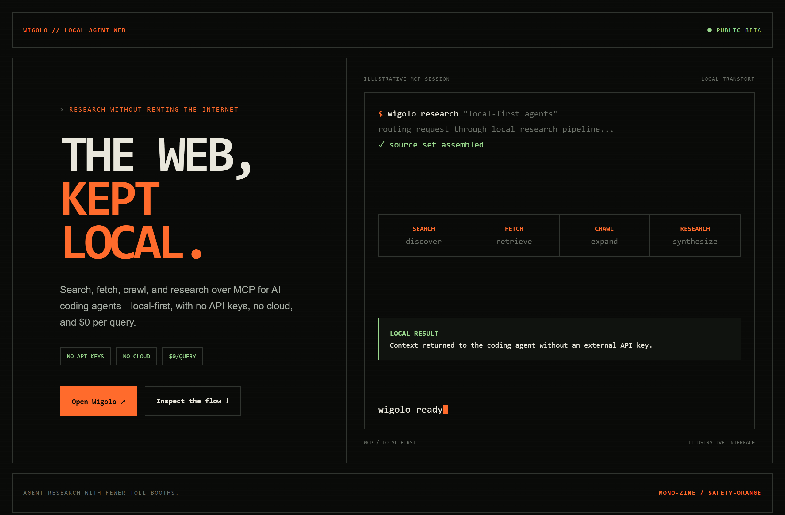

# Design Rep — Saturday, July 18

> 3 mocks — constellation, bauhaus, mono-zine

[Catalog](../../CATALOG.md) · [Home](../../README.md)

## [Robbyant/lingbot-map](https://github.com/Robbyant/lingbot-map)

- **Style:** constellation / lidar-cyan
- **Idea tested:** show streaming reconstruction as a quiet point field forming into a room
- **Verdict:** landed: technical and cinematic without generic AI spectacle
- [live .html](./01-lingbot-map.html) · [repo on GitHub](https://github.com/Robbyant/lingbot-map)

## [ibelick/ui-skills](https://github.com/ibelick/ui-skills)

- **Style:** bauhaus / vermillion-cobalt
- **Idea tested:** turn design engineering into a see→decide→refine practice with committed geometry
- **Verdict:** landed: playful enough to demonstrate taste, structured enough to teach it
- [live .html](./02-ui-skills.html) · [repo on GitHub](https://github.com/ibelick/ui-skills)

## [KnockOutEZ/wigolo](https://github.com/KnockOutEZ/wigolo)

- **Style:** mono-zine / safety-orange
- **Idea tested:** make local-first research tangible as one search→fetch→crawl→research terminal journey
- **Verdict:** landed: the no-key, no-cloud proposition reads as infrastructure
- [live .html](./03-wigolo.html) · [repo on GitHub](https://github.com/KnockOutEZ/wigolo)

