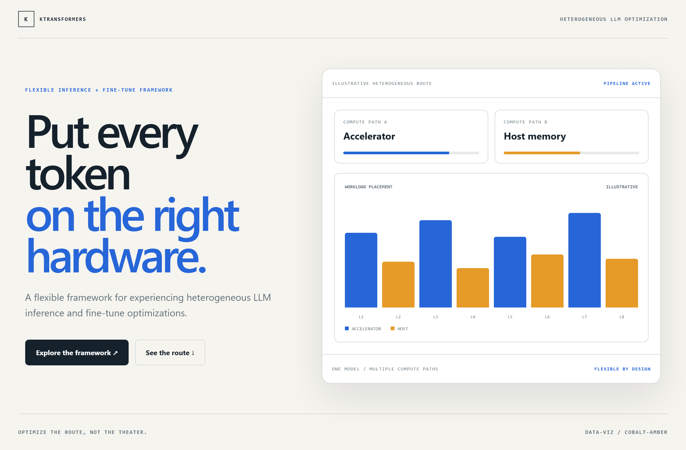
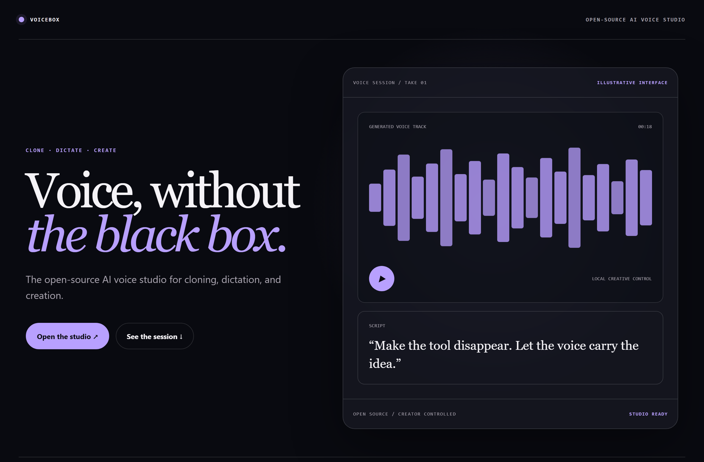
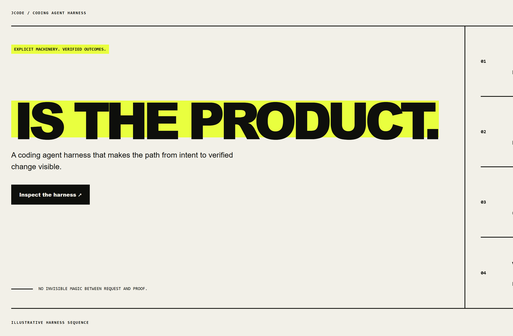

# Design Rep — Sunday, July 19

> 3 mocks — data-viz, glass, brutalist

[Catalog](../../CATALOG.md) · [Home](../../README.md)

## [kvcache-ai/ktransformers](https://github.com/kvcache-ai/ktransformers)

- **Style:** data-viz / cobalt-amber
- **Idea tested:** explain heterogeneous optimization as deliberate workload placement across compute paths
- **Verdict:** landed: flexibility is visible without invented benchmarks
- [live .html](./01-ktransformers.html) · [repo on GitHub](https://github.com/kvcache-ai/ktransformers)

## [jamiepine/voicebox](https://github.com/jamiepine/voicebox)

- **Style:** glass / signal-violet
- **Idea tested:** make open-source voice creation intimate through one restrained frosted studio surface
- **Verdict:** landed: polished and creator-controlled without generic gradient spectacle
- [live .html](./02-voicebox.html) · [repo on GitHub](https://github.com/jamiepine/voicebox)

## [1jehuang/jcode](https://github.com/1jehuang/jcode)

- **Style:** brutalist / acid-yellow
- **Idea tested:** expose the harness as intent→plan→execute→verify with no invisible magic
- **Verdict:** landed: the operating philosophy is unmistakable
- [live .html](./03-jcode.html) · [repo on GitHub](https://github.com/1jehuang/jcode)

