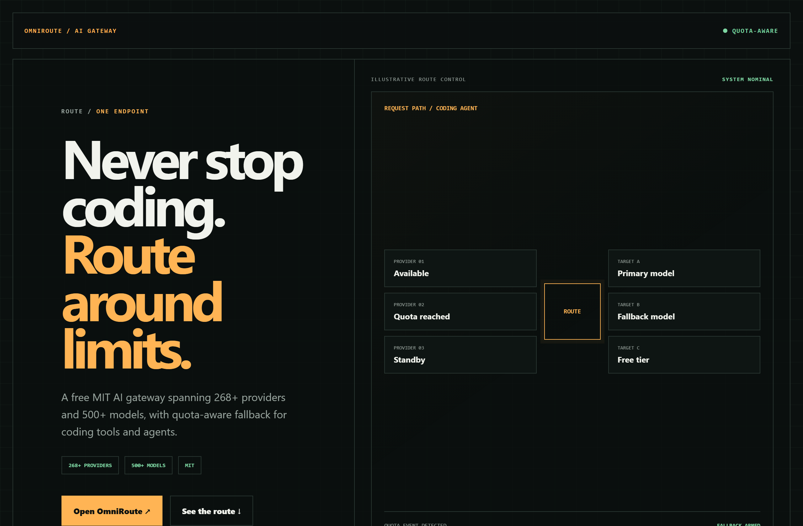
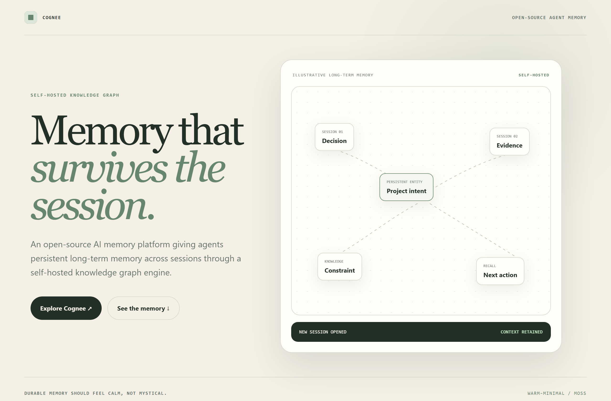
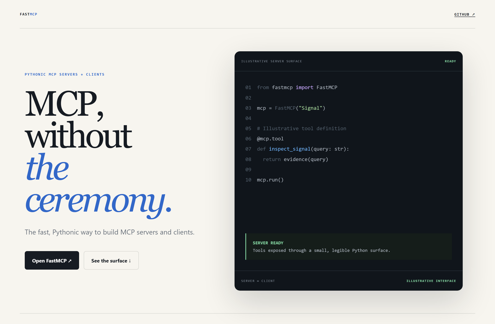

# Design Rep — Monday, July 20

> 3 mocks — hud, warm-minimal, editorial

[Catalog](../../CATALOG.md) · [Home](../../README.md)

## [diegosouzapw/OmniRoute](https://github.com/diegosouzapw/OmniRoute)

- **Style:** hud / signal-amber
- **Idea tested:** present quota-aware fallback as an aviation-style route controller
- **Verdict:** landed: operational resilience without game UI
- [live .html](./01-omniroute.html) · [repo on GitHub](https://github.com/diegosouzapw/OmniRoute)

## [topoteretes/cognee](https://github.com/topoteretes/cognee)

- **Style:** warm-minimal / moss
- **Idea tested:** make persistent agent memory calm through a soft graph of decisions, evidence, constraints, and actions
- **Verdict:** landed: retained context rather than mystical intelligence
- [live .html](./02-cognee.html) · [repo on GitHub](https://github.com/topoteretes/cognee)

## [PrefectHQ/fastmcp](https://github.com/PrefectHQ/fastmcp)

- **Style:** editorial / python-blue
- **Idea tested:** pair an editorial promise with one small illustrative Python surface
- **Verdict:** landed: technical proof without turning the hero into documentation
- [live .html](./03-fastmcp.html) · [repo on GitHub](https://github.com/PrefectHQ/fastmcp)

