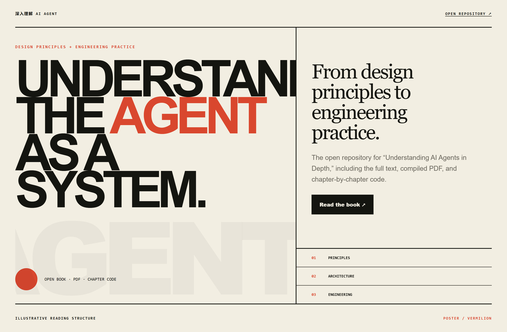
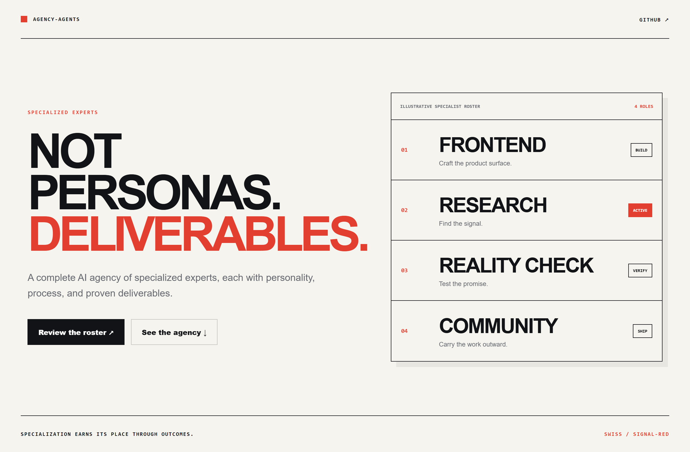
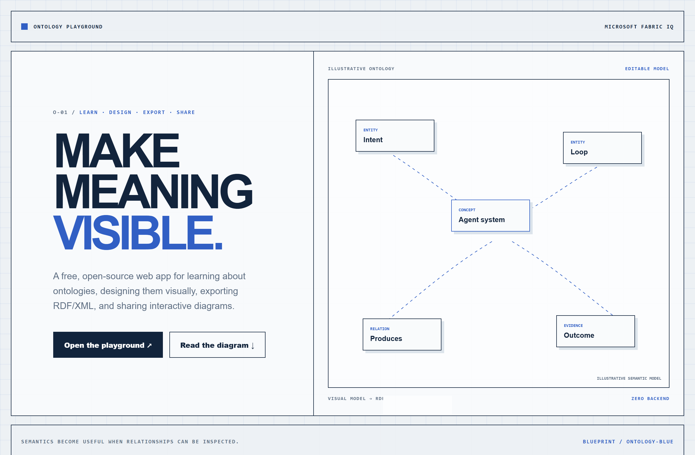

# Design Rep — Tuesday, July 21

> 3 mocks — poster, swiss, blueprint

[Catalog](../../CATALOG.md) · [Home](../../README.md)

## [bojieli/ai-agent-book](https://github.com/bojieli/ai-agent-book)

- **Style:** poster / vermilion
- **Idea tested:** treat a technical agent book as a bold systems manifesto with one conceptual center
- **Verdict:** landed: engineering material gains intellectual weight without academic wallpaper
- [live .html](./01-ai-agent-book.html) · [repo on GitHub](https://github.com/bojieli/ai-agent-book)

## [msitarzewski/agency-agents](https://github.com/msitarzewski/agency-agents)

- **Style:** swiss / signal-red
- **Idea tested:** present specialized agents as an accountable roster of roles and deliverables
- **Verdict:** landed: specialization feels operational and outcome-driven
- [live .html](./02-agency-agents.html) · [repo on GitHub](https://github.com/msitarzewski/agency-agents)

## [microsoft/Ontology-Playground](https://github.com/microsoft/Ontology-Playground)

- **Style:** blueprint / ontology-blue
- **Idea tested:** show ontology learning as an annotated semantic diagram connecting intent, loops, relations, and outcomes
- **Verdict:** landed: abstract meaning becomes inspectable without overstatement
- [live .html](./03-ontology-playground.html) · [repo on GitHub](https://github.com/microsoft/Ontology-Playground)

