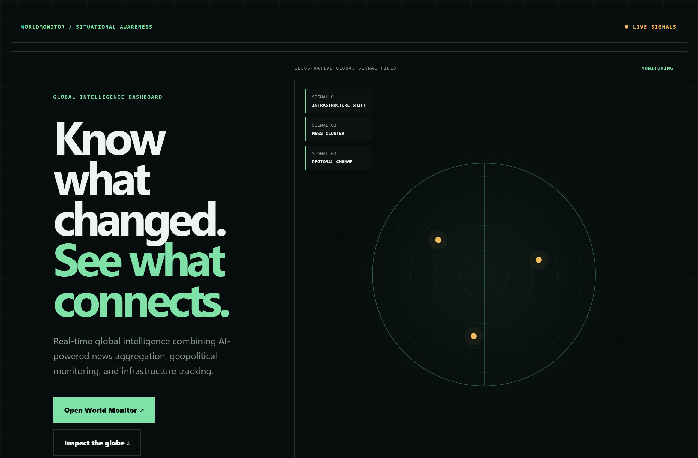
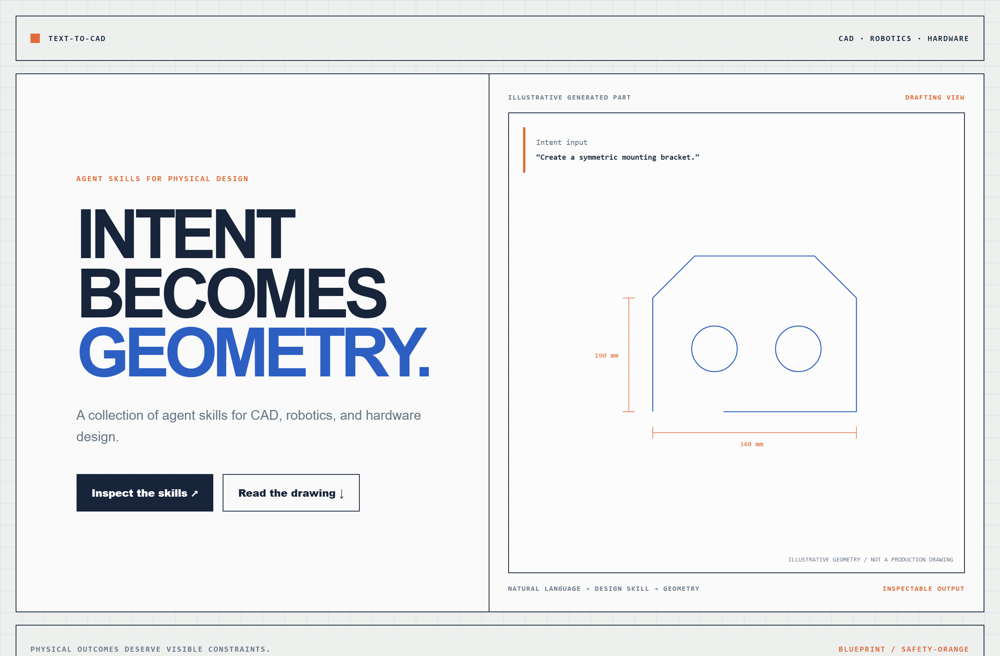
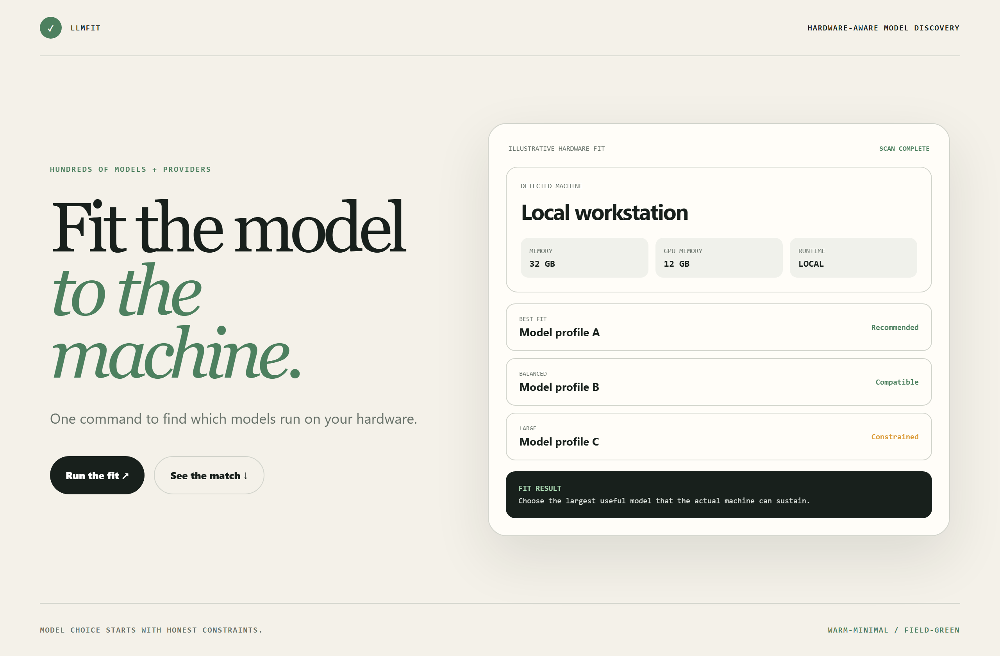

# Design Rep — Wednesday, July 22

> 3 mocks — data-viz, blueprint, warm-minimal

[Catalog](../../CATALOG.md) · [Home](../../README.md)

## [koala73/worldmonitor](https://github.com/koala73/worldmonitor)

- **Style:** data-viz / radar-green
- **Idea tested:** unify global intelligence as a restrained signal field with three event classes
- **Verdict:** landed: situational awareness without manufactured urgency
- [live .html](./01-worldmonitor.html) · [repo on GitHub](https://github.com/koala73/worldmonitor)

## [earthtojake/text-to-cad](https://github.com/earthtojake/text-to-cad)

- **Style:** blueprint / safety-orange
- **Idea tested:** turn language intent into an annotated drafting surface with visible dimensions and constraints
- **Verdict:** landed: physical outcomes feel inspectable rather than magical
- [live .html](./02-text-to-cad.html) · [repo on GitHub](https://github.com/earthtojake/text-to-cad)

## [AlexsJones/llmfit](https://github.com/AlexsJones/llmfit)

- **Style:** warm-minimal / field-green
- **Idea tested:** frame model selection as a calm hardware-fit decision with explicit constraints
- **Verdict:** landed: local compatibility matters more than abstract prestige
- [live .html](./03-llmfit.html) · [repo on GitHub](https://github.com/AlexsJones/llmfit)

