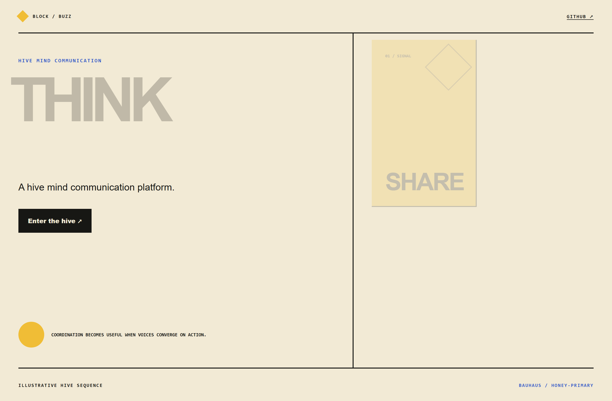
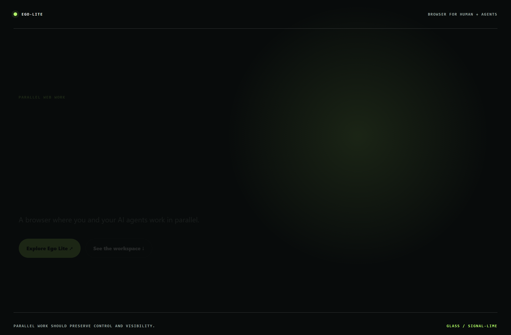
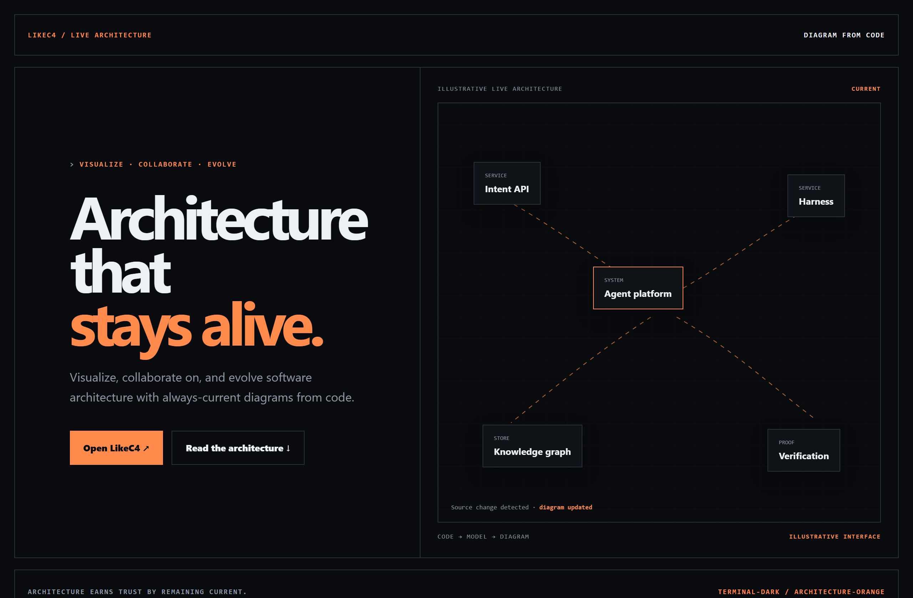

# Design Rep — Thursday, July 23

> 3 mocks — bauhaus, glass, terminal-dark

[Catalog](../../CATALOG.md) · [Home](../../README.md)

## [block/buzz](https://github.com/block/buzz)

- **Style:** bauhaus / honey-primary
- **Idea tested:** turn hive-mind communication into a share→connect→converge→act sequence using committed cells
- **Verdict:** landed: memorable coordination without chat-bubble cliches
- [live .html](./01-buzz.html) · [repo on GitHub](https://github.com/block/buzz)

## [citrolabs/ego-lite](https://github.com/citrolabs/ego-lite)

- **Style:** glass / signal-lime
- **Idea tested:** show a shared browser as visible human-judgment and agent-execution lanes
- **Verdict:** landed: controlled parallelism without autonomous theater
- [live .html](./02-ego-lite.html) · [repo on GitHub](https://github.com/citrolabs/ego-lite)

## [likec4/likec4](https://github.com/likec4/likec4)

- **Style:** terminal-dark / architecture-orange
- **Idea tested:** make living architecture a code-linked map that visibly updates after source change
- **Verdict:** landed: currency becomes the core product promise
- [live .html](./03-likec4.html) · [repo on GitHub](https://github.com/likec4/likec4)

