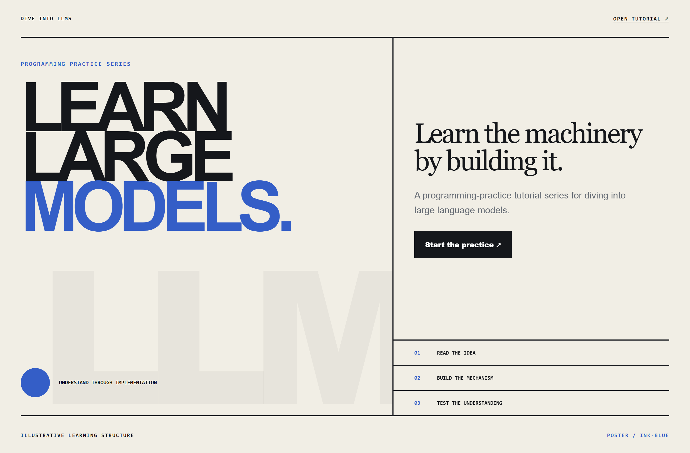
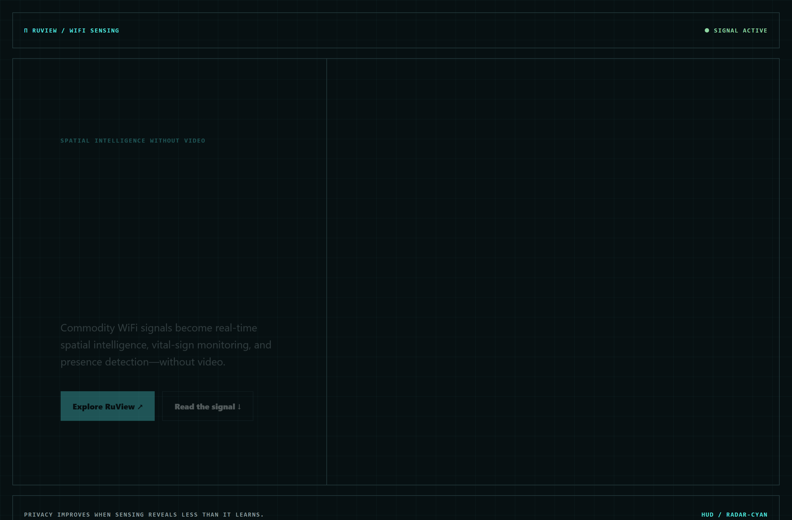
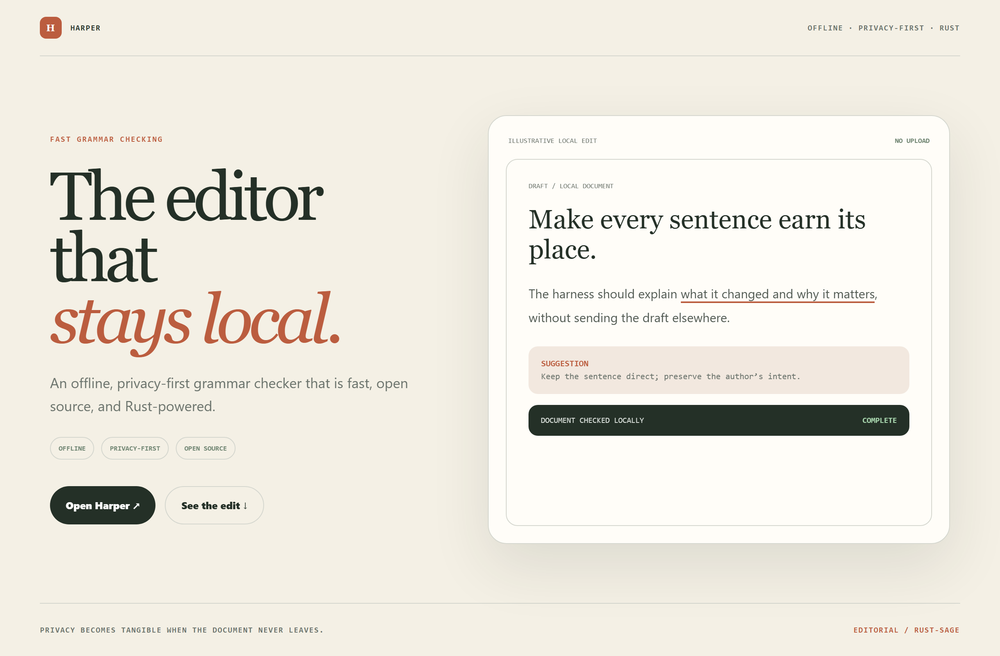

# Design Rep — Friday, July 24

> 3 mocks — poster, hud, editorial

[Catalog](../../CATALOG.md) · [Home](../../README.md)

## [Lordog/dive-into-llms](https://github.com/Lordog/dive-into-llms)

- **Style:** poster / ink-blue
- **Idea tested:** turn an LLM tutorial into a learn→build→test manifesto rather than a course catalogue
- **Verdict:** landed: practice feels consequential without pretending it is effortless
- [live .html](./01-dive-into-llms.html) · [repo on GitHub](https://github.com/Lordog/dive-into-llms)

## [ruvnet/RuView](https://github.com/ruvnet/RuView)

- **Style:** hud / radar-cyan
- **Idea tested:** show camera-free presence as a restrained radar instrument with explicit sensing source
- **Verdict:** landed: spatial intelligence is tangible while privacy stays central
- [live .html](./02-ruview.html) · [repo on GitHub](https://github.com/ruvnet/RuView)

## [Automattic/harper](https://github.com/Automattic/harper)

- **Style:** editorial / rust-sage
- **Idea tested:** make offline grammar checking a quiet editorial companion with one local edit
- **Verdict:** landed: privacy becomes behavior rather than a badge
- [live .html](./03-harper.html) · [repo on GitHub](https://github.com/Automattic/harper)

