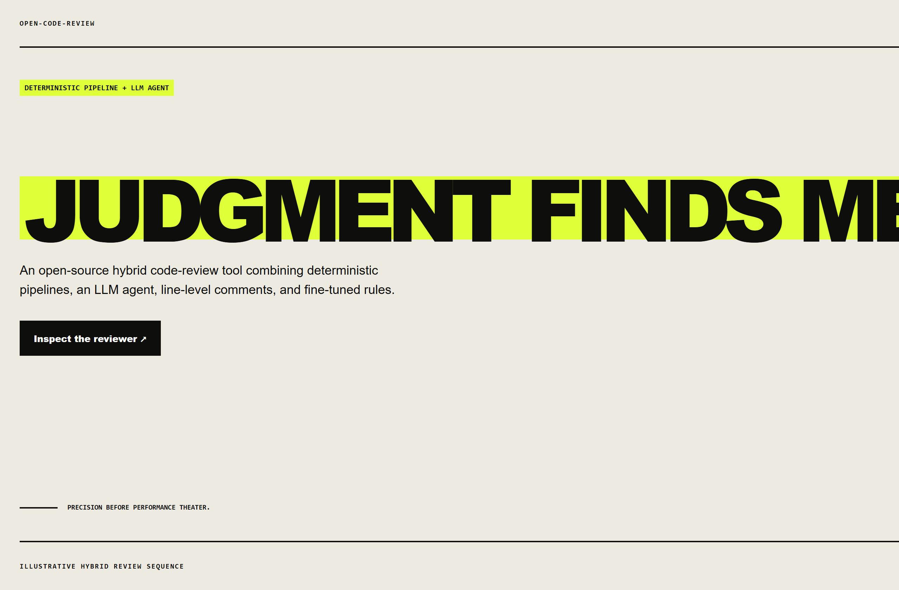
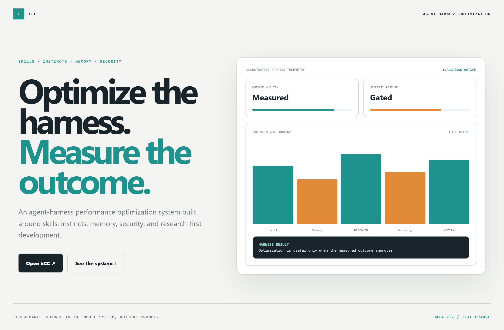
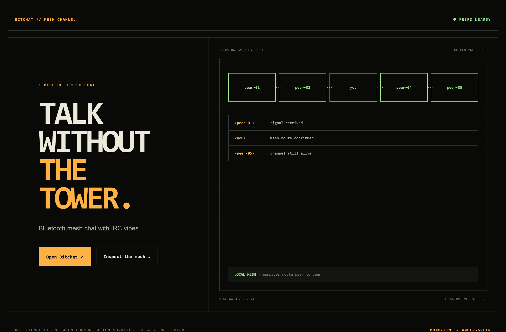

# Design Rep — Saturday, July 25

> 3 mocks — brutalist, data-viz, mono-zine

[Catalog](../../CATALOG.md) · [Home](../../README.md)

## [alibaba/open-code-review](https://github.com/alibaba/open-code-review)

- **Style:** brutalist / acid-yellow
- **Idea tested:** expose hybrid review as parse→rules→agent→comment separating precision from judgment
- **Verdict:** landed: trust without an AI reviewer persona
- [live .html](./01-open-code-review.html) · [repo on GitHub](https://github.com/alibaba/open-code-review)

## [affaan-m/ECC](https://github.com/affaan-m/ECC)

- **Style:** data-viz / teal-orange
- **Idea tested:** frame harness optimization as measured skills, memory, research, security, and verification
- **Verdict:** landed: whole-system performance becomes the product
- [live .html](./02-ecc.html) · [repo on GitHub](https://github.com/affaan-m/ECC)

## [permissionlesstech/bitchat](https://github.com/permissionlesstech/bitchat)

- **Style:** mono-zine / amber-green
- **Idea tested:** make peer-to-peer communication tangible as a Bluetooth mesh with IRC-style messages
- **Verdict:** landed: resilience feels structural rather than marketed
- [live .html](./03-bitchat.html) · [repo on GitHub](https://github.com/permissionlesstech/bitchat)

