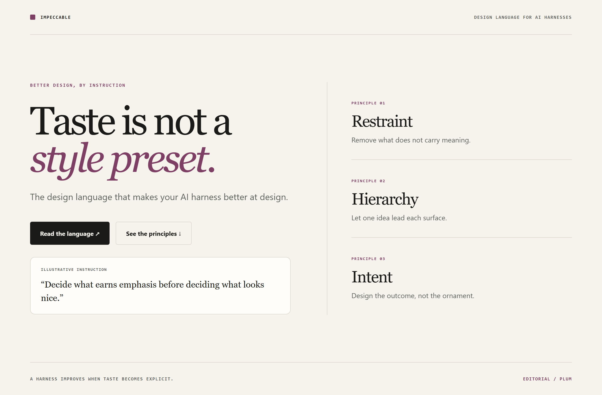
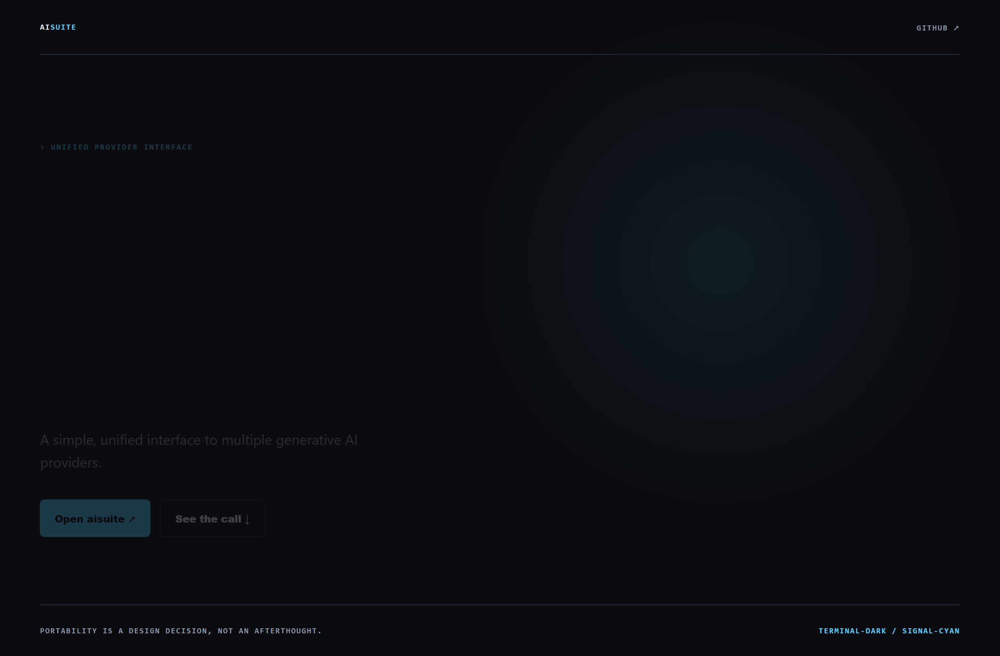
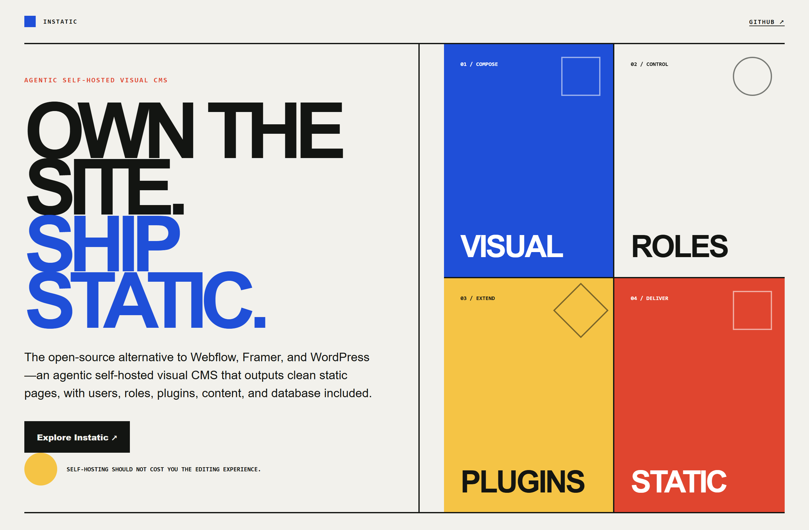

# Design Rep — Sunday, July 26

> 3 mocks — editorial, terminal-dark, bauhaus

[Catalog](../../CATALOG.md) · [Home](../../README.md)

## [pbakaus/impeccable](https://github.com/pbakaus/impeccable)

- **Style:** editorial / plum
- **Idea tested:** present a design language as calm editorial reasoning with one instruction sample
- **Verdict:** landed: argues for judgment and demonstrates it simultaneously
- [live .html](./01-impeccable.html) · [repo on GitHub](https://github.com/pbakaus/impeccable)

## [andrewyng/aisuite](https://github.com/andrewyng/aisuite)

- **Style:** terminal-dark / signal-cyan
- **Idea tested:** prove provider portability through one unchanged call shape above interchangeable targets
- **Verdict:** landed: abstraction reads as engineering leverage
- [live .html](./02-aisuite.html) · [repo on GitHub](https://github.com/andrewyng/aisuite)

## [CoreBunch/Instatic](https://github.com/CoreBunch/Instatic)

- **Style:** bauhaus / primary
- **Idea tested:** express a self-hosted CMS as compose→control→extend→deliver capability blocks
- **Verdict:** landed: ownership feels structural while editing stays inviting
- [live .html](./03-instatic.html) · [repo on GitHub](https://github.com/CoreBunch/Instatic)

