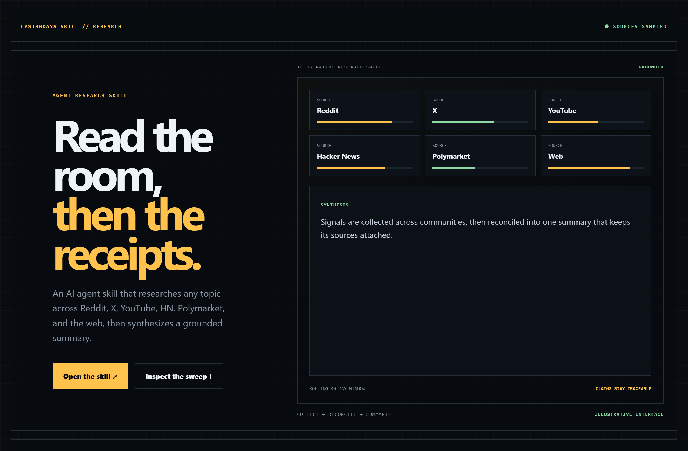
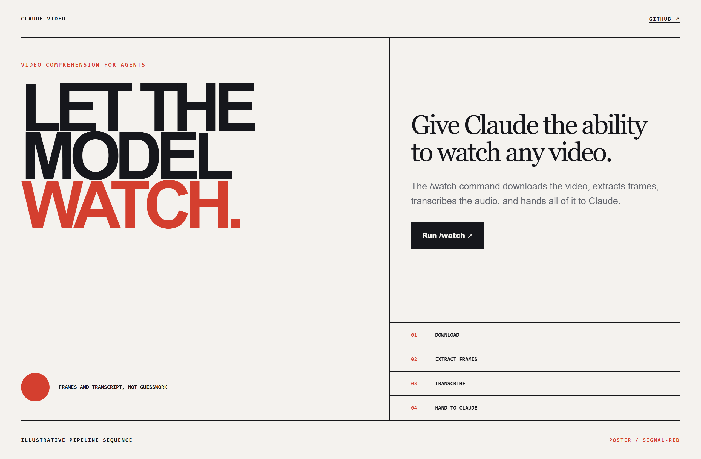
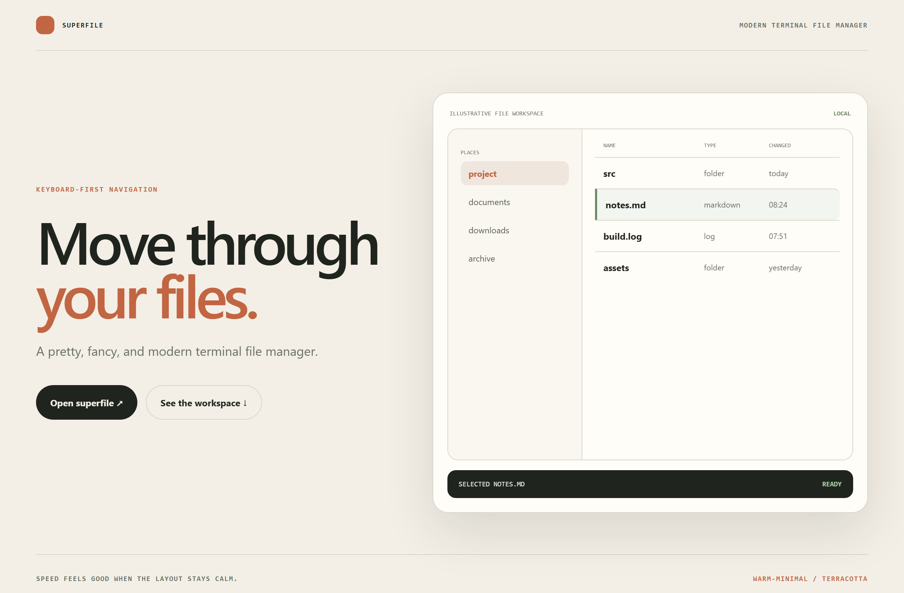

# Design Rep — Monday, July 27

> 3 mocks — hud, poster, warm-minimal

[Catalog](../../CATALOG.md) · [Home](../../README.md)

## [mvanhorn/last30days-skill](https://github.com/mvanhorn/last30days-skill)

- **Style:** hud / signal-amber
- **Idea tested:** render multi-community research as an instrument sweep with sources visible beneath the synthesis
- **Verdict:** landed: grounded claims stay traceable
- [live .html](./01-last30days-skill.html) · [repo on GitHub](https://github.com/mvanhorn/last30days-skill)

## [bradautomates/claude-video](https://github.com/bradautomates/claude-video)

- **Style:** poster / signal-red
- **Idea tested:** give a new model capability poster-scale clarity while listing the mechanism explicitly
- **Verdict:** landed: bold ambition without hiding how it works
- [live .html](./02-claude-video.html) · [repo on GitHub](https://github.com/bradautomates/claude-video)

## [yorukot/superfile](https://github.com/yorukot/superfile)

- **Style:** warm-minimal / terracotta
- **Idea tested:** make a terminal file manager calm and navigable through soft structure
- **Verdict:** landed: speed and comfort coexist without losing keyboard-first character
- [live .html](./03-superfile.html) · [repo on GitHub](https://github.com/yorukot/superfile)

