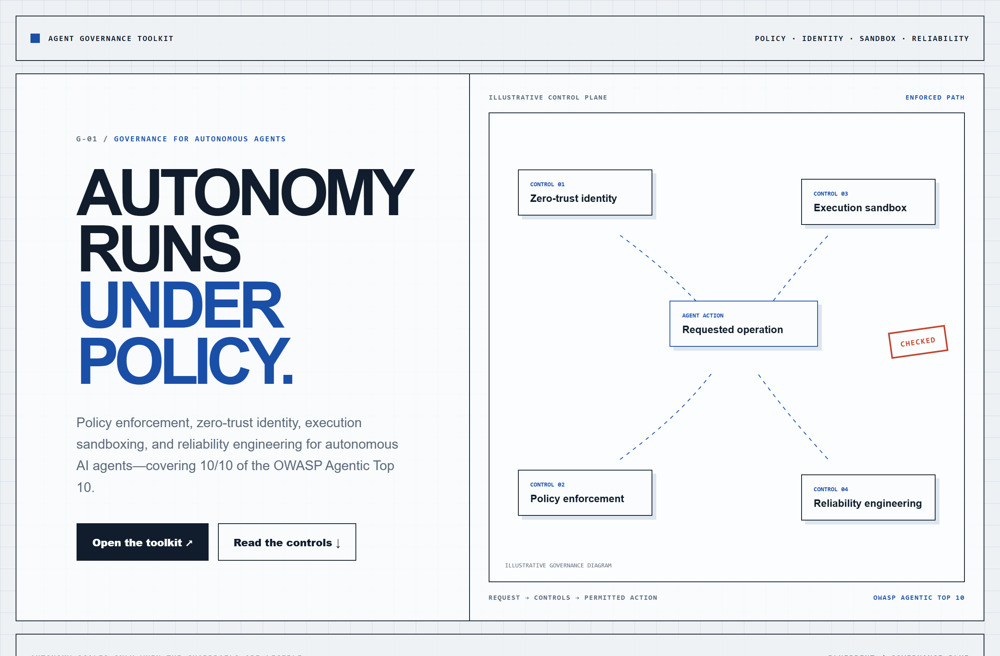
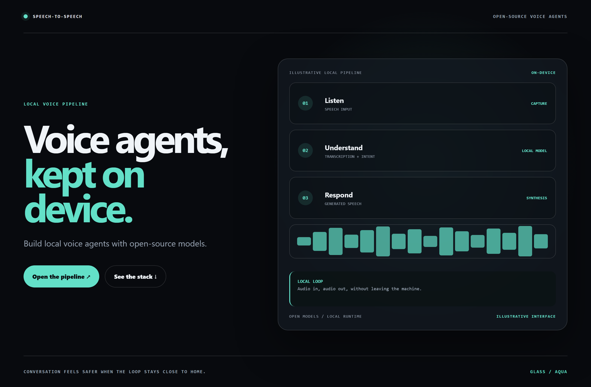
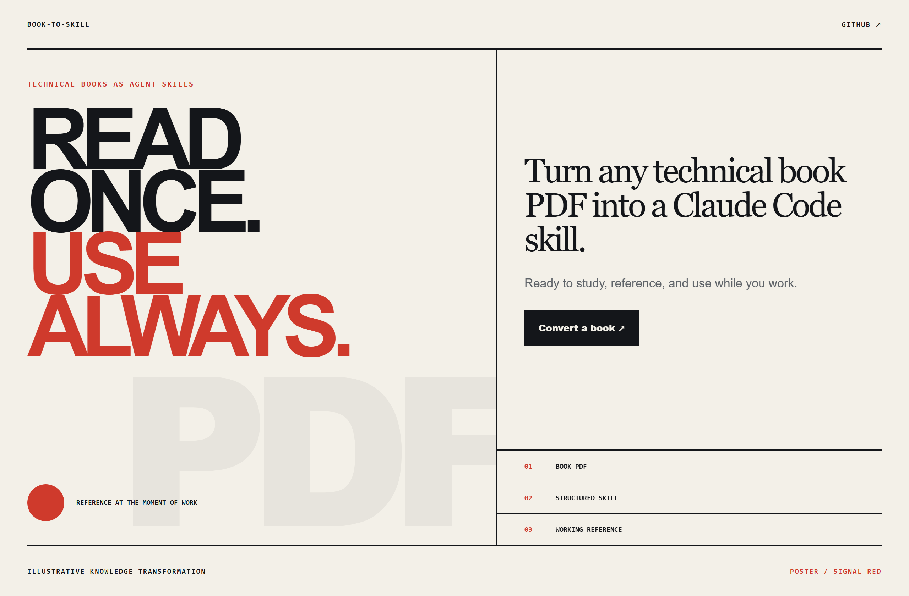

# Design Rep — Tuesday, July 28

> 3 mocks — blueprint, glass, poster

[Catalog](../../CATALOG.md) · [Home](../../README.md)

## [microsoft/agent-governance-toolkit](https://github.com/microsoft/agent-governance-toolkit)

- **Style:** blueprint / governance-blue
- **Idea tested:** draw governance as identity, policy, sandbox, and reliability gates around one agent action
- **Verdict:** landed: enforcement reads as architecture rather than compliance decoration
- [live .html](./01-agent-governance-toolkit.html) · [repo on GitHub](https://github.com/microsoft/agent-governance-toolkit)

## [huggingface/speech-to-speech](https://github.com/huggingface/speech-to-speech)

- **Style:** glass / aqua
- **Idea tested:** present a local voice loop as one frosted listen→understand→respond stack
- **Verdict:** landed: on-device conversation feels calm and credible
- [live .html](./02-speech-to-speech.html) · [repo on GitHub](https://github.com/huggingface/speech-to-speech)

## [virgiliojr94/book-to-skill](https://github.com/virgiliojr94/book-to-skill)

- **Style:** poster / signal-red
- **Idea tested:** compress book-to-skill conversion into one poster claim with honest transformation states
- **Verdict:** landed: memorable promise with visible mechanism
- [live .html](./03-book-to-skill.html) · [repo on GitHub](https://github.com/virgiliojr94/book-to-skill)

