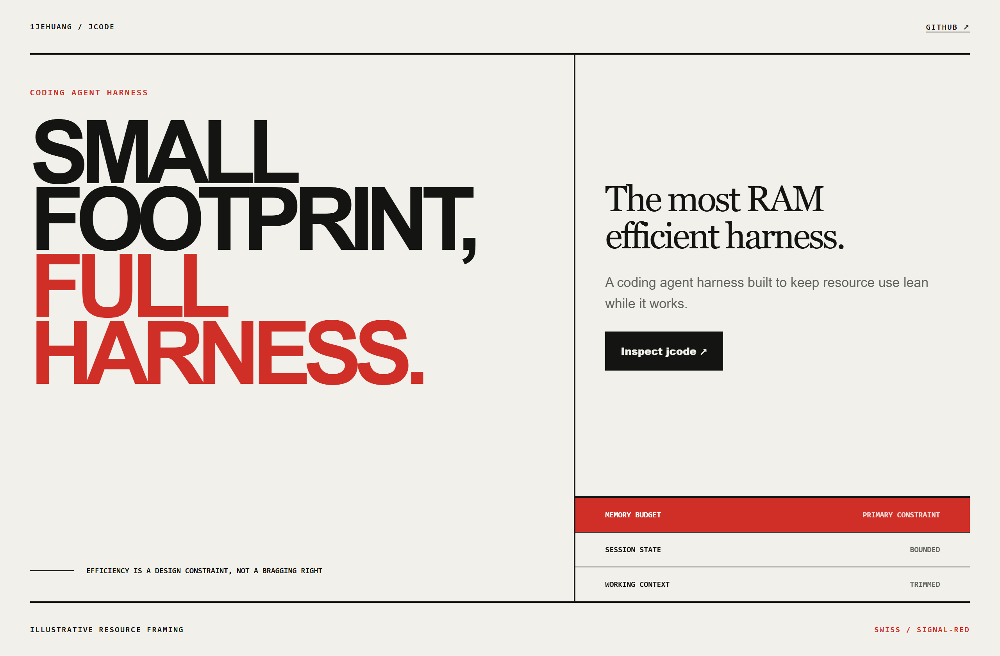
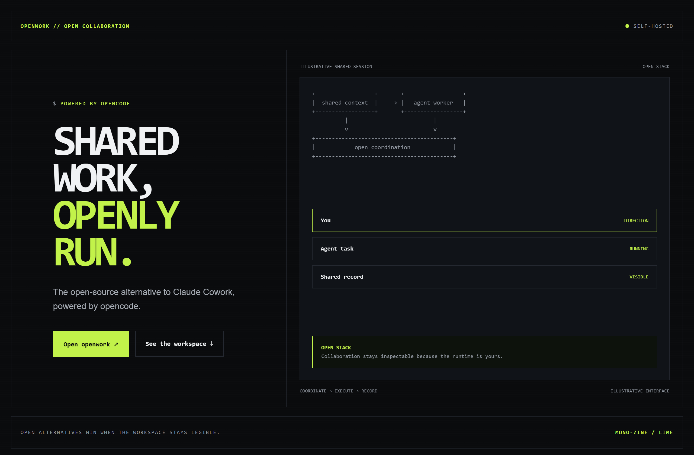
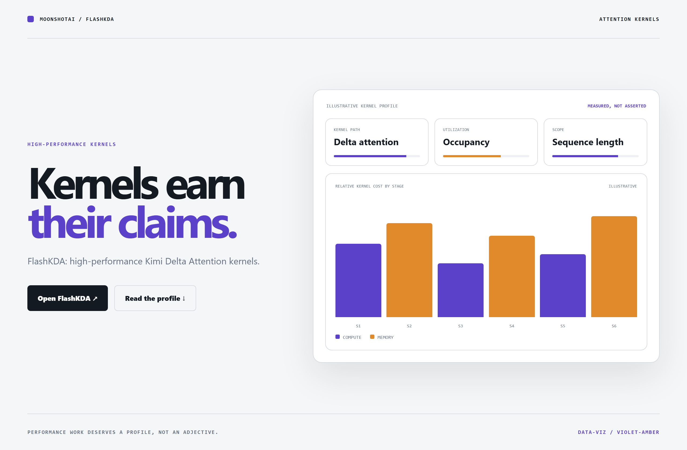

# Design Rep — Wednesday, July 29

> 3 mocks — swiss, mono-zine, data-viz

[Catalog](../../CATALOG.md) · [Home](../../README.md)

## [1jehuang/jcode](https://github.com/1jehuang/jcode)

- **Style:** swiss / signal-red
- **Idea tested:** make a resource constraint the headline claim with memory budget as primary commitment
- **Verdict:** landed: efficiency reads as engineering intent
- [live .html](./01-jcode.html) · [repo on GitHub](https://github.com/1jehuang/jcode)

## [different-ai/openwork](https://github.com/different-ai/openwork)

- **Style:** mono-zine / lime
- **Idea tested:** show an open collaboration stack as inspectable direction, execution, and record lanes
- **Verdict:** landed: openness feels operational instead of ideological
- [live .html](./02-openwork.html) · [repo on GitHub](https://github.com/different-ai/openwork)

## [MoonshotAI/FlashKDA](https://github.com/MoonshotAI/FlashKDA)

- **Style:** data-viz / violet-amber
- **Idea tested:** give a performance kernel a measured profile instead of superlative language
- **Verdict:** landed: the page invites verification rather than belief
- [live .html](./03-flashkda.html) · [repo on GitHub](https://github.com/MoonshotAI/FlashKDA)

