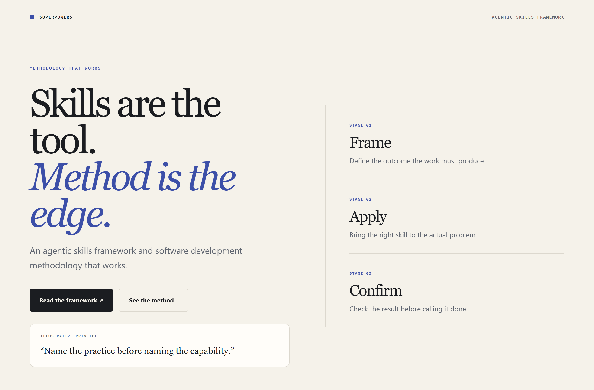
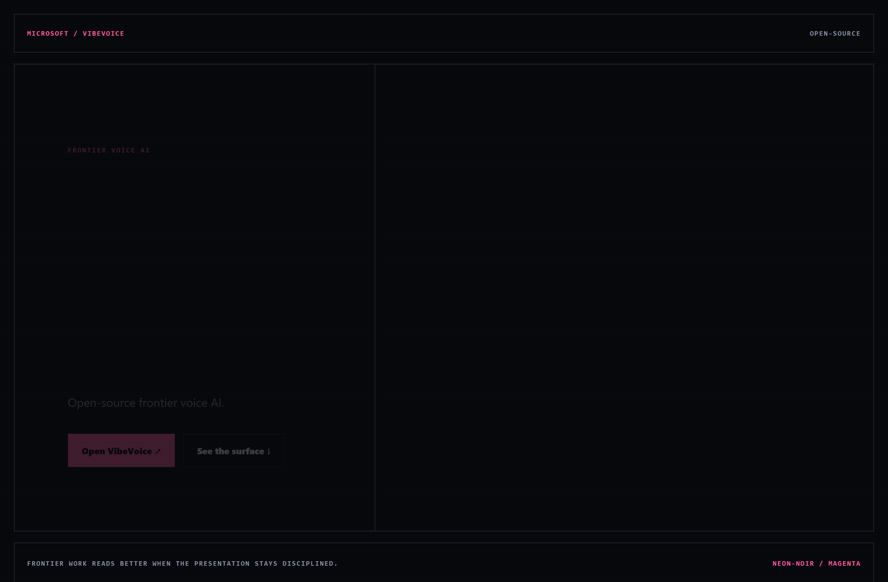
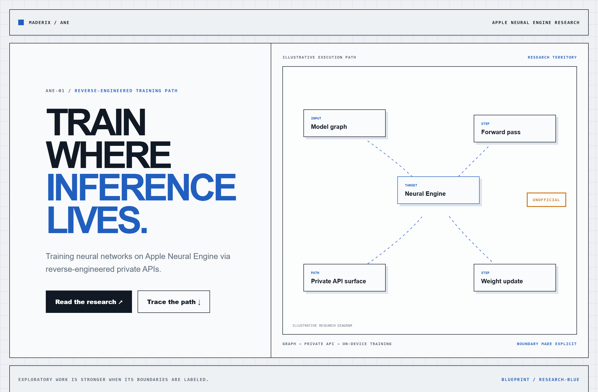

# Design Rep — Thursday, July 30

> 3 mocks — editorial, neon-noir, blueprint

[Catalog](../../CATALOG.md) · [Home](../../README.md)

## [obra/superpowers](https://github.com/obra/superpowers)

- **Style:** editorial / indigo
- **Idea tested:** give the frame→apply→confirm method equal weight with the headline claim
- **Verdict:** landed: reads as a working practice rather than a capability catalogue
- [live .html](./01-superpowers.html) · [repo on GitHub](https://github.com/obra/superpowers)

## [microsoft/VibeVoice](https://github.com/microsoft/VibeVoice)

- **Style:** neon-noir / magenta
- **Idea tested:** carry frontier voice research with one restrained orb and waveform instead of spectacle
- **Verdict:** landed: ambition stays legible without demo theatrics
- [live .html](./02-vibevoice.html) · [repo on GitHub](https://github.com/microsoft/VibeVoice)

## [maderix/ANE](https://github.com/maderix/ANE)

- **Style:** blueprint / research-blue
- **Idea tested:** diagram an unofficial training path while labeling the boundary explicitly
- **Verdict:** landed: exploration feels rigorous because limits are stated
- [live .html](./03-ane.html) · [repo on GitHub](https://github.com/maderix/ANE)

