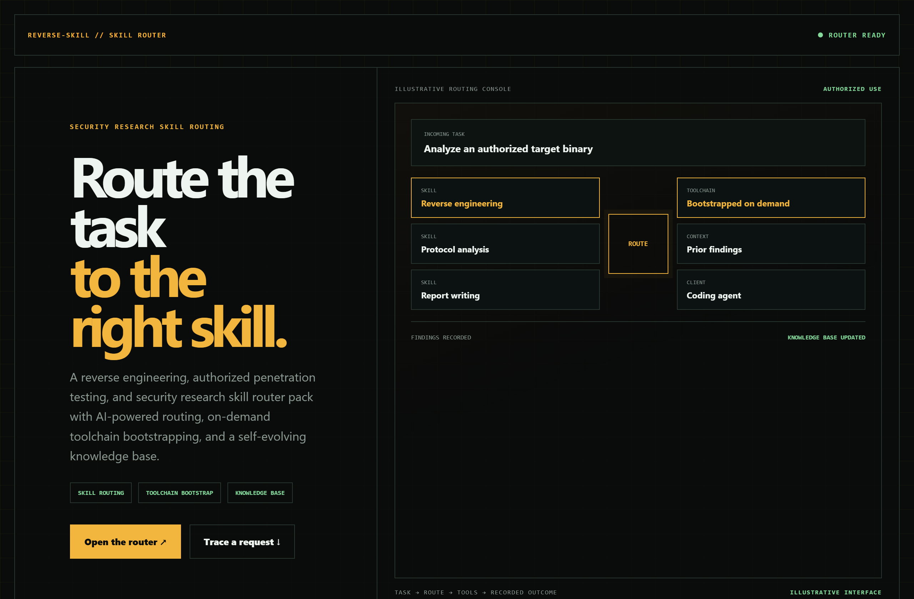
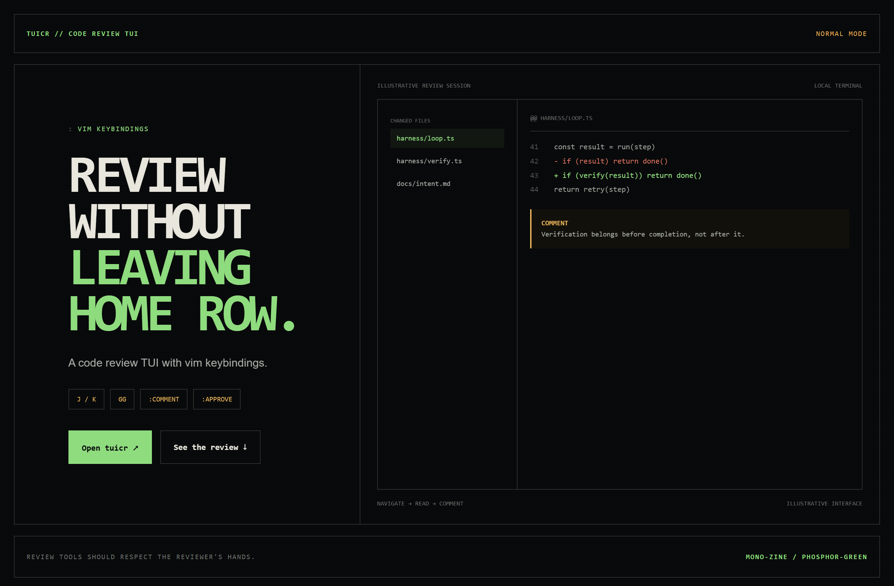
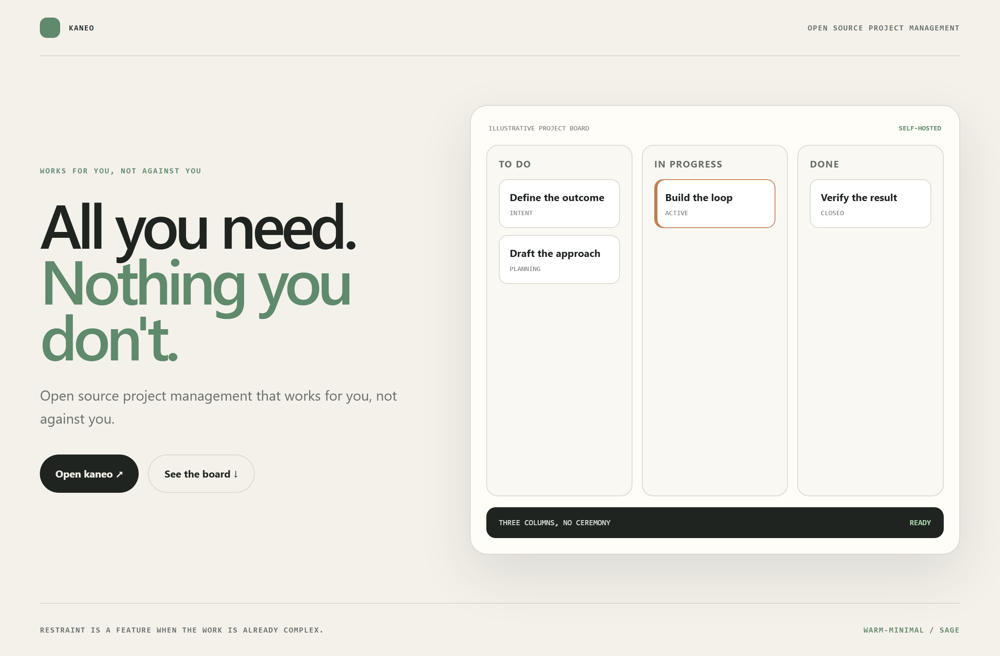

# Design Rep — Friday, July 31

> 3 mocks — hud, mono-zine, warm-minimal

[Catalog](../../CATALOG.md) · [Home](../../README.md)

## [zhaoxuya520/reverse-skill](https://github.com/zhaoxuya520/reverse-skill)

- **Style:** hud / signal-amber
- **Idea tested:** render skill routing as a dispatch console from task to tools to recorded findings
- **Verdict:** landed: routing reads as operational dispatch with authorized use stated
- [live .html](./01-reverse-skill.html) · [repo on GitHub](https://github.com/zhaoxuya520/reverse-skill)

## [agavra/tuicr](https://github.com/agavra/tuicr)

- **Style:** mono-zine / phosphor-green
- **Idea tested:** prove a keyboard-first review tool with a real diff and comment inside the terminal frame
- **Verdict:** landed: demonstration respects reviewer habits instead of selling them
- [live .html](./02-tuicr.html) · [repo on GitHub](https://github.com/agavra/tuicr)

## [usekaneo/kaneo](https://github.com/usekaneo/kaneo)

- **Style:** warm-minimal / sage
- **Idea tested:** make restraint the product argument with three calm columns and no ceremony
- **Verdict:** landed: minimalism feels considered rather than incomplete
- [live .html](./03-kaneo.html) · [repo on GitHub](https://github.com/usekaneo/kaneo)

