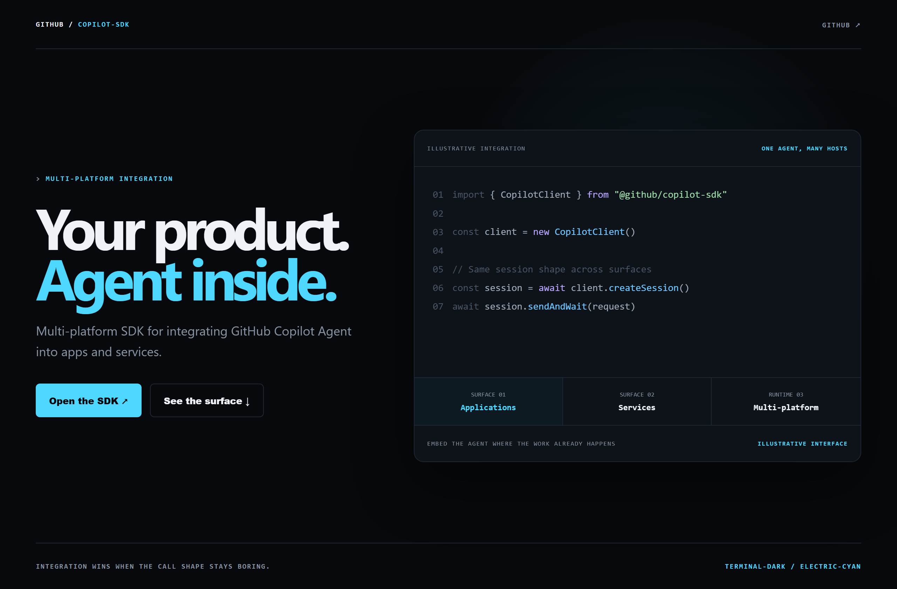
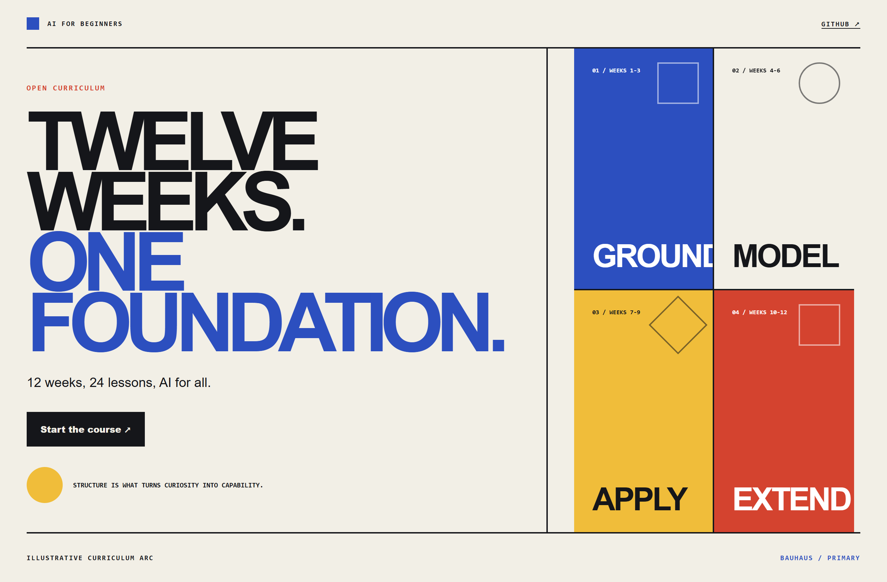
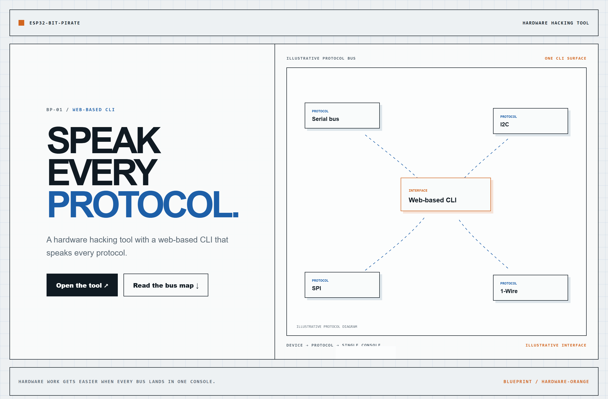

# Design Rep — Saturday, August 1

> 3 mocks — terminal-dark, bauhaus, blueprint

[Catalog](../../CATALOG.md) · [Home](../../README.md)

## [github/copilot-sdk](https://github.com/github/copilot-sdk)

- **Style:** terminal-dark / electric-cyan
- **Idea tested:** argue for embedded agents with one unchanged session shape above the surfaces it serves
- **Verdict:** landed: portability reads as engineering property not slogan
- [live .html](./01-copilot-sdk.html) · [repo on GitHub](https://github.com/github/copilot-sdk)

## [microsoft/AI-For-Beginners](https://github.com/microsoft/AI-For-Beginners)

- **Style:** bauhaus / primary
- **Idea tested:** give an open curriculum a ground→model→apply→extend geometric arc instead of a lesson index
- **Verdict:** landed: the path feels deliberate and finishable
- [live .html](./02-ai-for-beginners.html) · [repo on GitHub](https://github.com/microsoft/AI-For-Beginners)

## [geo-tp/ESP32-Bit-Pirate](https://github.com/geo-tp/ESP32-Bit-Pirate)

- **Style:** blueprint / hardware-orange
- **Idea tested:** diagram many protocols converging into one web-based console
- **Verdict:** landed: a broad promise becomes concrete and inspectable
- [live .html](./03-esp32-bit-pirate.html) · [repo on GitHub](https://github.com/geo-tp/ESP32-Bit-Pirate)

